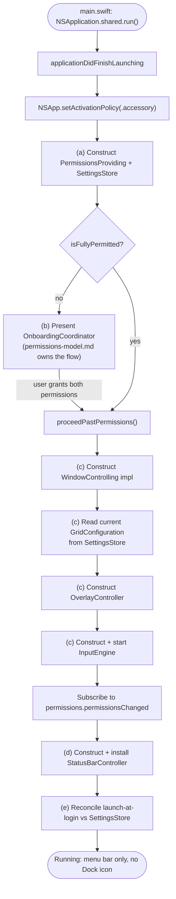
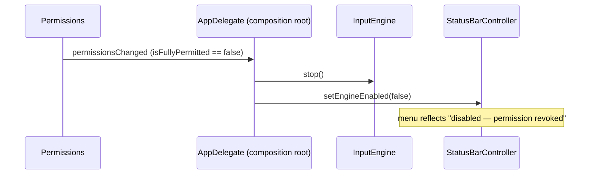

# App Shell & Lifecycle

Chunk 8 of 10 (per `docs/architecture/overview.md`). This chunk designs the **`MacGriddle`**
executable target: the composition root of the whole app. It is the *only* target permitted
to import every other target, and its job is exclusively **wiring** — constructing concrete
implementations, injecting protocol-typed dependencies into them, and reacting to
app-lifecycle and permission-lifecycle events. It contains no AX calls, no grid math, no
`CGEventTap` setup, and no SwiftUI view code of its own; every one of those concerns belongs
to a sibling target and is only *referenced* here.

```
Target: MacGriddle (executable)
Depends on: MacGriddleCore, GridEngine, WindowControl, Overlay, Permissions,
            Preferences, StatusBar, Input   (i.e. everything)
Concern: app entry point, composition root
```

**What this chunk explicitly does NOT own** (so the boundary is unambiguous for the combiner
agent): the `Info.plist`/`.app` packaging (`project-structure.md`), the exact shape of
`PermissionsProviding` and the onboarding UI flow (`permissions-model.md`), AX window
lookup/frame math (`window-control-and-coordinates.md`), pure grid math
(`grid-engine.md`), overlay window rendering (`overlay-rendering.md`), the `CGEventTap` +
gesture state machine (`input-engine-and-state-machine.md`), the Preferences UI and
`SettingsStore` internals (`preferences-ui.md`), and the `NSStatusItem` menu contents
(`statusbar-menu.md`). This chunk only documents **call sites** into all of those.

---

## 1. Activation Policy: Menu-Bar-Only Accessory App

MacGriddle must never show a Dock icon, never appear in ⌘-Tab, and never take over the
system menu bar with a normal app menu. AppKit's mechanism for this is
`NSApplication.ActivationPolicy.accessory`, set as early as possible in
`applicationDidFinishLaunching`:

```swift
import AppKit

final class AppDelegate: NSObject, NSApplicationDelegate {
    func applicationDidFinishLaunching(_ notification: Notification) {
        // First statement in the method, on purpose: every other line of
        // composition-root setup below assumes the process is already
        // running as a background/accessory app, not a regular one.
        NSApp.setActivationPolicy(.accessory)

        // ... composition root sequencing continues in Section 3 ...
    }
}
```

> **Cross-reference — `project-structure.md`:** the packaged `.app` bundle's `Info.plist`
> must *also* set `LSUIElement = 1` (equivalently `<key>LSUIElement</key><true/>`). That key
> is what keeps a Dock icon from ever flashing on screen for the shipped, bundled app, and it
> is owned entirely by the project-structure chunk's packaging script
> (`Scripts/build-app.sh`), not by this one.

**Why the programmatic call is still required even though `LSUIElement` will also be set.**
These two mechanisms cover two different execution contexts, not one:

- `LSUIElement` in `Info.plist` only takes effect when the process is launched *as a bundle*
  (i.e. `MacGriddle.app` via Launch Services — Finder double-click, `open`, login item,
  etc.). Its packaging is a separate build step (`project-structure.md`'s
  `Scripts/build-app.sh`), which does not run for every local iteration.
- During development, this target is a plain SwiftPM executable with no bundle and no
  `Info.plist` at all — e.g. `swift run MacGriddle` or invoking `.build/debug/MacGriddle`
  directly. Launch Services metadata is simply not consulted in that path, so without the
  programmatic call the dev-mode binary would show a Dock icon and grab keyboard focus like
  a normal app.

Calling `NSApp.setActivationPolicy(.accessory)` in code makes the accessory behavior correct
in **both** contexts (raw binary during development, and the final signed `.app`), while
`LSUIElement` in the bundle only reinforces it (and avoids the brief Dock-icon-then-hide
flash some apps exhibit when policy is set fractionally after launch) for the shipped
artifact. Keep both; they are not redundant.

---

## 2. Process Entry Point: `main.swift` + `AppDelegate`

### 2.1 Approach chosen: plain AppKit `main.swift`, not `@main` + `NSApplicationDelegateAdaptor`

Two viable shapes exist for a SwiftPM executable target's entry point:

1. **Plain AppKit** — a file literally named `main.swift` containing top-level statements
   (SwiftPM's convention: a target file named exactly `main.swift` is treated as the
   top-level entry code, no `@main` attribute required) that constructs `NSApplication` and
   an `NSObject`-based delegate by hand, then calls `run()`.
2. **SwiftUI `App` protocol** — a `@main`-attributed `struct` conforming to `App`, pulling in
   an `NSApplicationDelegate` via `@NSApplicationDelegateAdaptor`, with at least one `Scene`
   (e.g. an otherwise-empty `Settings { EmptyView() }` scene, since a menu-bar-only app has no
   real window content to declare as a `WindowGroup`).

**This chunk picks option 1.** Rationale, grounded in this project's own fixed decisions
(`overview.md`) rather than general preference:

- The cross-cutting decision "SwiftUI (via `NSHostingController`) for Preferences/Onboarding
  UI" means every window this app ever shows — the Preferences window, the onboarding
  window, and the per-screen overlay windows — is a plain AppKit `NSWindow`/
  `NSWindowController` with SwiftUI content hosted *inside* it. None of them are declared as
  SwiftUI `Scene`s/`WindowGroup`s. That means the SwiftUI `App` protocol would buy this
  project literally nothing except the `@main` keyword — there is no scene-managed window in
  the entire app for it to own.
- Adopting `App` + `NSApplicationDelegateAdaptor` anyway would mean running **two** parallel
  app-lifecycle systems (SwiftUI's `Scene`/environment machinery *and* the hand-rolled
  `NSWindowController`s this app actually needs) for zero functional benefit, and
  potential surprises where SwiftUI's scene phase notifications interact with manually-driven
  AppKit window lifecycles.
- Every prior-art tool surveyed in `docs/RESEARCH.md` §B.5 (Rectangle, AeroSpace, yabai,
  Amethyst) is an AppKit-first, menu-bar-driven tool under the hood; a plain `NSApplication`
  run loop is the idiomatic, well-trodden shape for this category of app.

(`@main` + `NSApplicationDelegateAdaptor` remains a legitimate alternative if a future chunk
revision ever wants a SwiftUI `Scene` for real — e.g. a `MenuBarExtra` — but nothing in the
fixed decisions or the 10-chunk breakdown calls for that today.)

### 2.2 `main.swift`

```swift
// Sources/MacGriddle/main.swift
//
// SwiftPM convention: a file named exactly `main.swift` in an executable
// target is the top-level entry point — no `@main` type is needed.

import AppKit

let app = NSApplication.shared
let delegate = AppDelegate()
app.delegate = delegate
app.run()
```

`app.run()` starts (and blocks on) the main run loop. That run loop is also what
`input-engine-and-state-machine.md`'s `CGEventTap` run-loop source attaches to
(`CFRunLoopAddSource(CFRunLoopGetCurrent(), ..., .commonModes)` on the main thread) — no
dedicated thread is created anywhere in this app; `NSApplication.run()` already spins the
one run loop everything else needs, per `docs/RESEARCH.md` §B.2.2.

### 2.3 `AppDelegate` shape

```swift
// Sources/MacGriddle/AppDelegate.swift

import AppKit
import Combine

import MacGriddleCore  // GridConfiguration, WindowHandle, WindowControlling, PermissionsProviding
import Permissions     // concrete PermissionsProviding impl + onboarding call site
import WindowControl   // concrete WindowControlling impl
import Overlay         // OverlayController
import Input           // InputEngine
import Preferences     // SettingsStore, PreferencesWindowController
import StatusBar       // StatusBarController
// Deliberately NOT importing GridEngine here — it is pure, stateless grid
// math (per overview.md: "no AppKit import ... must be fully
// unit-testable") consumed directly by Overlay and Input, both of which
// already depend on it. The composition root only ever passes a
// GridConfiguration *value* through; it never calls grid math itself.

final class AppDelegate: NSObject, NSApplicationDelegate {

    // MARK: Composition-root-owned instances
    // (Concrete type names below are ASSUMPTIONS about sibling chunks'
    // public API. See "Assumptions" at the end of this document.)

    private var permissions: PermissionsProviding!
    private var settingsStore: SettingsStore!
    private var windowController: WindowControlling!
    private var overlayController: OverlayController!
    private var inputEngine: InputEngine!
    private var statusBarController: StatusBarController!

    private var onboardingCoordinator: OnboardingCoordinator?
    private var preferencesWindowController: PreferencesWindowController?

    private var engineEnabled = false
    private var permissionsSubscription: AnyCancellable?

    // MARK: NSApplicationDelegate — see Sections 3, 4, 5 for bodies

    func applicationDidFinishLaunching(_ notification: Notification) { /* Section 3 */ }
    func applicationWillTerminate(_ notification: Notification) { /* Section 5 */ }
}
```

The first six stored properties are implicitly-unwrapped (`!`) rather than plain optionals.
This is a deliberate, narrow exception: each of them is constructed exactly once, inside
`proceedPastPermissions()` (Section 3), and lives for the remainder of the process — the
type system has no clean way to express "absent only during the brief onboarding gate at
startup, guaranteed present afterward," so IUO is used here instead of threading an
`Optional` through every later call site. Call sites still use `?.` defensively (e.g.
`inputEngine?.stop()`) as cheap insurance against a future reordering bug — that's valid on
an IUO, since it behaves as `Optional` for chaining purposes.

---

## 3. Composition Root Sequencing (`applicationDidFinishLaunching`)

In order, the composition root: **(a)** builds `Permissions` and checks both permission
booleans; **(b)** if either is missing, shows onboarding and waits; **(c)** once permitted,
constructs and wires `WindowControl`, grid configuration access, `Overlay`, and `Input`;
**(d)** builds and shows the `StatusBar` item; **(e)** reconciles launch-at-login against the
saved preference.

### 3.1 Sequencing diagram



### 3.2 Step (a): construct `Permissions` and check state

```swift
func applicationDidFinishLaunching(_ notification: Notification) {
    NSApp.setActivationPolicy(.accessory)

    let permissions = SystemPermissionsProvider()   // ASSUMPTION: concrete type name,
    self.permissions = permissions                   // owned by permissions-model.md

    let store = SettingsStore()                      // ASSUMPTION: init signature,
    self.settingsStore = store                        // owned by preferences-ui.md

    if permissions.isFullyPermitted {
        proceedPastPermissions()
    } else {
        presentOnboarding()
    }
}
```

`SettingsStore` is constructed unconditionally, before the permission gate — it has no
dependency on either permission (it is `UserDefaults`-backed per `overview.md`'s chunk 9
description), and the composition root only ever needs a single, shared instance of it for
the rest of the launch sequence (Preferences window, `Input`'s live configuration, and
launch-at-login reconciliation all read the same store).

### 3.3 Step (b): onboarding call site

The onboarding *flow* — how many steps, what copy, how it polls or observes the two
permission booleans, and how it deep-links to the right System Settings pane — is entirely
`permissions-model.md`'s concern. This chunk's only responsibility is the call site: show it
if not fully permitted, and resume the launch sequence once it reports success.

```swift
private func presentOnboarding() {
    let coordinator = OnboardingCoordinator(permissions: permissions)  // ASSUMPTION:
    onboardingCoordinator = coordinator                                 // type + init,
                                                                         // owned by
                                                                         // permissions-model.md
    // Accessory apps are not auto-activated the way a regular app would
    // be on launch — see Section 6 for why this call is required here.
    NSApp.activate(ignoringOtherApps: true)

    coordinator.present { [weak self] in
        self?.onboardingCoordinator = nil
        self?.proceedPastPermissions()
    }
}
```

### 3.4 Step (c): construct and wire core services

```swift
private func proceedPastPermissions() {
    let windowControl = AXWindowController()   // ASSUMPTION: concrete WindowControlling
    windowController = windowControl             // impl, owned by window-control-and-coordinates.md

    let overlay = OverlayController()           // ASSUMPTION: owned by overlay-rendering.md
    overlayController = overlay

    let engine = InputEngine(                    // ASSUMPTION: owned by
        windowControl: windowControl,             // input-engine-and-state-machine.md
        overlay: overlay,
        permissions: permissions,
        settings: settingsStore
    )
    inputEngine = engine

    engineEnabled = engine.start()
    // Should be rare: permissions were just confirmed above, so a false
    // return here most likely indicates a transient CGEventTap failure
    // (see RESEARCH.md §B.2.2) rather than a missing permission. The
    // StatusBar constructed in installStatusBar() below is told the real
    // `engineEnabled` value, so it surfaces this rather than claiming to
    // be running when it isn't.

    observePermissionChanges()
    installStatusBar()
    reconcileLaunchAtLogin()
}
```

**On "GridEngine-backed grid math access."** There is no separate object for the composition
root to construct here beyond the `GridConfiguration` value already reachable through
`settingsStore`. `overview.md` specifies `GridEngine` as pure, stateless functions with no
AppKit dependency; both `Overlay` and `Input` already depend on `GridEngine` directly (per
the target table in `overview.md`), so they call its math themselves, each time, using
whichever `GridConfiguration` value the composition root handed them. Concretely, "GridEngine
-backed grid math access" *is* the `settings: settingsStore` argument passed into
`InputEngine` above (and, transitively, whatever `GridConfiguration` `Overlay` reads from
`Input` when a gesture starts) — not a fourth object alongside `WindowControl`/`Overlay`/
`Input`.

The whole live `SettingsStore` is injected into `InputEngine` — not a one-time snapshot
`GridConfiguration` extracted from it at launch — so that changing grid size, live-vs-
snap-on-release, or the panic hotkey in Preferences while the app is running takes effect on
the *next* gesture without an app restart. `Input`'s exact initializer parameter (a
`GridConfiguration` value vs. a live settings reference) is `input-engine-and-state-machine.md`'s
call; this chunk only asserts the *intent* that configuration changes should be observed
live, not frozen at launch.

### 3.5 Step (d): construct and show `StatusBar`

```swift
private func installStatusBar() {
    let statusBar = StatusBarController(                              // ASSUMPTION: owned
        permissions: permissions,                                      // by statusbar-menu.md
        settings: settingsStore,
        initialEngineEnabled: engineEnabled,
        onOpenPreferences: { [weak self] in self?.showPreferences() },
        onToggleEngineEnabled: { [weak self] enabled in self?.setEngineEnabled(enabled) },
        onQuit: { NSApp.terminate(nil) }
    )
    statusBar.install()
    statusBarController = statusBar
}
```

`StatusBar` is handed the same `permissions` and `settingsStore` instances everything else
uses (per `overview.md`'s own description of chunk 10: "how it observes and reflects live
permission + engine-enabled state" — implying `StatusBar` subscribes to `permissions`
directly for its own menu rendering, rather than the composition root pushing every
permission change into it by hand). The composition root only pushes the one piece of state
that *only it* can know authoritatively — whether the gesture engine is actually running,
which depends on both live permission status *and* the user's manual enable/disable toggle —
via `initialEngineEnabled` at construction and `setEngineEnabled(_:)` afterward (Section 4).

### 3.6 Step (e): launch-at-login reconciliation

```swift
private func reconcileLaunchAtLogin() {
    // LaunchAtLogin is project-structure.md's design (docs/RESEARCH.md §B.4
    // sketches this exact `SMAppService`-backed shape; the final home/name
    // of the type is project-structure.md's call).
    if settingsStore.launchAtLoginEnabled, !LaunchAtLogin.isEnabled() {
        LaunchAtLogin.setEnabled(true)
    }
}
```

This is a reconciliation, not an unconditional re-register, for a reason spelled out
directly in `docs/RESEARCH.md` §B.4: `SMAppService.mainApp.status` is the live,
authoritative source of truth, and the user can remove the login item from System Settings
at any time outside the app. Reading `settingsStore.launchAtLoginEnabled` as *intent* and
`LaunchAtLogin.isEnabled()` as *live system state*, and only calling `setEnabled(true)` when
they disagree in the "should be on but isn't" direction:

- silently repairs drift (e.g. the user removed it from Login Items, but never asked
  MacGriddle to stop launching at login) without nagging them every single launch, and
- deliberately does **not** force the opposite correction (system says enabled, preference
  says disabled) at launch time — the moment a user flips the Preferences toggle off is
  `preferences-ui.md`'s responsibility to call `LaunchAtLogin.setEnabled(false)`, not
  something this chunk should silently re-decide on the app's behalf every boot.

### 3.7 Full launch sequence, assembled

```swift
extension AppDelegate {
    func applicationDidFinishLaunching(_ notification: Notification) {
        NSApp.setActivationPolicy(.accessory)

        let permissions = SystemPermissionsProvider()
        self.permissions = permissions

        let store = SettingsStore()
        self.settingsStore = store

        if permissions.isFullyPermitted {
            proceedPastPermissions()
        } else {
            presentOnboarding()
        }
    }
}
```

(`presentOnboarding()`, `proceedPastPermissions()`, `installStatusBar()`, and
`reconcileLaunchAtLogin()` are exactly the private methods shown in 3.3–3.6 above.)

---

## 4. Reacting to Permission Loss at Runtime

If the user revokes Accessibility or Input Monitoring in System Settings while MacGriddle is
running, `Permissions`' observable state (assumed to be a Combine publisher — see
Assumptions) fires, and the composition root must stop the event tap gracefully rather than
let subsequent AX/`CGEventTap` calls fail unpredictably mid-gesture.

```swift
private func observePermissionChanges() {
    permissionsSubscription = permissions.permissionsChanged
        .receive(on: DispatchQueue.main)   // defensive: don't assume the
                                            // publisher already delivers on main
        .sink { [weak self] _ in self?.handlePermissionsChanged() }
}

private func handlePermissionsChanged() {
    guard !permissions.isFullyPermitted else { return }
    setEngineEnabled(false)
}

private func setEngineEnabled(_ enabled: Bool) {
    if enabled {
        engineEnabled = inputEngine?.start() ?? false
    } else {
        inputEngine?.stop()
        engineEnabled = false
    }
    statusBarController?.setEngineEnabled(engineEnabled)
}
```



`setEngineEnabled(_:)` is the single code path for **both** directions this app can disable
or re-enable the gesture engine: a permission being revoked (Section 4) and the user
manually flipping the `StatusBar` enable/disable menu item (Section 3.5's
`onToggleEngineEnabled` closure). Routing both through one method keeps `engineEnabled` — and
what `StatusBarController` is told — a single source of truth, rather than letting
`AppDelegate` and `StatusBar` independently derive "is the engine running" from raw
permission booleans and risk disagreeing (e.g. about whether a manual disable should stick
even while permissions remain granted).

This chunk intentionally does **not** implement auto-resume when a lost permission is
re-granted — the task only calls for reacting to loss. Auto-resuming (re-subscribing already
covers detecting the regrant; the missing piece would be deciding whether to automatically
call `setEngineEnabled(true)` again, or wait for the user to flip the StatusBar toggle back
on) is a reasonable follow-up but is left to whichever chunk/implementation pass takes on
that UX decision explicitly, rather than assumed here.

---

## 5. Termination and Cleanup (`applicationWillTerminate`)

```swift
extension AppDelegate {
    func applicationWillTerminate(_ notification: Notification) {
        inputEngine?.stop()
    }
}
```

The actual `CGEventTap` teardown — disabling the tap (`CGEvent.tapEnable(tap:enable:false)`),
removing the run loop source, invalidating the `CFMachPort` — is `Input`'s implementation
detail (`input-engine-and-state-machine.md`). The composition root's only job at shutdown is
to make the call; it does not reach into `Input`'s internals to tear the tap down itself.
`stop()` is assumed idempotent (safe to call on an already-stopped or never-started engine),
matching how it is already used defensively elsewhere in this file (Section 4).

No other cleanup is needed at termination: `WindowControl` does not hold any open handles
that outlive individual AX calls, `Overlay` windows are ordinary `NSWindow`s torn down by the
process exiting normally, and `StatusBar`'s `NSStatusItem` is removed automatically when the
process exits. This app has no unsaved user state to prompt about, so
`applicationShouldTerminate(_:)` is not overridden — the default `.terminateNow` behavior is
correct.

---

## 6. Where Preferences and Onboarding Windows Live

### 6.1 The accessory-app focus nuance

An app running under `.accessory` activation policy has no Dock icon and is never made the
active/frontmost app automatically the way a `.regular` app is on launch or on a Dock-icon
click. Two concrete consequences for this app:

1. **At launch (onboarding).** There is no Dock-icon-click or Finder-double-click event for
   macOS to hook "activate this app" onto. MacGriddle can finish launching while some
   completely different app (Finder, Safari, whatever the user had focused a moment before)
   remains frontmost and key. Simply calling `showWindow(nil)` on the onboarding window
   controller can result in a window that is visually present but *behind* the frontmost
   app, or on-screen but not actually receiving keyboard input.
2. **Later, from the status-item menu (Preferences).** Clicking an `NSStatusItem` is not
   equivalent to clicking a Dock icon — it does not, by itself, activate MacGriddle as the
   foreground app the way it would for a `.regular` app's Dock icon.

The fix in both cases is the same single call, made by the composition root immediately
before ordering the window to the front:

```swift
NSApp.activate(ignoringOtherApps: true)
```

*(Aside: `activate(ignoringOtherApps:)` was superseded by a parameterless
`NSApplication.activate()` starting in macOS 14. Since this project's minimum target is
13.0 — `overview.md`'s cross-cutting decision, chosen for `SMAppService` — the
`ignoringOtherApps:` form remains the correct call for the whole supported OS range;
deprecation is not removal, so no availability branch is needed for this chunk's purposes.)*

### 6.2 Preferences window call site

```swift
private func showPreferences() {
    if preferencesWindowController == nil {
        preferencesWindowController = PreferencesWindowController(store: settingsStore)
        // ASSUMPTION: type + init, owned by preferences-ui.md. Constructed
        // lazily and cached (not re-created per open) since the window may
        // be opened many times over the app's lifetime from the StatusBar
        // menu.
    }

    NSApp.activate(ignoringOtherApps: true)
    preferencesWindowController?.showWindow(nil)
    preferencesWindowController?.window?.makeKeyAndOrderFront(nil)
}
```

### 6.3 Ownership: who retains these window controllers?

Because this is a menu-bar-only app with no Window menu, no Dock menu, and no other
AppKit-provided mechanism that keeps window controllers alive on the app's behalf,
*something* must hold a strong reference to `preferencesWindowController` and
`onboardingCoordinator` for as long as their windows should exist — a locally-scoped
`NSWindowController` with no other owner is deallocated (and its window torn down) as soon
as the creating function returns. This chunk's design has `AppDelegate` — the composition
root — hold both references directly, as shown in Section 2.3's property list, rather than
either window managing its own lifetime or `StatusBar` owning the `Preferences` window
controller itself.

This is a real design decision, not a certainty about `statusbar-menu.md`'s actual shape,
and is flagged accordingly: `overview.md`'s target table lists `StatusBar`'s dependencies as
`Core, Preferences`, so it is equally plausible that chunk 10 instead has `StatusBarController`
construct and own the `PreferencesWindowController` itself and show it directly on menu-item
click, without a round-trip through `AppDelegate` at all. This chunk keeps window-lifecycle
ownership centralized in the composition root because (a) `AppDelegate` already must own
`settingsStore`, which the Preferences window also needs, and (b) `NSApp.activate`/
`setActivationPolicy` are app-wide, singleton-level operations that conceptually belong at
the app-shell layer rather than inside a menu-bar-item module. Either way, the
`NSApp.activate(ignoringOtherApps: true)` requirement documented in 6.1 applies at whichever
call site ends up showing the window — that nuance is real regardless of which chunk's final
design owns the reference.

### 6.4 Onboarding window's activation call

Shown already in Section 3.3 (`presentOnboarding()`), reproduced here for completeness next
to its Preferences counterpart:

```swift
NSApp.activate(ignoringOtherApps: true)
coordinator.present { [weak self] in
    self?.onboardingCoordinator = nil
    self?.proceedPastPermissions()
}
```

Whether `OnboardingCoordinator.present(completion:)` internally calls
`makeKeyAndOrderFront` on one window or walks the user through several (e.g. a separate step
per permission) is entirely `permissions-model.md`'s business; the composition root's
obligation is only to have already activated the app before handing control to it.

---

## Cross-Chunk Dependencies

| Referenced chunk | What this chunk assumes from it |
|---|---|
| `project-structure.md` | `Info.plist` `LSUIElement = 1` for the packaged `.app` (Section 1); the `LaunchAtLogin`-shaped `SMAppService` wrapper sketched in `RESEARCH.md` §B.4 (Section 3.6) |
| `core-contracts.md` | `PermissionsProviding`, `WindowControlling`, `GridConfiguration` protocol/type *names* (confirmed by `overview.md`); member shapes assumed (see below) |
| `permissions-model.md` | Concrete `PermissionsProviding` implementation; the onboarding flow's call-site shape (`OnboardingCoordinator.present(completion:)`); an observable permission-change signal |
| `window-control-and-coordinates.md` | Concrete `WindowControlling` implementation (`AXWindowController`, assumed name) |
| `grid-engine.md` | Confirmed stateless/pure — deliberately *not* imported or called directly by this chunk (Section 3.4) |
| `overlay-rendering.md` | `OverlayController` (assumed name/shape), constructed here, wired into `Input` |
| `input-engine-and-state-machine.md` | `InputEngine` (assumed name/shape) with `start() -> Bool` / `stop()` lifecycle |
| `preferences-ui.md` | `SettingsStore` (name confirmed by `overview.md`), `PreferencesWindowController` (assumed name) |
| `statusbar-menu.md` | `StatusBarController` (assumed name/shape); assumed to independently observe `PermissionsProviding` for its own menu rendering |

---

## Assumptions Made About Other Modules' APIs

Everything below is a guess this chunk had to make about a sibling chunk's exact public
surface, because those chunks are written independently and in parallel. Names in
**bold** are confirmed directly by `overview.md`/`RESEARCH.md`; everything else is invented
for the purpose of writing a plausible, internally-consistent skeleton and should be
reconciled by the combiner agent against what each sibling chunk actually specifies.

| Symbol used here | Status | Notes |
|---|---|---|
| **`PermissionsProviding`** | Confirmed name | Member shape guessed: `isAccessibilityTrusted`, `isInputMonitoringTrusted`, `isFullyPermitted`, `permissionsChanged: AnyPublisher<Void, Never>` (Combine assumed; a closure/`NotificationCenter`-based design is equally plausible) |
| `SystemPermissionsProvider` | Guessed | Assumed concrete `PermissionsProviding` implementation type in `Permissions` |
| `OnboardingCoordinator` | Guessed | Assumed coordinator-style type (vs. a plain `NSWindowController`) with `init(permissions:)` and `present(completion: () -> Void)`, in/exposed-by `Permissions` |
| **`WindowControlling`** | Confirmed name | Member shape guessed: `windowUnderCursor(at:) -> WindowHandle?`, `frame(of:) -> CGRect?`, `setFrame(_:of:) -> Bool` — closely modeled on the free functions already sketched in `RESEARCH.md` §B.1 |
| `AXWindowController` | Guessed | Assumed concrete `WindowControlling` implementation type in `WindowControl`; assumed zero-argument `init()` |
| **`GridConfiguration`** | Confirmed name | Member shape guessed beyond `columns`/`rows` (grounded in `overview.md`'s "6 columns × 4 rows" default) |
| `OverlayController` | Guessed | Assumed name/shape in `Overlay`; assumed zero-argument `init()`, with `show`/`hide`/preview methods called by `Input`, not by this chunk |
| `InputEngine` | Guessed | Assumed name; assumed `init(windowControl:overlay:permissions:settings:)` and a `start() -> Bool` / `stop()` lifecycle pair. The `start()/stop()` shape is only loosely grounded — `RESEARCH.md`'s `GlobalMouseAndModifierTap` sketch shows `start() -> Bool` but never shows a `stop()`; this chunk assumes one exists because Section 5's requirement (clean teardown) has to call *something* |
| **`SettingsStore`** | Confirmed name | Member shape guessed: `gridConfiguration: GridConfiguration`, `launchAtLoginEnabled: Bool`; assumed zero-argument `init()` |
| `PreferencesWindowController` | Guessed | Assumed name/shape in `Preferences`; assumed `init(store:)` |
| `StatusBarController` | Guessed | Assumed name/shape in `StatusBar`; assumed `init(permissions:settings:initialEngineEnabled:onOpenPreferences:onToggleEngineEnabled:onQuit:)`, an `install()` step separate from `init`, and a `setEngineEnabled(_:)` method for the composition root to push engine-enabled state into. An eager, do-everything-in-`init` design (no separate `install()`) is an equally plausible alternative |
| `LaunchAtLogin.isEnabled()` / `.setEnabled(_:)` | Grounded, namespace guessed | The shape itself is copied verbatim from `RESEARCH.md` §B.4's own sketch (`SMAppService`-backed); only *which module ultimately hosts it* (assumed `project-structure.md`, per `overview.md`'s chunk-1 description) is a guess |
| `GestureState` | Not used | Confirmed to exist by `overview.md`, but this chunk never needed to reference it directly — it is `Input`'s internal state-machine concern |
