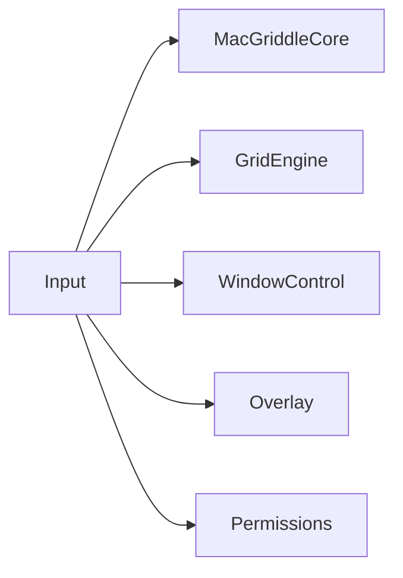
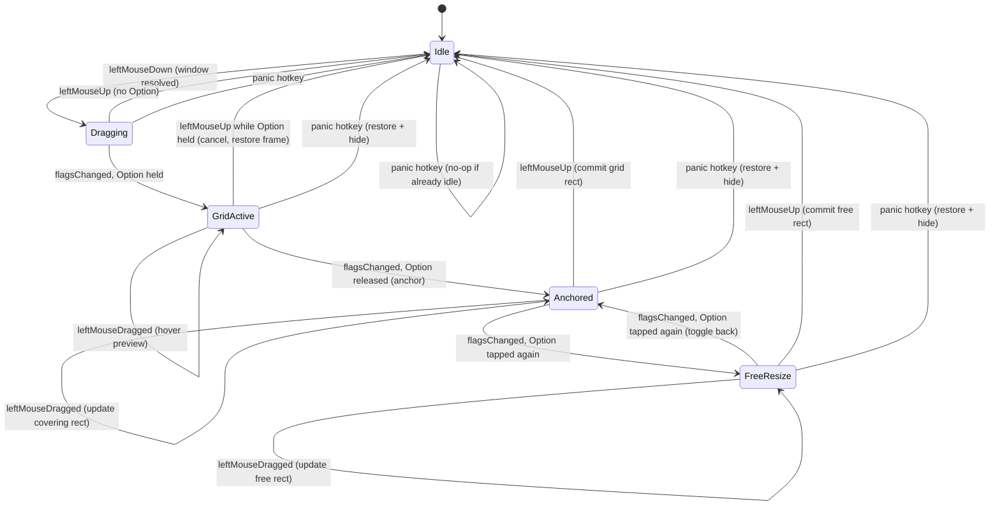

# Input Engine & Gesture State Machine (`Input`)

Chunk 4 of 10. Covers the `Input` target: the `CGEventTap` that detects the drag + Option
gesture, and the state machine that turns raw mouse/keyboard events into calls on
`WindowControl` and `Overlay`. This is the module every other engine-side chunk was written
around but none of them owns — `overview.md` assigns it `Core, GridEngine, WindowControl,
Overlay, Permissions` as dependencies, i.e. everything except `Preferences`/`StatusBar`, and
its job is almost entirely orchestration: translate low-level events into the 8-step gesture
from `RESEARCH.md` Part A / `overview.md`'s product spec.

## Target summary

| Target | Depends on | Concern |
|---|---|---|
| `Input` | Core, GridEngine, WindowControl, Overlay, Permissions | `CGEventTap` + gesture state machine; orchestrates the others |



Notably **not** a dependency: `Preferences`. `app-shell-and-lifecycle.md` (chunk 8) guessed
`InputEngine` might take the whole live `SettingsStore` — it can't, without violating this
fixed edge. §7 below resolves that with a `configure(...)` method the composition root calls
with plain values instead.

---

## 1. `GlobalMouseAndModifierTap`

`RESEARCH.md` §B.2 already names and sketches this class with a `start() -> Bool` method.
Reproduced here as this chunk's authoritative version, with three additions `RESEARCH.md`'s
sketch didn't cover: a `stop()` (needed by `app-shell-and-lifecycle.md`'s
`applicationWillTerminate`/permission-loss paths, which chunk 8 flagged as assumed-but-not-
grounded), `.keyDown` added to the event mask (for the panic hotkey, §6), and self-healing
against `kCGEventTapDisabledByTimeout`/`...ByUserInput` (`RESEARCH.md` §B.2.2 calls this out
as something "production code should watch for" but the base sketch doesn't implement it).

```swift
import CoreGraphics
import Foundation

/// Wraps exactly one CGEventTap: session-wide, listen-only, watching the
/// four mouse events plus flagsChanged and keyDown. Owns nothing about
/// gesture semantics — GestureEngine (§3) is the only thing that
/// interprets what these callbacks mean.
final class GlobalMouseAndModifierTap {
    private var eventTap: CFMachPort?
    private var runLoopSource: CFRunLoopSource?

    typealias EventHandler = (CGEventType, CGEvent) -> Void
    private let handler: EventHandler

    init(handler: @escaping EventHandler) {
        self.handler = handler
    }

    /// Returns false if Input Monitoring isn't granted (CGEvent.tapCreate
    /// returns nil silently in that case — RESEARCH.md §B.2.2) or tap
    /// creation otherwise fails. Safe to call again later — e.g. after the
    /// user grants Input Monitoring during onboarding — since it holds no
    /// state that would make a second call unsafe if the first one failed.
    @discardableResult
    func start() -> Bool {
        guard eventTap == nil else { return true } // already running

        let eventMask: CGEventMask =
            (1 << CGEventType.leftMouseDown.rawValue) |
            (1 << CGEventType.leftMouseDragged.rawValue) |
            (1 << CGEventType.leftMouseUp.rawValue) |
            (1 << CGEventType.flagsChanged.rawValue) |
            (1 << CGEventType.keyDown.rawValue) // panic hotkey only, see §6

        guard let tap = CGEvent.tapCreate(
            tap: .cgSessionEventTap,
            place: .headInsertEventTap,
            options: .listenOnly, // never .defaultTap — must not be able to swallow/alter input
            eventsOfInterest: eventMask,
            callback: { proxy, type, event, refcon in
                guard let refcon else { return Unmanaged.passUnretained(event) }
                let tapSelf = Unmanaged<GlobalMouseAndModifierTap>.fromOpaque(refcon).takeUnretainedValue()
                tapSelf.handle(type: type, event: event)
                // Listen-only taps ignore the return value, but the callback
                // signature still requires returning the (unmodified) event.
                return Unmanaged.passUnretained(event)
            },
            userInfo: Unmanaged.passUnretained(self).toOpaque()
        ) else { return false }

        eventTap = tap
        let source = CFMachPortCreateRunLoopSource(kCFAllocatorDefault, tap, 0)
        runLoopSource = source
        CFRunLoopAddSource(CFRunLoopGetCurrent(), source, .commonModes)
        CGEvent.tapEnable(tap: tap, enable: true)
        return true
    }

    /// Added beyond RESEARCH.md's base sketch — needed by
    /// app-shell-and-lifecycle.md's applicationWillTerminate and by
    /// GestureEngine's response to a permission being revoked mid-session
    /// (§8). Safe to call when not running (idempotent), matching how
    /// chunk 8 already calls InputEngine.stop() defensively in more than
    /// one place.
    func stop() {
        guard let tap = eventTap else { return }
        CGEvent.tapEnable(tap: tap, enable: false)
        if let source = runLoopSource {
            CFRunLoopRemoveSource(CFRunLoopGetCurrent(), source, .commonModes)
        }
        eventTap = nil
        runLoopSource = nil
    }

    private func handle(type: CGEventType, event: CGEvent) {
        // RESEARCH.md §B.2.2: macOS can disable a tap it judges slow or
        // misbehaving; both disable reasons arrive as event *types*
        // delivered to this same callback, not as an error. Re-enabling
        // immediately is the documented self-heal — without this, a single
        // timeout silently and permanently kills gesture detection until
        // the next app relaunch.
        if type == .tapDisabledByTimeout || type == .tapDisabledByUserInput {
            if let tap = eventTap {
                CGEvent.tapEnable(tap: tap, enable: true)
            }
            return
        }
        handler(type, event)
    }
}
```

---

## 2. Window/screen resolution helpers

```swift
import AppKit

/// Sketched illustratively in window-control-and-coordinates.md §4 as
/// "more plausibly lives in Input... since it's the only other target
/// that depends on WindowControl" — this is that function, claimed by
/// this chunk.
func screen(containing quartzPoint: CGPoint) -> NSScreen? {
    let height = ScreenSpace.primaryScreenHeight()
    let cocoaPoint = ScreenSpace.quartzToCocoa(quartzPoint, primaryScreenHeight: height)
    return NSScreen.screens.first { $0.frame.contains(cocoaPoint) }
}

/// The Quartz-space frame of whichever screen contains `quartzPoint`, or
/// the primary screen's frame as a last-resort fallback (e.g. a point that
/// momentarily falls between displays during a resolution change) so grid
/// math always has *some* valid screenFrame rather than needing to handle
/// nil at every call site.
func screenFrame(containing quartzPoint: CGPoint) -> CGRect {
    let height = ScreenSpace.primaryScreenHeight()
    let cocoaFrame = screen(containing: quartzPoint)?.frame
        ?? NSScreen.screens.first?.frame
        ?? .zero
    return ScreenSpace.cocoaToQuartz(cocoaFrame, primaryScreenHeight: height)
}
```

---

## 3. Internal gesture state machine

**Scoping decision, stated up front:** at `leftMouseDown`, this module captures whichever
window `WindowControl.window(at:)` resolves under the cursor as the gesture's *candidate*
target — it does **not** attempt to detect "is this specifically the title-bar region" the
way the original WindowGrid's click-and-hold-then-right-click gesture implicitly relies on
title-bar dragging for. Since this design never intercepts or cancels the OS's own native
window drag (§5 — snap-on-release, matching WinGrid11's strategy), a `mouseDown` anywhere
else on a window (e.g. mid-content) simply means the native OS drag never actually moves
the window during `.dragging`/`.gridActive`, while MacGriddle's own overlay/gesture can still
run using that window as its candidate. This is a deliberate v1 simplification, not an
oversight — precisely replicating "was this a title-bar grab" would require per-app AX
hit-testing this project's research never called for, and the practical failure mode (holding
Option over a window's content instead of its title bar) is easy for a user to self-correct
once observed, unlike a silent miscalculation.

```swift
import CoreGraphics

/// The window this gesture is acting on, captured once at mouseDown and
/// carried through every state until commit/cancel/idle.
private struct GestureCandidate {
    let window: WindowHandle
    let originalFrame: CGRect   // Quartz space — captured verbatim for restore-on-cancel
    let screenFrame: CGRect     // Quartz space — the screen the gesture is locked to once anchored (see §9)
}

/// Input's own state, richer than Core's public GestureState (which has no
/// associated values at all — core-contracts.md §1). Translated to the
/// public enum only at the two call sites into Overlay (§4).
private enum InternalState {
    case idle
    case dragging(GestureCandidate)
    case gridActive(GestureCandidate)
    case anchored(GestureCandidate, anchor: GridCell)
    case freeResize(GestureCandidate, anchorPoint: CGPoint)
}
```

### Transition table

| From | Event | Guard | To | Side effects |
|---|---|---|---|---|
| `idle` | `leftMouseDown` | `WindowControl.window(at:)` resolves a window | `dragging` | Capture `GestureCandidate` (frame via `WindowControl.frame(of:)`) |
| `idle` | `leftMouseDown` | no window resolves | `idle` | none — nothing under the cursor to act on |
| `dragging` | `flagsChanged`, ⌥ becomes held | — | `gridActive` | `overlay.show(configuration:, state: .gridActive)` |
| `dragging` | `leftMouseUp` | — | `idle` | none — ordinary click/drag the OS already handled; discard candidate |
| `gridActive` | `leftMouseDragged` | — | `gridActive` | Recompute hovered cell on the current screen; `overlay.updateSelection(rect: singleCellRect, state: .gridActive)` |
| `gridActive` | `flagsChanged`, ⌥ released | — | `anchored` | Lock `screenFrame` to the screen under the cursor at this instant (§9); capture hovered cell as `anchor` |
| `gridActive` | `leftMouseUp` (⌥ still held) | — | `idle` | **Cancel**: restore `originalFrame` (§5), `overlay.hide()` |
| `anchored` | `leftMouseDragged` | live-resize off | `anchored` | Recompute covering rect; `overlay.updateSelection(rect:, state: .anchored)` only |
| `anchored` | `leftMouseDragged` | live-resize on | `anchored` | Same, plus `windowControl.setFrame(coveringRect, of: window)` |
| `anchored` | `flagsChanged`, ⌥ tapped again | — | `freeResize` | Anchor point := anchor cell's rect origin (geometric continuity, §9) |
| `anchored` | `leftMouseUp` | — | `idle` | **Commit**: `windowControl.setFrame(finalCoveringRect, of: window)`, `overlay.hide()` |
| `freeResize` | `leftMouseDragged` | live-resize off | `freeResize` | Recompute free rect; `overlay.updateSelection(rect:, state: .freeResize)` only |
| `freeResize` | `leftMouseDragged` | live-resize on | `freeResize` | Same, plus `windowControl.setFrame(freeRect, of: window)` |
| `freeResize` | `flagsChanged`, ⌥ tapped again | — | `anchored` | Toggle back: re-derive `anchor` cell from the current anchor point |
| `freeResize` | `leftMouseUp` | — | `idle` | **Commit**: `windowControl.setFrame(finalFreeRect, of: window)`, `overlay.hide()` |
| *(any)* | panic hotkey (§6) | — | `idle` | Force-reset: restore `originalFrame` if a candidate exists, `overlay.hide()`, unconditionally |



### Distinguishing "⌥ released" (anchor) from "⌥ tapped again" (free-resize toggle)

Both are `flagsChanged` events reporting Option's bit no longer set relative to the previous
event, followed later by another `flagsChanged` reporting it set again — the *meaning*
differs only by which `InternalState` the machine is in when each half of the tap occurs:
in `.gridActive`, an Option-released `flagsChanged` means anchor (there is nothing to toggle
back from yet); in `.anchored`/`.freeResize`, an Option-*pressed* `flagsChanged` means toggle.
No separate "was that a tap or a hold" timing logic is needed — the state machine only ever
looks at the current bit (held vs. not), and which transition fires is already fully
determined by the combination of (current bit, current state), exactly as the transition
table enumerates. This mirrors `RESEARCH.md`'s own `flagsChanged` handling
(`event.flags.contains(.maskAlternate)` — a plain boolean check, no timing state).

---

## 4. Translating to the public `GestureState`

The only two places this module's rich `InternalState` becomes `Core.GestureState` are the
calls into `Overlay`'s `GridOverlayRendering` protocol (`overlay-rendering.md` §4):

```swift
private extension InternalState {
    var publicState: GestureState {
        switch self {
        case .idle: return .idle
        case .dragging: return .dragging
        case .gridActive: return .gridActive
        case .anchored: return .anchored
        case .freeResize: return .freeResize
        }
    }
}
```

`show(configuration:state:)` and `updateSelection(rect:state:)` both take `candidate.publicState`
wherever the transition table above calls for an overlay update. `hide()` takes no state
parameter at all (`overlay-rendering.md` §4), so commit/cancel/panic paths call it directly —
`Core.GestureState.committed`/`.cancelled` are never actually constructed by this module's real
code (see `core-contracts.md` §1's note on why those two cases exist purely for `Overlay`'s own
switch-exhaustiveness).

---

## 5. Restore-on-cancel and commit, using `WindowControl`'s primitives

`window-control-and-coordinates.md` §5 already provides `captureForRestore`/`restore` built on
top of `WindowControlling`'s three primitives. This module is the one chunk that actually calls
them, at exactly the points the transition table marks "Cancel" and the two "Commit" rows:

```swift
// At leftMouseDown (idle -> dragging):
guard let window = windowControl.window(at: point),
      let originalFrame = windowControl.frame(of: window) else {
    return // nothing under the cursor to act on; stay idle
}
let candidate = GestureCandidate(window: window, originalFrame: originalFrame, screenFrame: screenFrame(containing: point))

// Cancel path (gridActive -> idle, mouseUp while Option still held):
windowControl.setFrame(candidate.originalFrame, of: candidate.window)
overlay.hide()

// Commit path (anchored/freeResize -> idle, mouseUp):
windowControl.setFrame(finalRect, of: candidate.window)
overlay.hide()
```

Both `setFrame` calls are `@discardableResult` and their `Bool` return is deliberately not
inspected here beyond what `WindowControl` itself already logs/handles — per that chunk's §6,
a `false` return most commonly means the window closed mid-gesture, which is "nothing left to
do," not a retry-worthy error, and this module has no more specific recovery available than
`WindowControl` already provides.

---

## 6. Live-resize vs. snap-on-release

The default (`overview.md`: "snap-on-release... is the path that must be rock-solid first")
means the `leftMouseDragged` rows in `.anchored`/`.freeResize` **only** call
`overlay.updateSelection(...)` — the real window's frame is untouched until the single
`windowControl.setFrame(...)` call on commit. When `liveResizeEnabled` is `true` (§7's
`configure` parameter), the exact same `finalRect` computation additionally calls
`windowControl.setFrame(...)` on every drag event, continuously — and the commit path's
`setFrame` call still fires unconditionally on top of that, guaranteeing the *last* applied
frame is always the fully-settled final rect even if a live-resize call and the mouse-up
event raced in an unexpected order.

---

## 7. Panic hotkey

Folded into the same `GlobalMouseAndModifierTap` (§1) rather than a second registration
mechanism (e.g. Carbon `RegisterEventHotKey`), because: (a) Input Monitoring — the permission
already required for this tap — covers observing `keyDown` the same way it covers mouse
events, so adding `.keyDown` to the existing mask introduces no new permission surface; (b) it
keeps exactly one event-handling path instead of two independently-lifecycled ones; (c) as a
listen-only tap it cannot consume the Escape key press either way, so system/foreground-app
behavior for Escape is completely unaffected — this is purely an additional observer.

```swift
import Carbon.HIToolbox // kVK_Escape — a virtual keycode constant, not the deprecated
                         // RegisterEventHotKey API; safe to import just for the constant.

private let panicModifiers: CGEventFlags = [.maskControl, .maskAlternate, .maskShift]

private func isPanicHotkey(_ event: CGEvent) -> Bool {
    let keycode = event.getIntegerValueField(.keyboardEventKeycode)
    return keycode == Int64(kVK_Escape) && event.flags.contains(panicModifiers)
}
```

In the tap's event handler: on `.keyDown` where `isPanicHotkey(event)` is true, unconditionally
run the panic path from the transition table's last row — restore `originalFrame` if an
`InternalState` case currently carries a `GestureCandidate`, call `overlay.hide()`
unconditionally (harmless/no-op if it was already hidden — `overlay-rendering.md` §4's `hide()`
already guards on `isVisible`), and set `state = .idle`. This is safe to invoke from `.idle`
too (matches the transition table's explicit self-loop row) — a panic reset when nothing is
in progress is simply a no-op past the state assignment.

---

## 8. Permission gating

Two independent checks, per `core-contracts.md` §4 / `permissions-model.md` §5's "both or
neither" finding:

- **Input Monitoring** gates whether `tap.start()` (§1) can succeed at all. `start()` is called
  (a) once at `InputEngine.start()` (§9), and (b) again every time
  `permissions.isInputMonitoringGranted` transitions `false → true` — `permissions-model.md`
  §2 explicitly flags this as a live, re-checkable condition to retry against, not a one-time
  boot gate, since `CGEvent.tapCreate` fails silently (returns `nil`) rather than throwing if
  the permission is missing at creation time. `GlobalMouseAndModifierTap.start()`'s own
  already-running guard (§1) makes re-calling it safe/idempotent whether or not the previous
  attempt succeeded.
- **Accessibility** gates every `WindowControl` call the state machine makes
  (§3/§5's `window(at:)`/`frame(of:)`/`setFrame(...)`). This module does not duplicate
  `AXIsProcessTrusted()` checks itself — per `window-control-and-coordinates.md` §6,
  `WindowControl` already fails safely (`nil`/`false`) on every call when Accessibility isn't
  granted, and this state machine already treats a `nil` from `window(at:)`/`frame(of:)` as
  "stay idle" (§5) — so a missing Accessibility grant simply means every `leftMouseDown` fails
  to produce a `GestureCandidate` and the gesture never leaves `idle`, with no special-case
  branch needed here.

`InputEngine.start()`'s own `Bool` return (§9) reflects only the tap's success/failure — it
does **not** separately gate on `isAccessibilityGranted`, consistent with the above: an
Accessibility-only gap doesn't prevent the tap from running, it just means gestures silently
never acquire a window, which the `.idle`-forever behavior already handles gracefully without
`InputEngine` needing to know why.

---

## 9. Public `InputEngine` API

```swift
import Combine

public final class InputEngine {
    private let windowControl: WindowControlling
    private let overlay: GridOverlayRendering
    private let permissions: PermissionsProviding

    private var tap: GlobalMouseAndModifierTap?
    private var state: InternalState = .idle
    private var configuration = GridConfiguration(columns: 6, rows: 4) // overview.md default
    private var liveResizeEnabled = false
    private var permissionsCancellable: AnyCancellable?

    public init(
        windowControl: WindowControlling,
        overlay: GridOverlayRendering,
        permissions: PermissionsProviding
    ) {
        self.windowControl = windowControl
        self.overlay = overlay
        self.permissions = permissions

        // Retry tap creation whenever Input Monitoring flips true mid-session
        // (onboarding, or re-granting after a revocation) — §8.
        permissionsCancellable = permissions.objectWillChange
            .sink { [weak self] _ in
                guard let self, self.permissions.isInputMonitoringGranted else { return }
                self.tap?.start()
            }
    }

    /// Called once by the composition root at launch, and again by the
    /// same composition root whenever the relevant SettingsStore fields
    /// change (preferences-ui.md §6's .sink pattern) — Input never imports
    /// Preferences itself (see the intro's dependency table), so it only
    /// ever receives plain values, not a SettingsStore reference. This is
    /// the resolution to app-shell-and-lifecycle.md's looser "inject the
    /// whole live SettingsStore" guess — see Reconciliation below.
    public func configure(gridConfiguration: GridConfiguration, liveResizeEnabled: Bool) {
        self.configuration = gridConfiguration
        self.liveResizeEnabled = liveResizeEnabled
    }

    /// Installs the event tap. Returns whether the tap itself started
    /// successfully (Input Monitoring granted) — see §8 for why this does
    /// not also depend on Accessibility being granted.
    @discardableResult
    public func start() -> Bool {
        let newTap = GlobalMouseAndModifierTap { [weak self] type, event in
            self?.handle(type: type, event: event)
        }
        let started = newTap.start()
        tap = newTap
        return started
    }

    public func stop() {
        tap?.stop()
        tap = nil
        // Defensive reset, mirroring the panic hotkey's own behavior — a
        // stop() call mid-gesture (app quitting, permission revoked) should
        // leave the target window exactly as it was, not half-resized.
        forceResetToIdle()
    }

    private func handle(type: CGEventType, event: CGEvent) {
        // Full dispatch per the §3 transition table and §7's panic-hotkey
        // check goes here. Omitted in this document beyond the pieces
        // already shown in §3/§5/§6/§7 — this function is the single call
        // site that assembles them into the real switch-on-(state, event)
        // implementation.
    }

    private func forceResetToIdle() {
        if case .dragging(let candidate) = state { restore(candidate) }
        if case .gridActive(let candidate) = state { restore(candidate) }
        if case .anchored(let candidate, _) = state { restore(candidate) }
        if case .freeResize(let candidate, _) = state { restore(candidate) }
        overlay.hide()
        state = .idle
    }

    private func restore(_ candidate: GestureCandidate) {
        windowControl.setFrame(candidate.originalFrame, of: candidate.window)
    }
}
```

**On `permissions.objectWillChange`**: `PermissionsProviding` requires `ObservableObject`
conformance (`core-contracts.md` §4), and every `ObservableObject` vends `objectWillChange`
for free — this avoids needing a bespoke combined publisher just to know "something about
permissions changed, worth re-checking." `permissions-model.md`'s `PermissionsMonitor` (the
concrete conformer) already fires this automatically via its `@Published` properties, with no
changes needed on that chunk's side.

### Screen-locking once anchored (v1 scope)

Per the transition table, `screenFrame` is captured into `GestureCandidate` fresh each time a
gesture is (re-)anchored — using whichever screen is under the cursor **at the instant of
anchoring** — and then held fixed for the rest of that anchored/free-resize run, even if the
cursor later crosses onto a different physical display. `.gridActive` (before anchoring), by
contrast, re-resolves the screen under the cursor on every move, so the user is free to choose
which monitor to start on. This matches how the original WindowGrid/WinGrid11 (and every
prior-art tool in `RESEARCH.md` §B.5) scope grid snapping to a single monitor per gesture —
none of them support a selection spanning two physical displays' grids — so this is a
deliberate, spec-consistent v1 boundary, not an oversight. A cursor that drifts onto a second
screen mid-`anchored` drag simply keeps resolving cells against the *locked* screen's frame
(clamped to its edges by `GridEngine.cell(at:)`'s own clamping, `grid-engine.md` §5), rather
than jumping the whole gesture to the new screen.

---

## Flagged: one small addition needed in `overlay-rendering.md`

Wiring live Preferences edits through requires `Overlay`'s appearance to be updatable after
construction. `overlay-rendering.md`'s `GridOverlayController` currently only accepts
`OverlayAppearance` via `init(appearance:)` — no setter. This chunk does not rewrite that
design; it flags the one small addition needed:

```swift
// Addition needed in overlay-rendering.md's GridOverlayController:
func updateAppearance(_ appearance: OverlayAppearance) {
    self.appearance = appearance
}
```

Called directly by the composition root (which already holds its own reference to the
`OverlayController` per `app-shell-and-lifecycle.md` §2.3) whenever `SettingsStore`'s color/
opacity fields change — **not** routed through `InputEngine`, since `Input` has no reason to
sit between the composition root and a module it doesn't otherwise mediate appearance for.
This keeps `configure(gridConfiguration:liveResizeEnabled:)` (§9) scoped to exactly what
`Input`'s own state machine needs, and leaves appearance as a direct composition-root→Overlay
concern, matching `preferences-ui.md` §6's existing bridging pattern for every other setting.

---

## Reconciliation vs. `app-shell-and-lifecycle.md`'s guesses

| Guessed in chunk 8 | Confirmed here |
|---|---|
| `InputEngine(windowControl:overlay:permissions:settings:)` | Close, but **no `settings:` parameter** — replaced by `configure(gridConfiguration:liveResizeEnabled:)`, called separately (once at launch, again on relevant `SettingsStore` changes). `Input` cannot depend on `Preferences` per the fixed target table, so it cannot accept a `SettingsStore` reference regardless of how the composition root wants to sequence the call. |
| `start() -> Bool` / `stop()` | Confirmed exactly, including chunk 8's own note that `stop()` wasn't grounded in `RESEARCH.md`'s base sketch — it's added here (§1) for precisely the reason chunk 8 needed it (clean teardown, idempotent). |
| "GridEngine-backed grid math access... not a fourth object" | Confirmed — `InputEngine` never holds a `GridEngine` instance (it's a stateless namespace, called directly, `grid-engine.md` §3/§5/§6/§7); the composition root's only grid-related responsibility toward `Input` is the `configure(gridConfiguration:...)` call. |

No changes needed to chunk 8's composition-root sequencing itself (§3 of that document) —
only its `InputEngine(...)` call site's argument list, which was already marked as a guess
in that chunk's own assumptions table.

---

## Post-launch revision: `GlobalMouseAndModifierTap` is now an active tap, not listen-only

This chunk originally specified (and the shipped code enforced, with an explicit comment)
that the tap must be `.listenOnly` — "must not be able to swallow/alter input." That
constraint has been deliberately relaxed, found necessary by real manual testing: with
live-resize enabled, the real window visibly fought itself while dragging ("shaky, keeps
shifting back to a corner"). Root cause: a listen-only tap can observe a drag but never stop
it, so macOS's own native window-drag (started by the user's title-bar mouse-down,
independent of MacGriddle) kept moving the window to follow the cursor at the same time
`InputEngine` was moving/resizing that same window to the grid-cell rect via Accessibility on
every `leftMouseDragged` tick — two forces controlling one window's frame every frame.

**Fix**: `GlobalMouseAndModifierTap` now uses `.defaultTap` (active). `InputEngine.handle
(type:event:)` returns the event to pass it through, or `nil` to swallow it — and only ever
returns `nil` for a `.leftMouseDragged` event, and only when `handleMouseDragged(to:)` reports
it just took over the window's frame (state is `.anchored`/`.freeResize`, live-resize is on,
`WindowControl.setFrame` returned `true`). Every other event and every other outcome always
passes through unmodified — mouse-down, mouse-up, flagsChanged, the panic hotkey's keyDown,
and ordinary dragging (live-resize off, or before anchoring) are all completely unaffected.

The suppression condition is derived live from `state` on every event, not a separately
managed flag — so there's nothing to leak or forget to tear down. The instant the gesture
ends (mouse-up, cancel, panic-reset) or leaves those two states, the very next drag event
passes through normally again.

**Accepted trade-off**: an active tap can, in principle, block system-wide mouse input if its
callback hangs, where a listen-only tap could not. The existing `tapDisabledByTimeout`/
`tapDisabledByUserInput` self-heal (already present, unchanged) is the safety net — it matters
more now than it used to. See `docs/REVIEW.md`'s live-resize drag-takeover entry for the full
writeup and manual-test results.
