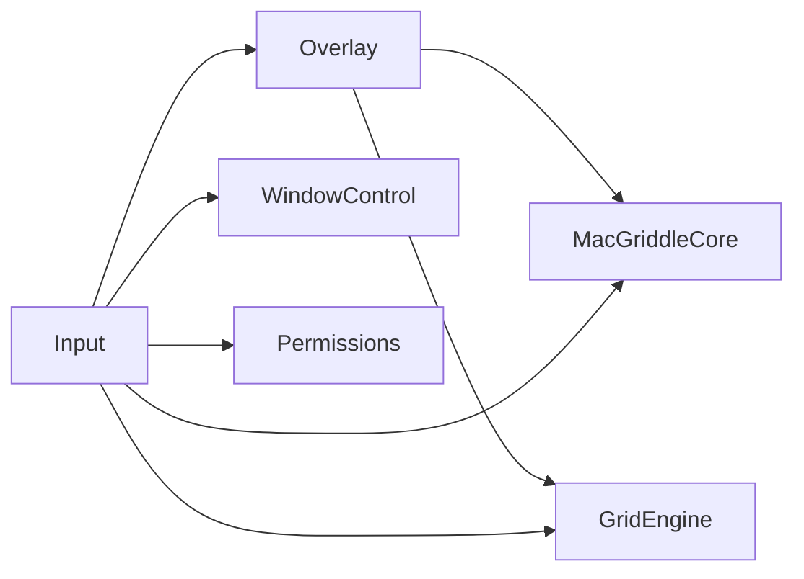
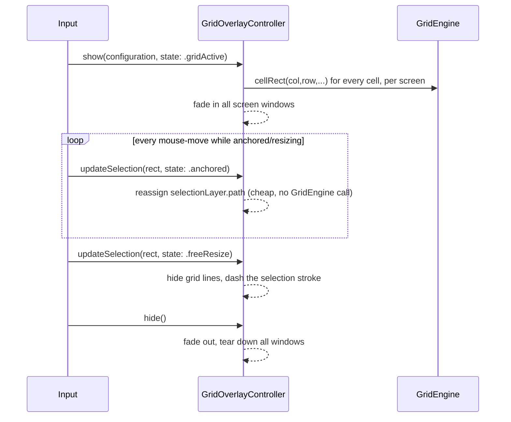

# `Overlay` — Per-Screen Grid Rendering

## Target summary

| Target | Depends on | Concern |
|---|---|---|
| `Overlay` | `MacGriddleCore`, `GridEngine` | Per-screen grid overlay `NSWindow`s + rendering |



`Overlay` sits between `GridEngine` (pure math, no AppKit) and `Input` (the state
machine that actually knows about mouse events and ⌥-key transitions). It is the only
chunk in this diagram that touches `NSWindow`/`NSScreen`/`CALayer` for grid *rendering*
specifically.

## What this chunk owns vs. does not own

**Owns:**
- Creating, positioning, showing, hiding, and destroying one borderless overlay window
  per connected screen.
- Drawing grid lines and a selection-rectangle highlight inside those windows.
- Reacting to screen-configuration changes so stale/missing windows never linger.
- Deciding, purely as a *rendering* question, which of its N screens should show the
  live selection highlight (by geometry, not by being told).

**Explicitly does not own** (called out up front because it shapes every design choice
below):
- **Grid math.** `Overlay` never computes a cell boundary or a covering rectangle
  itself — it asks `GridEngine` for cell rects when it needs to draw grid lines, and it
  receives an already-computed selection rectangle from `Input` for the live highlight.
  See the assumptions section for exactly which `GridEngine` calls this chunk assumes.
- **Gesture state.** `Overlay` never listens to a `CGEventTap`, never reads modifier
  keys, and never advances any state machine. It is handed a `GestureState` value by
  `Input` on every call and only ever *switches* on it to decide how to render — it
  never decides *when* a transition happens.
- **Window snapping.** `Overlay` never calls into `WindowControl`/`AXUIElement*`. It has
  no idea a real window is being dragged; it just draws rectangles on screens.

This is what "purely reactive" means concretely: delete every other target from the
package, stub `GridEngine`'s two functions and `GestureState`'s cases, and `Overlay`
still compiles and renders — it has no outbound knowledge of *why* it's being told to
show a particular rectangle.

---

## 1. One borderless `NSWindow` per `NSScreen`

Each screen gets its own window, sized to exactly cover that screen. Properties and the
reasoning for each:

| Property | Value | Why |
|---|---|---|
| `styleMask` | `.borderless` | No titlebar, no chrome — this window is 100% custom-drawn content. |
| `isOpaque` | `false` | Required for a window whose backing isn't fully painted; lets the desktop/other windows show through everywhere we don't draw. |
| `backgroundColor` | `.clear` | Paired with `isOpaque = false` — otherwise AppKit fills the window with an opaque default color before compositing our layers. |
| `hasShadow` | `false` | A borderless window still casts a drop shadow by default. Left on, every screen would show a faint rectangular shadow floating over the desktop even when nothing is drawn inside it — a visible bug, not a style choice. |
| `ignoresMouseEvents` | `true` | **Critical.** See callout below. |
| `level` | `.screenSaver` | See callout below. |
| `collectionBehavior` | `[.canJoinAllSpaces, .stationary, .fullScreenAuxiliary, .ignoresCycle]` | See callout below. |
| `isReleasedWhenClosed` | `false` | We manage this window's lifetime explicitly (create/destroy per gesture); don't let AppKit's close-handling double-free it. |
| `isRestorable` | `false` | Purely transient, runtime-only chrome — must never appear in macOS's window-restoration-on-relaunch flow. |
| `animationBehavior` | `.none` | We drive our own fade (Section 4) via `NSAnimationContext`; the default window-ordering animation would double up on top of that and add latency we don't want. |

```swift
/// One borderless, click-through overlay window covering exactly one `NSScreen`.
/// Owned and recreated by `GridOverlayController` (Section 2/4) — never
/// instantiated directly by `Input` or anything outside this chunk.
final class OverlayWindow: NSWindow {

    /// The view that actually draws grid lines + the selection highlight.
    /// See Section 3.
    let overlayContentView: GridOverlayContentView

    // Never let this window take key/main status. See callout below —
    // this is as important as `ignoresMouseEvents` for not disturbing
    // whatever app the user is mid-drag on.
    override var canBecomeKey: Bool { false }
    override var canBecomeMain: Bool { false }

    init(screen: NSScreen) {
        let contentFrame = NSRect(origin: .zero, size: screen.frame.size)
        overlayContentView = GridOverlayContentView(frame: contentFrame)

        super.init(
            contentRect: screen.frame,
            styleMask: [.borderless],
            backing: .buffered,
            defer: false,
            screen: screen
        )

        configureWindow(for: screen)
        contentView = overlayContentView
    }

    private func configureWindow(for screen: NSScreen) {
        level = .screenSaver
        isOpaque = false
        backgroundColor = .clear
        hasShadow = false
        ignoresMouseEvents = true
        isReleasedWhenClosed = false
        isRestorable = false
        animationBehavior = .none
        collectionBehavior = [.canJoinAllSpaces, .stationary, .fullScreenAuxiliary, .ignoresCycle]
        setFrame(screen.frame, display: false)
    }

    /// This window's frame converted to Quartz/global-display space
    /// (top-left origin, Y-down) — the same space `GridEngine` and `Input`
    /// operate in end to end, per the coordinate discipline fixed in
    /// `docs/architecture/overview.md`. ASSUMED: a shared flip helper of
    /// roughly this shape lives in `Core` — see the assumptions section for
    /// exactly what's guessed about its name/signature.
    var quartzFrame: CGRect {
        CoordinateSpace.flippedRect(frame, primaryScreenHeight: CoordinateSpace.primaryScreenHeight())
    }

    var quartzOrigin: CGPoint { quartzFrame.origin }
}
```

### Why `ignoresMouseEvents = true` is load-bearing, not incidental

The entire illusion this app depends on is: the user's real mouse-down is still being
delivered, for the whole gesture, to the real window/app underneath — AppKit's own
drag-a-window-by-its-titlebar behavior (or whatever the target app does with its own
titlebar) keeps running completely undisturbed while a grid is painted on top of it.
`Input`'s `CGEventTap` is a **listen-only** tap (per `docs/RESEARCH.md` Section B.2) —
it observes events, it does not consume or redirect them. If this overlay window were
allowed to participate in hit-testing at all, it would sit directly in front of every
pixel on screen and start swallowing clicks meant for whatever's underneath, breaking
both the real drag *and* every other app on the user's desktop for as long as the
overlay is visible. `ignoresMouseEvents = true` makes the window completely invisible
to hit-testing at the WindowServer level — not just visually transparent. Combined with
`canBecomeKey`/`canBecomeMain` returning `false` and always ordering the window front
with `orderFront(nil)` (never `makeKeyAndOrderFront(nil)`, see Section 4), the overlay
can never steal keyboard focus or frontmost-app status from whatever app the user is
dragging a window of.

### Why window level `.screenSaver`

The brief calls for floating above full-screen apps' menu bars/docks, not just above
ordinary app windows. AppKit's standard level ladder (`.normal` = 0, `.floating` = 3,
`.mainMenu` = 24, `.statusBar` = 25, `.popUpMenu` = 101 …) tops out, for anything an app
would normally reach for, well below the tier reserved for screen-saver/lock-screen-class
UI. `.screenSaver` (1000) is comfortably above all of those, which is exactly the
"must be above virtually everything" requirement here, and it's the same tier
reached for by other "always-on-top utility HUD" macOS tools for this identical need.
If a future build ever finds a specific app whose own presentation level still wins,
the escalation path is `NSWindow.Level(rawValue: Int(CGWindowLevelForKey(.maximumWindow)))`
— documented here as the next lever to pull, not implemented preemptively since nothing
in scope today demands it.

One honest caveat: no window level is a hard guarantee against *every* other app,
because another app could in principle request an even higher level for itself. This is
best-effort "float above the overwhelming majority of real-world cases," matching the
general tone of this project's feasibility research rather than an absolute promise.

### Why this `collectionBehavior`, not scoping it out

The brief explicitly allows scoping Spaces/full-screen-app visibility out of v1. This
chunk chooses **not** to scope it out, for a reason specific to *this* concern that
doesn't reopen `docs/RESEARCH.md`'s Spaces scope boundary:

- `docs/RESEARCH.md` (Section B.5, "Scope boundary confirmed by prior art") scopes out
  Spaces work that requires **private API** — moving a real window across Spaces via AX,
  or querying which Space a window "really" lives on via private `CGS*` calls. That
  boundary is about `WindowControl`/`Input` snapping a real window across Spaces, which
  this chunk never does.
- Making a purely visual, click-through overlay window *appear* on every Space (so it's
  visible regardless of which Space each connected display happens to be showing) is a
  different, much lower-risk category: it's 100% public `NSWindow.CollectionBehavior`
  API, the same mechanism legitimate HUD-style utilities (screen-recording indicators,
  annotation overlays) use.
- It's also directly motivated by the product spec's own wording: "a grid overlay
  appears on **every connected screen**" (not "every screen in the current Space"). A
  common real setup is one external display running an app full-screen while a second
  display shows the normal desktop — without this `collectionBehavior`, the grid simply
  wouldn't render on the full-screen display, silently breaking that spec line for a
  common multi-monitor configuration.

Breaking down the flags used:
- **`.canJoinAllSpaces`** — the window is visible no matter which Space is currently
  active on its screen, rather than being pinned to whichever Space existed when it was
  created.
- **`.fullScreenAuxiliary`** — permits the window to draw over another app's window that
  is itself in full-screen mode within its Space (this is the specific flag that
  addresses "over full-screen apps," as distinct from `.canJoinAllSpaces`'s "over every
  Space" concern).
- **`.stationary`** — the overlay does not participate in the slide/fade animation
  Mission Control plays when switching Spaces. This only matters for the rare case where
  a Space switch happens to fire while a gesture is active; without it the overlay could
  visually "fly" during that transition, which reads as a glitch for UI that's supposed
  to feel perfectly locked to the screen.
- **`.ignoresCycle`** — excludes the window from the standard window-cycling order
  (`Cmd+`` `), so it never becomes a target the user can accidentally cycle to.

(`.canJoinAllSpaces` and `.moveToActiveSpace` are mutually exclusive per Apple's own
documentation — this design uses only the former, never both.)

---

## 2. Multiplying across screens

Overlay windows are cheap, short-lived, and rebuilt from scratch on every `show()` call
by reading `NSScreen.screens` fresh each time — there is no persistent pool of windows
sitting around between gestures. This sidesteps an entire class of "stale screen array"
bugs for free: since a gesture only starts when the user is actively holding a mouse
button + ⌥, and ends within a few seconds, rebuilding N (typically 1–3) windows per
gesture is not a meaningful cost, and it means the window set is *always* correct for
whatever the display arrangement is *right now*.

```swift
// Members of GridOverlayController — full type assembled in Section 4.
// Shown here in isolation to focus on just the screen-multiplication concern.

private func rebuildWindows() {
    overlayWindows.forEach { $0.orderOut(nil) }
    overlayWindows = NSScreen.screens.map { OverlayWindow(screen: $0) }
}

/// Registered once at init against `NSApplication.didChangeScreenParametersNotification`.
private func screenParametersDidChange() {
    // Not currently mid-gesture: nothing to do. The next show() call will
    // read NSScreen.screens fresh and build the right window set naturally.
    guard isVisible else { return }

    // Mid-gesture screen change (monitor unplugged/lid closed/arrangement
    // changed while the user is dragging): tear down and rebuild cleanly
    // against the new screen list, and re-apply whatever grid config/state
    // was last known. Deliberately does NOT try to preserve the in-flight
    // selection rect — if the screen the anchor cell lived on just
    // disappeared, that rect may no longer mean anything. Overlay's job is
    // to not crash and not show garbage; deciding whether to keep going or
    // cancel the gesture entirely belongs to Input, not to this chunk.
    rebuildWindows()
    if let configuration = lastConfiguration, let state = lastState {
        applyConfiguration(configuration, state: state)
    }
    for window in overlayWindows {
        window.alphaValue = appearance.opacity
        window.orderFront(nil)
    }
}
```

The notification observer is registered with the closure-based
`NotificationCenter.default.addObserver(forName:object:queue:using:)` API rather than
the `@objc`/`#selector` pattern, since `GridOverlayController` is a plain Swift class,
not an `NSObject` subclass — see the full `init` in Section 4. `GridOverlayController`
is constructed once by the composition root (`app-shell-and-lifecycle.md`'s concern) and
lives for the app's entire run, so there is no realistic deinit/teardown path where this
observer registration needs to be undone.

---

## 3. Rendering approach

**Decision: a layer-backed `NSView` subclass drawing via `CAShapeLayer`, not
`SwiftUI`/`NSHostingView`.**

### Why not SwiftUI

`updateSelection` is explicitly a hot path — it's called on every mouse-move for the
entire duration of a live resize, which on a high-polling-rate mouse or a
120 Hz ProMotion display can be a lot of calls per second. Every one of those needs to
turn into an on-screen rectangle moving with effectively zero perceptible lag, because
visible lag between the cursor and the highlighted cell is precisely the kind of
"feels janky" defect that made the original WindowGrid's live-resize storms a problem in
the first place (`docs/RESEARCH.md` Part A.2), even though the underlying mechanism here
is different (we're not resizing a real window on every move, just redrawing a preview).
`NSHostingView` bridges into SwiftUI's declarative diffing/render pipeline on every state
change — real, if usually small, overhead that buys nothing here, because the content
being drawn (a handful of lines plus one highlighted rectangle) has none of the
complexity SwiftUI's data-binding and layout system is actually good for.

### Why `CAShapeLayer`, not just raw `draw(_:)`

Both options avoid SwiftUI's overhead, but a further split is worth making explicit:
- `draw(_:)` + `setNeedsDisplay(_:)` is CPU-bound — every invalidated frame re-enters
  `NSGraphicsContext` and repaints.
- A `CAShapeLayer` whose `.path` is reassigned is compositor-side — Core Animation just
  hands the GPU a new path to composite on the next frame; there is no CPU-side redraw
  pass at all for a plain property update like this.

This design uses two persistent shape layers per screen — one for grid lines (rebuilt
rarely: on `show()` and only again if `GridConfiguration` changes mid-gesture), one for
the selection highlight (rebuilt on every `updateSelection` call). The hot path is
therefore reduced to "build one `CGPath` rect, assign it to `.path`" — no view redraw,
no layout pass, and (per the module boundary in the intro) no `GridEngine` call either,
since the rect arrives pre-computed.

```swift
/// Layer-backed content view hosted by each OverlayWindow. Draws grid lines
/// (rare updates) and the selection highlight (hot path) as two independent
/// CAShapeLayers so the hot path never touches draw(_:) or SwiftUI.
final class GridOverlayContentView: NSView {
    private let gridLinesLayer = CAShapeLayer()
    private let selectionLayer = CAShapeLayer()

    override init(frame frameRect: NSRect) {
        super.init(frame: frameRect)
        commonInit()
    }

    required init?(coder: NSCoder) {
        super.init(coder: coder)
        commonInit()
    }

    /// Makes this view's (and therefore its backing layer's) coordinate
    /// system top-left-origin, Y-down — matching Quartz/global-display
    /// space exactly. With this in place, converting a GridEngine/Input
    /// rect (already in that same space) into this layer's local space is
    /// a pure translation (subtract this screen's Quartz origin) — no axis
    /// flip math anywhere in this view. This is a direct application of the
    /// coordinate discipline `docs/RESEARCH.md` Section B.3 calls out as the
    /// #1 source of "wrong monitor" bugs in hand-rolled window managers.
    override var isFlipped: Bool { true }

    private func commonInit() {
        wantsLayer = true
        gridLinesLayer.fillColor = nil // stroke-only
        selectionLayer.fillRule = .nonZero
        layer?.addSublayer(gridLinesLayer)
        layer?.addSublayer(selectionLayer)
    }

    /// Cosmetic-only update — safe to call whenever appearance settings
    /// change, independent of grid/selection geometry.
    func applyAppearance(_ appearance: OverlayAppearance) {
        gridLinesLayer.strokeColor = appearance.cellStrokeColor.cgColor
        gridLinesLayer.lineWidth = 1
        selectionLayer.fillColor = appearance.selectionFillColor.cgColor
        selectionLayer.strokeColor = appearance.selectionStrokeColor.cgColor
        selectionLayer.lineWidth = 2
        window?.alphaValue = appearance.opacity
    }

    /// COLD PATH — called from show(configuration:state:), and again only
    /// if GridConfiguration changes mid-gesture. Never called from the
    /// per-mouse-move hot path. This is the only place this chunk calls
    /// into GridEngine (ASSUMED signature — see assumptions section).
    func rebuildGridLines(configuration: GridConfiguration, screenFrame: CGRect, quartzOrigin: CGPoint) {
        let path = CGMutablePath()
        for row in 0..<configuration.rows {
            for column in 0..<configuration.columns {
                let cellRect = GridEngine.cellRect(column: column, row: row, in: configuration, screenFrame: screenFrame)
                path.addRect(cellRect.offsetBy(dx: -quartzOrigin.x, dy: -quartzOrigin.y))
            }
        }
        gridLinesLayer.path = path
    }

    func setGridLinesVisible(_ visible: Bool) {
        gridLinesLayer.isHidden = !visible
    }

    /// HOT PATH — called on every updateSelection. O(1): one CGPath, one
    /// property assignment. No GridEngine call, no view redraw, no layout.
    func setSelection(_ rect: CGRect?, quartzOrigin: CGPoint) {
        guard let rect else {
            selectionLayer.path = nil
            return
        }
        let localRect = rect.offsetBy(dx: -quartzOrigin.x, dy: -quartzOrigin.y)
        selectionLayer.path = CGPath(rect: localRect, transform: nil)
    }

    /// See Section 5.
    func setFreeResizeStyle(_ isFreeResize: Bool) {
        selectionLayer.lineDashPattern = isFreeResize ? [6, 4] : nil
    }
}
```

The `rebuildGridLines`/`setSelection` split is also exactly how the `GridEngine`
dependency in the target table cashes out in practice: `Overlay` links against
`GridEngine` to draw the **static** grid (cell-rect lookups, done once per `show()`),
while the **live** selection rectangle is hot-path data handed in by `Input` as a plain
`CGRect` — `Overlay` never calls `GridEngine`'s "covering rect" function itself. See the
assumptions section for why this split is inferred rather than confirmed.

---

## 4. Show/hide lifecycle & public API

```swift
/// The seam Input codes against. Defined here since Overlay owns this
/// contract's shape — core-contracts.md may define an equivalent; flagged
/// for the combiner to reconcile if so (see assumptions section).
protocol GridOverlayRendering: AnyObject {
    func show(configuration: GridConfiguration, state: GestureState)
    func updateSelection(rect: CGRect, state: GestureState)
    func hide()
}
```

| Method | Called | Cost |
|---|---|---|
| `show(configuration:state:)` | Once, when the grid overlay should first appear (gesture enters grid-active) | Rebuilds windows, rebuilds grid lines per screen, fades in. Not hot. |
| `updateSelection(rect:state:)` | Continuously, on every relevant mouse-move while resizing/free-resizing | O(1) per call — the entire point of the design in Section 3. |
| `hide()` | Once, when the gesture ends (committed, cancelled, or panic-reset) | Fades out, tears down windows. Not hot. |

This folds `GestureState` into `show`/`updateSelection` rather than adding a fourth
setter, since every meaningful visual transition already coincides with one of those two
calls — including a free-resize toggle, which per `docs/RESEARCH.md` Part A.2/A.3 is
reversible mid-gesture and would naturally arrive alongside the next selection update
since the cursor is presumably still moving. This keeps the public surface at exactly
the three methods the brief suggests.

```swift
/// Not an NSWindowController subclass on purpose — that type models a single
/// window, and this one intentionally owns N of them (one per connected
/// screen), rebuilt on every show(). Constructed once by the composition
/// root and lives for the app's whole run.
final class GridOverlayController: GridOverlayRendering {
    private var overlayWindows: [OverlayWindow] = []
    private var appearance: OverlayAppearance
    private var isVisible = false
    private var lastConfiguration: GridConfiguration?
    private var lastState: GestureState?

    init(appearance: OverlayAppearance) {
        self.appearance = appearance
        NotificationCenter.default.addObserver(
            forName: NSApplication.didChangeScreenParametersNotification,
            object: nil,
            queue: .main
        ) { [weak self] _ in
            self?.screenParametersDidChange()
        }
    }

    // MARK: - GridOverlayRendering

    func show(configuration: GridConfiguration, state: GestureState) {
        lastConfiguration = configuration
        lastState = state
        rebuildWindows()
        applyConfiguration(configuration, state: state)
        fadeIn()
        isVisible = true
    }

    func updateSelection(rect: CGRect, state: GestureState) {
        lastState = state
        guard let target = overlayWindows.max(by: { overlapArea($0, rect) < overlapArea($1, rect) }) else { return }
        for window in overlayWindows {
            let view = window.overlayContentView
            view.setGridLinesVisible(shouldShowGridLines(for: state))
            if window === target {
                view.setFreeResizeStyle(isFreeResize(state))
                view.setSelection(rect, quartzOrigin: window.quartzOrigin)
            } else {
                view.setSelection(nil, quartzOrigin: window.quartzOrigin)
            }
        }
    }

    func hide() {
        guard isVisible else { return }
        isVisible = false
        fadeOutThenTeardown()
    }

    // MARK: - Screen configuration changes (Section 2)

    private func screenParametersDidChange() {
        guard isVisible else { return }
        rebuildWindows()
        if let configuration = lastConfiguration, let state = lastState {
            applyConfiguration(configuration, state: state)
        }
        for window in overlayWindows {
            window.alphaValue = appearance.opacity
            window.orderFront(nil)
        }
    }

    // MARK: - Window lifecycle

    private func rebuildWindows() {
        overlayWindows.forEach { $0.orderOut(nil) }
        overlayWindows = NSScreen.screens.map { OverlayWindow(screen: $0) }
    }

    private func applyConfiguration(_ configuration: GridConfiguration, state: GestureState) {
        for window in overlayWindows {
            window.overlayContentView.applyAppearance(appearance)
            window.overlayContentView.rebuildGridLines(
                configuration: configuration,
                screenFrame: window.quartzFrame,
                quartzOrigin: window.quartzOrigin
            )
            window.overlayContentView.setGridLinesVisible(shouldShowGridLines(for: state))
        }
    }

    private func fadeIn() {
        for window in overlayWindows {
            window.alphaValue = 0
            window.orderFront(nil) // never makeKeyAndOrderFront — see Section 1
        }
        NSAnimationContext.runAnimationGroup { context in
            context.duration = 0.12
            overlayWindows.forEach { $0.animator().alphaValue = appearance.opacity }
        }
    }

    private func fadeOutThenTeardown() {
        // Capture and clear self.overlayWindows immediately (rather than
        // after the animation completes) so a fast hide() followed by a
        // new show() never touches windows that are still mid-fade-out —
        // the new show() simply builds a fresh set.
        let windowsToClose = overlayWindows
        overlayWindows = []
        NSAnimationContext.runAnimationGroup({ context in
            context.duration = 0.1
            windowsToClose.forEach { $0.animator().alphaValue = 0 }
        }, completionHandler: {
            windowsToClose.forEach { $0.orderOut(nil) }
        })
    }

    // MARK: - Helpers

    private func overlapArea(_ window: OverlayWindow, _ rect: CGRect) -> CGFloat {
        let intersection = window.quartzFrame.intersection(rect)
        return intersection.isNull ? 0 : intersection.width * intersection.height
    }

    private func shouldShowGridLines(for state: GestureState) -> Bool {
        switch state {
        case .gridActive, .anchored:
            return true
        case .idle, .dragging, .freeResize, .committed, .cancelled:
            return false
        }
    }

    private func isFreeResize(_ state: GestureState) -> Bool {
        if case .freeResize = state { return true }
        return false
    }
}
```

Note that `updateSelection` never receives (or needs) a screen parameter: since the
incoming rect is already in Quartz-global space, `Overlay` determines which screen's
window should show the highlight purely by finding the greatest-overlap `quartzFrame`
among its own windows (`overlapArea`/`max(by:)` above). Figuring out "which physical
screen does this rect belong to" is ordinary geometry, not grid math, so it's reasonable
for this chunk to own it rather than requiring `Input` to pass a screen reference through.



---

## 5. Free-resize visual variant

Grid-snapped and free-resize modes must read as clearly different states at a glance,
since the whole point of the mode (per `docs/RESEARCH.md` Part A.2/A.3) is that the
window will land on an arbitrary rectangle instead of a grid cell boundary.

| | Grid-snapped (`.gridActive` / `.anchored`) | Free-resize (`.freeResize`) |
|---|---|---|
| Grid lines | Visible (`gridLinesLayer.isHidden = false`) | Hidden (`gridLinesLayer.isHidden = true`) |
| Selection stroke | Solid | Dashed (`lineDashPattern = [6, 4]`) |
| Selection fill/stroke colors | From `OverlayAppearance`, unchanged | Same colors, unchanged |
| Selection rect source | Grid-cell-aligned covering rect (computed upstream by `Input`/`GridEngine`) | Raw cursor-driven rect (computed upstream by `Input`; passed through unchanged) |

Both toggles (`setGridLinesVisible`, `setFreeResizeStyle`) are driven purely by
`GestureState` inside `updateSelection`/`applyConfiguration` — no new fields are needed
from `OverlayAppearance` for this. The dash pattern is an `Overlay`-internal constant,
not an injected setting: it's a rendering *treatment* of the mode, not a user preference,
so keeping it out of the appearance object's surface area matches the instruction not to
guess additional settings fields beyond the four named in the brief. Hiding grid lines
this way is effectively free — a hidden `CAShapeLayer` doesn't composite at all, so
toggling modes back and forth mid-gesture (per the "reversible mid-gesture" behavior in
`docs/RESEARCH.md`) costs nothing beyond the same `setSelection` call already happening
on every cursor move.

---

## Non-goals for v1

- No per-cell hover highlighting as the cursor crosses unanchored cells — only the
  single selection/covering rectangle described above is rendered. Not requested by the
  brief; can be added later as another `CAShapeLayer` if wanted.
- No visual difference between "live-resize" and "snap-on-release" Preferences modes —
  those affect whether `WindowControl` moves the *real* window during the drag, not
  what `Overlay` draws. `Overlay` always renders the same preview rectangle regardless
  of that setting.
- No attempt to keep the overlay visible across a real macOS Space switch initiated
  independent of screen-parameter changes (e.g., a four-finger swipe mid-gesture) beyond
  what `.canJoinAllSpaces`/`.fullScreenAuxiliary` give for free — no additional
  Space-change notification handling beyond `didChangeScreenParametersNotification`.
- No attempt to guarantee visibility above literally every other app's window level —
  best-effort via `.screenSaver`, as noted in Section 1.

---

## Assumptions about sibling chunks (flagged)

Everything below is a place this chunk had to guess at a sibling's shape because that
chunk's file isn't visible here. Nothing above depends on these guesses being *exactly*
right in every detail — the reasoning for each design choice is included above so the
combiner/implementer can adjust the call sites without rethinking the architecture.

- **`GridEngine`** (grid-engine.md, sibling, not visible). Confirmed to exist with
  roughly this shape both by the task brief and by `overview.md`'s own chunk-6
  description ("cell rects for (cols, rows) over a screen frame, anchor+cursor →
  covering rectangle"). What's actually guessed:
  - The exact call signature used above,
    `GridEngine.cellRect(column:row:in:screenFrame:) -> CGRect` — real name, parameter
    order, whether it's a static namespace/enum vs. a protocol/instance, and whether
    `column`/`row` are raw `Int`s vs. a `Cell`/`GridPosition` struct are all unconfirmed.
  - That the "covering rect for anchor+current cell" function is called by `Input`
    (not by `Overlay`) — this chunk infers that split from the fact that
    `updateSelection` is specified to take a ready-made `rect:` rather than
    column/row indices, but it's possible `GridEngine` is instead called from inside
    `Overlay` on every `updateSelection`. If so, only `updateSelection`'s body would
    need to change (call `GridEngine.coveringRect(...)` instead of taking `rect`
    as a parameter) — the rest of this design, including the hot-path performance
    reasoning in Section 3, is unaffected either way as long as whichever call happens
    on the hot path stays O(1)/allocation-light.
  - That `screenFrame` is expressed in Quartz-global space (consistent with
    `overview.md`'s fixed coordinate-space decision that the whole hit-test/frame-math
    pipeline stays in Quartz end to end) rather than Cocoa or screen-local space.

- **`GestureState`** (core-contracts.md, sibling, not visible). Confirmed to be a real
  named type owned by that chunk; the case list used above
  (`idle`/`dragging`/`gridActive`/`anchored`/`freeResize`/`committed`/`cancelled`) is
  the illustrative set suggested by the brief, not a confirmed enum definition. This
  chunk's rendering logic only ever `switch`es on the *case*, never unpacks associated
  values (e.g. anchor/current cell indices, if any exist) — all geometry `Overlay` needs
  arrives pre-computed via the `rect:` parameter on `updateSelection`. That makes this
  design robust to the real enum's exact associated-value shape; only the two small
  `switch` statements (`shouldShowGridLines`, `isFreeResize`) would need their case names
  adjusted if the real enum differs from this guess.

- **`GridConfiguration`** (core-contracts.md, sibling, not visible). Confirmed to be a
  real named type (per `overview.md`'s chunk-2 description and the fixed "6 columns × 4
  rows" default). Assumed to expose `columns: Int` and `rows: Int` (or equivalent) —
  exact field names not visible.

- **`OverlayAppearance`** (preferences-ui.md, sibling, not visible). The brief specifies
  four field names directly (`cellStrokeColor`, `selectionFillColor`,
  `selectionStrokeColor`, an `opacity`-ish field); this chunk assumes exactly those four
  and no more — `cellStrokeColor: NSColor`, `selectionFillColor: NSColor`,
  `selectionStrokeColor: NSColor`, `opacity: Double`. Two things were guessed beyond the
  names themselves:
  - That `opacity` applies to the **overall overlay window's `alphaValue`**, rather than
    being baked separately into each color's own alpha channel. This was a deliberate
    pick (simplest single knob, matches how `docs/RESEARCH.md` Part A describes
    WindowGrid/WinGrid11's config as "grid colors/opacity" as a related-but-separate
    settings pair), not a certainty.
  - That stroke/line **widths** are not part of this settings object at all — this
    chunk hardcodes them as internal constants (1pt grid lines, 2pt selection stroke)
    specifically to avoid guessing at additional injected fields beyond the four named
    in the brief. If `Preferences` does expose width fields, only
    `applyAppearance(_:)`'s body needs updating.

- **Core's coordinate-flip utility** (referenced as `CoordinateSpace.flippedRect(_:primaryScreenHeight:)`
  and `CoordinateSpace.primaryScreenHeight()` in `OverlayWindow.quartzFrame`). The
  *existence* of some shared helper along these lines is a fixed cross-cutting decision
  in `overview.md` (flip against `NSScreen.screens[0].frame.height`, never
  `NSScreen.main`) and is spelled out concretely in `docs/RESEARCH.md` Section B.3.1.
  What's guessed here is purely the exact namespace/function names this chunk used to
  call it — if `core-contracts.md` names this differently, only the implementation of
  `OverlayWindow.quartzFrame` needs to change, not the surrounding design.
