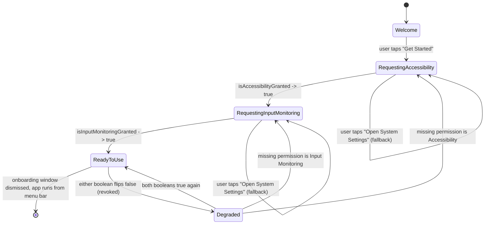

# Permissions Model

## Scope

This chunk designs the `Permissions` target: the check/request/observe logic for macOS's
two independently-gated TCC permissions MacGriddle needs. Per `docs/RESEARCH.md`
(Sections B.1.1, B.2.1) and the overview's cross-cutting decisions, these are **not**
substitutes for one another and must never be treated as one combined "is the app
allowed to run" flag:

| Permission | Raw check API | Raw prompt API | Gates |
|---|---|---|---|
| **Accessibility** | `AXIsProcessTrusted()` | `AXIsProcessTrustedWithOptions(_:)` | All `AXUIElement*` window read/move/resize calls (`WindowControl`) |
| **Input Monitoring** | `CGPreflightListenEventAccess()` | `CGRequestListenEventAccess()` | The listen-only `CGEventTap` that detects the drag + Option gesture (`Input`) |

Per the fixed project layout, `Permissions` depends on `MacGriddleCore` only — it has no
target dependency on `WindowControl`, `Input`, `Overlay`, `Preferences`, or `StatusBar`.
This document owns the *logic and observable state*; it does not own:

- The exact shape of `PermissionsProviding` — that's `core-contracts.md` (chunk 2). See
  the assumption callout immediately below.
- Rendering onboarding screens as SwiftUI views — no target other than the `MacGriddle`
  executable (composition root) depends on both `Permissions` and a UI-hosting target, so
  actual screen composition is `app-shell-and-lifecycle.md` (chunk 8) /
  `preferences-ui.md` (chunk 9) territory. This document specifies the *states and
  transitions* that UI must render (Section 4), and the concrete API it renders them from.
- Consuming these booleans to gate real AX calls or tap creation — that's
  `window-control-and-coordinates.md` (chunk 5) and `input-engine-and-state-machine.md`
  (chunk 4). This document explains *why* they must (Section 5) and what this target
  hands them (Section 3), but the gating code itself lives in those chunks.

### Assumption flagged — `core-contracts.md` was not visible while writing this

Everything below is designed against this assumed shape for `PermissionsProviding`:

```swift
public protocol PermissionsProviding: ObservableObject {
    var isAccessibilityGranted: Bool { get }
    var isInputMonitoringGranted: Bool { get }

    func requestAccessibility()
    func requestInputMonitoring()
    func refreshStatus()
}
```

Specifically I assumed:

- **Two independently observable booleans**, exposed as plain `{ get }` properties on a
  protocol that itself requires `ObservableObject` conformance — not, say, two Combine
  `AnyPublisher<Bool, Never>` properties, and not an `async` stream. `ObservableObject`
  is a `Combine` framework type (not SwiftUI), so requiring it here doesn't force this
  Core-only target into a SwiftUI dependency; it just means the concrete type backs the
  properties with `@Published` so SwiftUI views elsewhere (Preferences/Onboarding, per the
  overview) can bind to them directly with no adapter layer.
- **Request methods return `Void`, not `Bool`.** This is a deliberate choice, not an
  oversight — seeing the *why* mattered enough that I've called it out again in Section 3,
  because the underlying `AXIsProcessTrustedWithOptions`/`CGRequestListenEventAccess`
  calls *do* return `Bool`, and a naive port would expose that return value and invite
  every caller to misuse it as "did the user grant it."
- **A `refreshStatus()` escape hatch** for manual re-checks (e.g. a "Check Again" button,
  or `StatusBar` forcing a refresh when its menu opens), separate from the automatic
  polling in Section 3.

If `core-contracts.md` lands on a different shape (Combine publishers instead of
`@Published`-style properties, `async`/`await` request methods, additional cases, etc.),
only the concrete `PermissionsMonitor` class in Section 3 needs to change shape to
conform. Sections 1, 2, 4, and 5 are unaffected — they depend only on "two independently
observable booleans plus a way to trigger each OS prompt," not on the protocol's exact
Swift syntax.

### Target shape

- **Target**: `Permissions`. **Package dependency**: `MacGriddleCore` only.
- **System framework imports** (Apple SDK frameworks — these do *not* appear in the
  `Package.swift` target-dependency table in `project-structure.md`, which only lists
  in-package target dependencies): `ApplicationServices` (Accessibility),
  `CoreGraphics` (Input Monitoring), `AppKit` (`NSApplication.didBecomeActiveNotification`,
  `NSWorkspace` for deep links), `Combine` (`ObservableObject`/`@Published`).
- **Public surface**: a `PermissionsProviding`-conforming `PermissionsMonitor` class, and
  a `SystemSettingsDeepLink` helper (Section 4). Everything else in this target — the two
  raw-API wrapper namespaces below — stays internal; nothing outside `Permissions` should
  ever call `AXIsProcessTrusted*`/`CGPreflight*`/`CGRequest*` directly. Centralizing them
  here is the entire point of this target existing as its own module rather than letting
  every consumer poke TCC directly.

---

## 1. Accessibility Permission

```swift
import ApplicationServices

/// Raw Accessibility TCC check/request calls. Internal to the `Permissions`
/// target — `PermissionsMonitor` (Section 3) is the only caller.
enum AccessibilityPermission {

    /// Silent check — never shows UI, safe to call as often as needed.
    static func isGranted() -> Bool {
        AXIsProcessTrusted()
    }

    /// Actively prompts the user with the system "MacGriddle would like to
    /// control this computer using accessibility features" dialog — but
    /// only the FIRST time this process's code-signing identity is ever
    /// asked. Every call after an explicit Allow/Deny is a silent no-op
    /// that just returns the current trust state (RESEARCH.md B.1.1).
    ///
    /// - Important: the `Bool` this returns is the trust state at the
    ///   instant of the call — almost always still `false` immediately
    ///   after showing the prompt, because the user hasn't acted on the
    ///   system dialog yet. Never treat this return value as "the user
    ///   granted access." The real outcome shows up later, asynchronously,
    ///   through `isGranted()` — via the poll timer or
    ///   `didBecomeActiveNotification` (Section 3).
    @discardableResult
    static func requestPrompt() -> Bool {
        let promptKey = kAXTrustedCheckOptionPrompt.takeUnretainedValue() as String
        let options: NSDictionary = [promptKey: true]
        return AXIsProcessTrustedWithOptions(options)
    }
}
```

**When to call `isGranted()` (silent check):**

- On app launch, before the composition root decides whether to show onboarding or go
  straight to the normal running state.
- Every tick of the poll timer described in Section 3.
- On every `NSApplication.didBecomeActiveNotification` (Section 3).
- As a cheap defensive pre-flight inside `WindowControl` before attempting an AX call.
  `WindowControl` must still handle an `.apiDisabled` `AXError` on the actual call
  regardless of this pre-flight — the permission can be revoked in the gap between the
  check and the call (an inherent TOCTOU window with any OS permission, not something
  this target can close; see `window-control-and-coordinates.md`).

**When to call `requestPrompt()` (prompting check):**

- Only inside the direct handler of an explicit user action — a "Grant Accessibility
  Access…" button click in the onboarding UI (Section 4). Never on a timer, never
  automatically on launch or on becoming active — that would either do nothing useful
  (one-shot already consumed) or surprise the user with a system dialog they didn't
  directly ask for in that moment.
- Safe to call more than once across the app's lifetime (e.g. the user leaves onboarding
  and comes back later), but it only shows the system dialog the first time ever for this
  signing identity; every later call is a silent passthrough. There is no API to ask
  "has the one-shot prompt already been consumed?" — treat "still not granted a couple
  seconds after tapping the button" as the signal to reveal the System Settings deep-link
  fallback (Section 4), rather than trying to detect one-shot state directly.

---

## 2. Input Monitoring Permission

```swift
import CoreGraphics

/// Raw Input Monitoring TCC check/request calls. Internal to the
/// `Permissions` target — `PermissionsMonitor` (Section 3) is the only
/// caller.
enum InputMonitoringPermission {

    /// Silent check — never shows UI, safe to call as often as needed.
    static func isGranted() -> Bool {
        CGPreflightListenEventAccess()
    }

    /// Actively prompts with the system "MacGriddle would like to receive
    /// keystrokes and other input from other applications" dialog. Same
    /// one-shot-per-code-identity behavior as Accessibility
    /// (RESEARCH.md B.2.1), and the same caveat: the returned `Bool` is the
    /// state at the moment of the call, not a confirmed post-prompt result.
    @discardableResult
    static func requestPrompt() -> Bool {
        CGRequestListenEventAccess()
    }
}
```

**When to call `isGranted()` (silent check):** identical timing to Accessibility's
silent check above — launch, poll tick, `didBecomeActiveNotification`. The one addition
specific to this permission: `Input`'s gesture engine should treat `isGranted()` (surfaced
through `PermissionsProviding`) as a condition it can transition on *while already
running*, not just a boot-time gate. `CGEvent.tapCreate` returns `nil` — silently, no
thrown error — if Input Monitoring isn't granted at creation time (RESEARCH.md B.2.2), so
`Input` needs to retry tap creation when this boolean flips from `false` to `true` mid-session
(the user granting it during onboarding, or re-granting it after a revocation) rather than
only ever attempting `tapCreate` once at launch. See `input-engine-and-state-machine.md`.

**When to call `requestPrompt()` (prompting check):** identical timing to Accessibility's
prompting check above — only from an explicit "Grant Input Monitoring Access…" button
click in the onboarding UI, never automatically.

---

## 3. Polling & Observing Strategy

macOS has no push notification for "the user just flipped a TCC checkbox in System
Settings." `PermissionsMonitor` — the concrete `PermissionsProviding` implementation —
has to actively discover both grants and revocations. Two signals are combined, rather
than picking just one, because they cover different real-world timings:

1. **`NSApplication.didBecomeActiveNotification`** — the primary signal. The overwhelmingly
   common real path is: user is on the onboarding screen → clicks "Grant Accessibility
   Access…" → System Settings opens and MacGriddle resigns active → user toggles the
   checkbox → user switches back to MacGriddle (click, ⌘-Tab, or just clicking anywhere
   in it), which reactivates it. This is event-driven (zero cost while nothing is
   happening) and covers both "just granted during onboarding" and "revoked later while
   the app was in the background."
2. **A short-interval timer, but only while a permission is actually outstanding.** The
   notification above misses the case where the user grants the permission without
   MacGriddle ever losing active status having already lost it once (e.g. they act on the
   System Settings dialog quickly, or some other window transition doesn't route through
   `didBecomeActive` the way expected). A 1-second poll gives onboarding a checkmark that
   appears "immediately" instead of only reacting to a focus change, at negligible cost —
   both underlying calls are cheap, synchronous, local checks, not network or disk I/O.
   The timer only exists while `!(isAccessibilityGranted && isInputMonitoringGranted)`; it
   invalidates itself the instant both become true, so there is no permanent busy-loop
   running for the rest of the app's lifetime once setup is complete. If a permission is
   later revoked, the same timer re-arms (Section 4's `Degraded` state) until both are
   true again.

```swift
import AppKit
import Combine

/// Concrete implementation of `PermissionsProviding` (core-contracts.md).
/// Owns all polling/observing logic so nothing outside this target ever
/// has to know *how* a grant or a revocation gets discovered.
public final class PermissionsMonitor: ObservableObject, PermissionsProviding {

    @Published public private(set) var isAccessibilityGranted: Bool
    @Published public private(set) var isInputMonitoringGranted: Bool

    /// Non-nil only while at least one permission is outstanding
    /// (first-run onboarding, or a later re-grant recovery flow).
    /// This is what keeps the strategy from being a permanent busy-loop.
    private var pollTimer: Timer?
    private let pollInterval: TimeInterval = 1.0
    private var activationObserver: NSObjectProtocol?

    public init() {
        isAccessibilityGranted = AccessibilityPermission.isGranted()
        isInputMonitoringGranted = InputMonitoringPermission.isGranted()

        activationObserver = NotificationCenter.default.addObserver(
            forName: NSApplication.didBecomeActiveNotification,
            object: nil,
            queue: .main
        ) { [weak self] _ in
            self?.refreshStatus()
        }

        startPollingIfNeeded()
    }

    deinit {
        pollTimer?.invalidate()
        if let activationObserver {
            NotificationCenter.default.removeObserver(activationObserver)
        }
    }

    // MARK: - PermissionsProviding

    public func requestAccessibility() {
        // Void return by design — see the callout below. The prompt is
        // fired; the real answer arrives later through the published
        // booleans, not through this call's return value.
        AccessibilityPermission.requestPrompt()
        startPollingIfNeeded()
    }

    public func requestInputMonitoring() {
        InputMonitoringPermission.requestPrompt()
        startPollingIfNeeded()
    }

    public func refreshStatus() {
        isAccessibilityGranted = AccessibilityPermission.isGranted()
        isInputMonitoringGranted = InputMonitoringPermission.isGranted()
        startPollingIfNeeded() // re-arms if something just became ungranted
    }

    // MARK: - Private

    /// Starts the fast poll only when at least one permission is
    /// outstanding; stops itself the instant both are granted.
    private func startPollingIfNeeded() {
        guard pollTimer == nil else { return }
        guard !(isAccessibilityGranted && isInputMonitoringGranted) else { return }

        let timer = Timer(timeInterval: pollInterval, repeats: true) { [weak self] _ in
            guard let self else { return }
            let ax = AccessibilityPermission.isGranted()
            let im = InputMonitoringPermission.isGranted()
            if ax != self.isAccessibilityGranted { self.isAccessibilityGranted = ax }
            if im != self.isInputMonitoringGranted { self.isInputMonitoringGranted = im }
            if ax && im {
                self.pollTimer?.invalidate()
                self.pollTimer = nil
            }
        }
        // .common so the timer still fires while a menu is tracking
        // (the NSStatusItem menu is open) or a modal onboarding window is
        // running — same reasoning RESEARCH.md B.2.2 gives for attaching
        // the CGEventTap's run-loop source to .commonModes. Using the
        // non-auto-scheduling `Timer(timeInterval:repeats:block:)`
        // initializer and adding it to .common explicitly (rather than
        // `Timer.scheduledTimer`, which auto-adds to .default) avoids any
        // ambiguity about double registration.
        RunLoop.main.add(timer, forMode: .common)
        pollTimer = timer
    }
}
```

**Design callout — why `requestAccessibility()`/`requestInputMonitoring()` return `Void`:**
`AXIsProcessTrustedWithOptions` and `CGRequestListenEventAccess` both return a `Bool`
synchronously. It is tempting to expose that value from `PermissionsProviding`'s request
methods and let callers treat `true` as "granted." That would be a bug: the returned value
reflects trust state at the moment of the call, before the user has had any chance to act
on the dialog that call just triggered. Dropping it from the protocol's method signature
(the wrapper functions above still return it, marked `@discardableResult`, purely so a
future call site *could* inspect it for logging without being forced to) removes the
temptation entirely and makes "read `isAccessibilityGranted`/`isInputMonitoringGranted`
afterward, not the call's return value" the only path available through the public
contract.

---

## 4. Onboarding UX Flow

### States

| State | Shown when | What the screen says / does |
|---|---|---|
| `welcome` | First launch, neither permission checked yet, or user hasn't dismissed the intro | Brief explanation: MacGriddle needs two separate permissions — Accessibility ("so it can see and move other apps' windows") and Input Monitoring ("so it can notice when you hold Option while dragging"). One "Get Started" button. |
| `requestingAccessibility` | `isAccessibilityGranted == false` | Explains Accessibility specifically. A "Grant Accessibility Access…" button calls `requestAccessibility()`. A secondary "Open System Settings" link (visible from the start, not just after a failed attempt) uses `SystemSettingsDeepLink.accessibility` below, since the one-shot system prompt may already be spent from a prior run. Screen auto-advances the instant `isAccessibilityGranted` flips `true` — no separate "Continue" click needed. |
| `requestingInputMonitoring` | `isAccessibilityGranted == true`, `isInputMonitoringGranted == false` | Same shape, for Input Monitoring: explains "notices when you hold Option while dragging," button calls `requestInputMonitoring()`, fallback link uses `SystemSettingsDeepLink.inputMonitoring`. Auto-advances on `isInputMonitoringGranted → true`. |
| `readyToUse` | Both booleans `true` | Brief "You're all set" confirmation; dismisses the onboarding window and hands off to the app's normal running state (menu bar icon live, `Input`'s tap installed — see `app-shell-and-lifecycle.md`). |
| `degraded(missing:)` | Either boolean flips `false` **after** onboarding already reached `readyToUse` once | Not a crash, not silence — a distinct "MacGriddle lost access to <permission>, its grid gesture won't work until you re-grant it" state. Reuses the *same* `requestingAccessibility`/`requestingInputMonitoring` screen (same button, same deep link), just entered from a different trigger than first-run onboarding. `StatusBar` (chunk 10) should also reflect this visually (e.g. a dimmed/warning menu-bar icon) independent of whether the onboarding window itself is currently on screen — a user who dismissed the window shouldn't have to reopen it to notice something's wrong. |



A lightweight convenience type is suggested here — **not** asserted as part of
`PermissionsProviding` itself, since owning "onboarding screen sequencing" could equally
reasonably land in chunk 8's app-shell composition root. Whichever chunk ends up owning
the actual `enum`, this is the mapping it should implement, derived purely from the two
booleans plus one piece of state (`hasCompletedOnboardingOnce`) that more naturally lives
in `Preferences`' `UserDefaults`-backed store (chunk 9) than in this Core-only target:

```swift
public enum OnboardingStage: Equatable {
    case welcome
    case requestingAccessibility
    case requestingInputMonitoring
    case readyToUse
    case degraded(missing: MissingPermission)
}

public enum MissingPermission: Equatable {
    case accessibility
    case inputMonitoring
    case both
}
```

### Deep links

Both privacy panes are addressable via the `x-apple.systempreferences:` URL scheme.
The Accessibility fragment is confirmed directly in `docs/RESEARCH.md` (B.1.1); the Input
Monitoring fragment (`Privacy_ListenEvent`) was verified against Apple's current System
Settings URL scheme for macOS 13 (Ventura) specifically, since the two panes use different
anchor names and getting this wrong silently opens the generic Privacy & Security pane
instead of jumping straight to the right section:

```swift
import AppKit

public enum SystemSettingsDeepLink {
    case accessibility
    case inputMonitoring

    public var url: URL {
        switch self {
        case .accessibility:
            return URL(string: "x-apple.systempreferences:com.apple.preference.security?Privacy_Accessibility")!
        case .inputMonitoring:
            return URL(string: "x-apple.systempreferences:com.apple.preference.security?Privacy_ListenEvent")!
        }
    }

    public func open() {
        NSWorkspace.shared.open(url)
    }
}
```

### Revocation handling (not just first-run)

RESEARCH.md is explicit that either permission "can be revoked independently at any time
from System Settings," and that a revoked tap/AX call fails silently rather than crashing
or throwing. The onboarding/permissions UI must never assume `readyToUse` is a terminal
state:

- `PermissionsMonitor` keeps observing after reaching `readyToUse` (via
  `didBecomeActiveNotification`, at zero ongoing timer cost — Section 3), so a revocation
  is still detected without any user action inside MacGriddle itself.
- Detecting `isAccessibilityGranted` or `isInputMonitoringGranted` flip to `false` while
  the app believed it was fully set up routes to `degraded(missing:)`, re-arms the fast
  poll timer (Section 3), and re-shows the *same* request screen/button used during
  onboarding — no bespoke "error screen" to design or maintain separately.
- Consumers downstream (`WindowControl`, `Input`) are expected to fail their individual
  operations gracefully regardless (an AX call returns `.apiDisabled`; `CGEvent.tapCreate`
  returns `nil`) — this target's job is making sure the *user* finds out promptly and is
  given a one-click path back to `readyToUse`, not making those downstream failures
  impossible.

---

## 5. Combined Permission States

Accessibility and Input Monitoring gate two different subsystems that this app's single
gesture depends on *simultaneously*: Accessibility gates `WindowControl`'s `AXUIElement*`
calls (finding the window under the cursor, reading/writing its frame); Input Monitoring
gates `Input`'s `CGEventTap` (detecting the drag start, the held Option key, the
drag end). There are four combined states, and only one of them is actually usable:

| Accessibility | Input Monitoring | `WindowControl` (AX calls) | `Input` (`CGEventTap`) | Net result |
|---|---|---|---|---|
| ✗ | ✗ | Every call fails with `.apiDisabled`. | `CGEvent.tapCreate` returns `nil`; no tap installed. | Completely inert. No window information, no gesture detection at all. Onboarding blocks here (`welcome`/`requestingAccessibility`). |
| ✓ | ✗ | Succeeds — could read/set any window's frame if something asked it to. | `CGEvent.tapCreate` still returns `nil`; tap never installs. | **Still fully non-functional for the product loop**, not "partially working." Nothing ever calls into `WindowControl`, because the gesture state machine that would even notice "a drag started" or "Option is held" — the thing that would decide to call `WindowControl` in the first place — never receives a single tap callback. Accessibility being granted has no observable effect on the running app in this state. |
| ✗ | ✓ | Every call fails with `.apiDisabled`, **including** the hit-test call (`AXUIElementCopyElementAtPosition`) used to figure out *which* window is under the cursor. | Tap installs and delivers real events — drag-start, Option-held, drag-end are all detected correctly. | The gesture state machine *can* run (`idle → dragging → gridActive(...)`), and the grid overlay itself can even be shown, since overlay rendering is a plain `NSWindow` with no AX dependency (`overlay-rendering.md`). But resolving which window is being dragged, previewing its would-be frame, and the final snap-on-release all require AX calls that fail — so the drag proceeds with the overlay visible and no window ever actually identified or moved. Functionally broken, via a different failure point than the row above, but just as unusable. |
| ✓ | ✓ | Succeeds. | Tap installs, delivers events. | **The only functional state.** This is the sole combination under which the Part A gesture (`docs/RESEARCH.md`) works end to end. |

**Stated plainly: MacGriddle does not work at all until both permissions are granted, and
this is expected, not a bug to work around.** Partial-grant states are not "degraded but
usable" — one permission with the other missing leaves the app exactly as inert as having
neither, just via a different silent failure point (no tap at all vs. a tap with no way to
resolve or move a window). Every chunk that surfaces permission state to the user
(`app-shell-and-lifecycle.md`, `statusbar-menu.md`, the onboarding flow in Section 4 above)
should treat "both granted" as the only non-degraded state to display — there is no
meaningful "1 of 2 permissions granted, partially working" message to show, because there
is no partially-working behavior to describe.

---

## Handoff notes for other chunks

- **`core-contracts.md` (chunk 2)**: `PermissionsProviding` needs, at minimum, the two
  independently-observable booleans, `requestAccessibility()`/`requestInputMonitoring()`
  returning `Void` (not `Bool` — see Section 3's callout), and some form of manual
  `refreshStatus()`. If the real contract differs, only `PermissionsMonitor`'s conformance
  needs to adapt.
- **`input-engine-and-state-machine.md` (chunk 4)**: treat `isInputMonitoringGranted` as a
  live, re-checkable condition to retry `CGEvent.tapCreate` against, not a one-time launch
  gate — granting it mid-session (during onboarding, or after a revocation) must start
  producing events without requiring an app restart.
- **`window-control-and-coordinates.md` (chunk 5)**: handle `.apiDisabled` defensively on
  every AX call regardless of any upstream `isAccessibilityGranted` check — the TOCTOU gap
  described in Section 1 means the permission can be revoked between the check and the
  call.
- **`statusbar-menu.md` (chunk 10)**: expected to render a degraded/disabled visual state
  driven by these two booleans even when the onboarding window isn't on screen — see
  Section 4's revocation handling and Section 5's matrix.
- **`app-shell-and-lifecycle.md` (chunk 8)** / **`preferences-ui.md` (chunk 9)**: own
  actually rendering the `welcome` / `requestingAccessibility` / `requestingInputMonitoring`
  / `readyToUse` / `degraded` screens as SwiftUI views; this chunk owns the states,
  transitions, and the `PermissionsMonitor`/`SystemSettingsDeepLink` API they're built on.
- The two `x-apple.systempreferences:` deep-link URLs in Section 4 are exact and verified
  against Apple's current System Settings URL scheme for macOS 13+ — no other chunk should
  need to re-derive or second-guess them.
