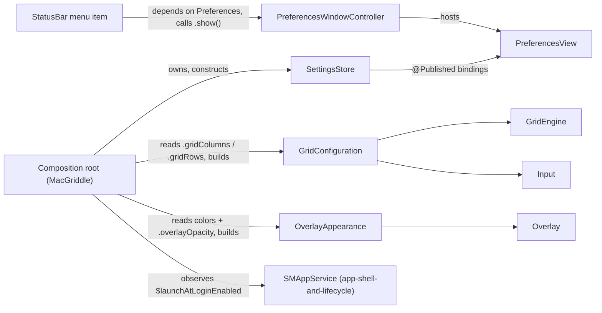

# Preferences — Settings Window & Settings Store

Covers the `Preferences` target: **depends only on `MacGriddleCore`**. It owns two things —
a `UserDefaults`-backed `SettingsStore` (the single settings model for the whole app) and a
SwiftUI `PreferencesView` + AppKit window-hosting shell that presents it. Nothing in this
target touches `CGEventTap`, `AXUIElement`, or `NSStatusItem` — it is pure "read/write user
preferences, render a window for them."

Suggested file layout inside the target:

```
Sources/Preferences/
├── SettingsStore.swift              // the ObservableObject + UserDefaults bridge
├── Color+Hex.swift                  // internal Color <-> hex persistence helper
├── PreferencesView.swift            // the tabbed SwiftUI view + its tab subviews
└── PreferencesWindowController.swift // NSWindowController that hosts PreferencesView
```

Only `SettingsStore` and `PreferencesWindowController` are `public`. `PreferencesView` and
everything in `Color+Hex.swift` are internal implementation details — nothing outside this
target ever needs to construct a `PreferencesView` directly or hex-encode a color itself.
Keeping the public surface small is deliberate: it's the only part of this target other
targets can become coupled to.

---

## 1. Design choice: manual `@Published` + `UserDefaults` bridge, not `@AppStorage`

`SettingsStore` uses plain `@Published` stored properties with hand-written `didSet`
persistence, **not** `@AppStorage`. Two concrete reasons, both load-bearing elsewhere in the
app:

1. **`@AppStorage` doesn't validate.** `gridColumns`/`gridRows` need clamping to `1...12` (a
   0-column grid is a real correctness bug for `GridEngine`, not a cosmetic one). `@AppStorage`
   has no hook for that — a raw property wrapper can't intercept and reject/clamp a write.  A
   `didSet` can.
2. **`@AppStorage` doesn't give non-View code a publisher.** `@AppStorage`'s change-notification
   plumbing is wired directly into SwiftUI's view-invalidation machinery; it does **not** call
   `objectWillChange` on a containing `ObservableObject`, and it exposes no `$property` Combine
   publisher usable from plain Swift code. The composition root (`app-shell-and-lifecycle.md`)
   is plain AppKit/Combine code, not a SwiftUI view — it needs to `.sink` on
   `settings.$gridColumns` / `settings.$launchAtLoginEnabled` to react to live changes (re-derive
   a `GridConfiguration` for a running `Input`, or call `SMAppService`). A manual `@Published`
   property gives that publisher for free; `@AppStorage` does not. See §6.

`Color` values are stored as hex strings (`UserDefaults` has no native `Color`/`NSColor`
storage), bridged through `NSColor` — see §3.

---

## 2. `SettingsStore`

### Bounds

```swift
extension SettingsStore {
    /// Shared by both grid dimensions. 1 rules out a degenerate zero-column
    /// or zero-row grid (a real crash/nonsense-math risk downstream in
    /// GridEngine, not just a UI concern). 12 caps cell count at something
    /// still usable on a laptop display — WindowGrid's own default topped
    /// out at 12x6.
    public static let dimensionRange = 1...12

    /// Floor of 0.1 (not 0.0) so the overlay can never be dialed to fully
    /// invisible-but-still-active mid-gesture, which would be confusing.
    public static let opacityRange = 0.1...1.0
}
```

### The store

```swift
import Combine
import Foundation
import SwiftUI

/// Single source of truth for every user-configurable setting in MacGriddle.
/// `ObservableObject` so SwiftUI views update live; every property also has
/// a manual `didSet` that clamps (where relevant) and persists to
/// `UserDefaults`. See "Design choice" above for why this is hand-written
/// instead of `@AppStorage`.
///
/// Owned by the composition root as a single long-lived instance for the
/// app's lifetime (see §6) — not a singleton, just constructed once and
/// injected wherever it's needed.
public final class SettingsStore: ObservableObject {

    // MARK: Grid

    @Published public var gridColumns: Int {
        didSet { persistGridColumns() }
    }

    @Published public var gridRows: Int {
        didSet { persistGridRows() }
    }

    // MARK: Behavior

    /// `false` = snap-on-release (the v1 default per the overview): the
    /// window stays put until mouse-up, then one clean resize is applied.
    /// `true` = continuously resize the real window during the drag —
    /// opt-in, since this is what corrupts Electron/Chromium redraw paths.
    @Published public var liveResizeEnabled: Bool {
        didSet { userDefaults.set(liveResizeEnabled, forKey: Keys.liveResizeEnabled) }
    }

    /// User *intent* only. `SettingsStore` never calls `SMAppService`
    /// itself — seeing this flip is the composition root's cue to make the
    /// real call. See §6 for why that side effect deliberately does not
    /// live in this target.
    @Published public var launchAtLoginEnabled: Bool {
        didSet { userDefaults.set(launchAtLoginEnabled, forKey: Keys.launchAtLoginEnabled) }
    }

    // MARK: Appearance

    /// Thin grid-line color, drawn for every cell boundary. Default: a
    /// mostly-transparent white, so lines read clearly on both light and
    /// dark desktop backgrounds without dominating the screen.
    @Published public var cellStrokeColor: Color {
        didSet { userDefaults.set(cellStrokeColor.toHexString(), forKey: Keys.cellStrokeColor) }
    }

    /// Fill for the live selection/preview rectangle. Default: translucent
    /// blue — the alpha baked into this color is its *own* translucency,
    /// independent of `overlayOpacity` below.
    @Published public var selectionFillColor: Color {
        didSet { userDefaults.set(selectionFillColor.toHexString(), forKey: Keys.selectionFillColor) }
    }

    /// Border stroke for the selection/preview rectangle. Default: a
    /// near-opaque version of the same blue, so the covering rectangle's
    /// edges stay crisp even when the fill is very translucent.
    @Published public var selectionStrokeColor: Color {
        didSet { userDefaults.set(selectionStrokeColor.toHexString(), forKey: Keys.selectionStrokeColor) }
    }

    /// Master opacity dial for the *entire* overlay, multiplied on top of
    /// each color's own alpha by the Overlay renderer. Lets a user dim the
    /// whole grid with one slider instead of re-tuning three color pickers.
    @Published public var overlayOpacity: Double {
        didSet { userDefaults.set(overlayOpacity, forKey: Keys.overlayOpacity) }
    }

    // MARK: Read-only

    /// Not user-editable in this release (see `input-engine-and-state-machine.md`
    /// for where it's actually registered). Surfaced here purely so the About
    /// tab can display it. Making this configurable — re-registering the
    /// hotkey when changed — is a natural future enhancement, not required
    /// for v1. Deliberately a plain `let`, not `@Published`: it never
    /// changes at runtime, so it isn't part of the persisted/observable
    /// settings surface.
    public let panicHotkeyDisplayString = "⌃⌥⇧Escape"

    // MARK: Storage

    private let userDefaults: UserDefaults

    /// `userDefaults` is an injectable dependency (defaulting to `.standard`)
    /// specifically so a future test target could construct a store against
    /// `UserDefaults(suiteName: "test")` instead of polluting the real
    /// domain — no test target exists for this chunk yet, but the seam
    /// costs nothing to leave in place.
    public init(userDefaults: UserDefaults = .standard) {
        self.userDefaults = userDefaults

        // NOTE: none of these properties have an inline default value at
        // declaration. That's deliberate, not an oversight — see the
        // callout below.
        gridColumns = Self.dimensionRange.clamped(
            userDefaults.object(forKey: Keys.gridColumns) as? Int ?? Defaults.gridColumns
        )
        gridRows = Self.dimensionRange.clamped(
            userDefaults.object(forKey: Keys.gridRows) as? Int ?? Defaults.gridRows
        )
        liveResizeEnabled = userDefaults.object(forKey: Keys.liveResizeEnabled) as? Bool
            ?? Defaults.liveResizeEnabled
        launchAtLoginEnabled = userDefaults.object(forKey: Keys.launchAtLoginEnabled) as? Bool
            ?? Defaults.launchAtLoginEnabled
        cellStrokeColor = Color(hex: userDefaults.string(forKey: Keys.cellStrokeColor) ?? "")
            ?? Defaults.cellStrokeColor
        selectionFillColor = Color(hex: userDefaults.string(forKey: Keys.selectionFillColor) ?? "")
            ?? Defaults.selectionFillColor
        selectionStrokeColor = Color(hex: userDefaults.string(forKey: Keys.selectionStrokeColor) ?? "")
            ?? Defaults.selectionStrokeColor
        overlayOpacity = Self.opacityRange.clamped(
            userDefaults.object(forKey: Keys.overlayOpacity) as? Double ?? Defaults.overlayOpacity
        )
    }

    /// Restores every setting to its shipped default in one call — used by
    /// the "Restore Defaults" button in `PreferencesView` (§4). Each
    /// assignment still goes through its own `didSet`, so this both
    /// re-persists to `UserDefaults` *and* re-notifies any Combine
    /// subscriber (e.g. the composition root's launch-at-login observer,
    /// §6) exactly as if the user had changed each control by hand — no
    /// separate code path to keep in sync.
    public func resetToDefaults() {
        gridColumns = Defaults.gridColumns
        gridRows = Defaults.gridRows
        liveResizeEnabled = Defaults.liveResizeEnabled
        launchAtLoginEnabled = Defaults.launchAtLoginEnabled
        cellStrokeColor = Defaults.cellStrokeColor
        selectionFillColor = Defaults.selectionFillColor
        selectionStrokeColor = Defaults.selectionStrokeColor
        overlayOpacity = Defaults.overlayOpacity
    }

    private func persistGridColumns() {
        let clamped = Self.dimensionRange.clamped(gridColumns)
        if clamped != gridColumns {
            gridColumns = clamped // re-enters didSet once, then settles below
            return
        }
        userDefaults.set(gridColumns, forKey: Keys.gridColumns)
    }

    private func persistGridRows() {
        let clamped = Self.dimensionRange.clamped(gridRows)
        if clamped != gridRows {
            gridRows = clamped
            return
        }
        userDefaults.set(gridRows, forKey: Keys.gridRows)
    }
}

private enum Keys {
    static let gridColumns = "gridColumns"
    static let gridRows = "gridRows"
    static let liveResizeEnabled = "liveResizeEnabled"
    static let launchAtLoginEnabled = "launchAtLoginEnabled"
    static let cellStrokeColor = "cellStrokeColorHex"
    static let selectionFillColor = "selectionFillColorHex"
    static let selectionStrokeColor = "selectionStrokeColorHex"
    static let overlayOpacity = "overlayOpacity"
}

private enum Defaults {
    static let gridColumns = 6
    static let gridRows = 4
    static let liveResizeEnabled = false
    static let launchAtLoginEnabled = false
    static let overlayOpacity = 1.0
    static let cellStrokeColor = Color.white.opacity(0.6)
    static let selectionFillColor = Color.blue.opacity(0.25)
    static let selectionStrokeColor = Color.blue.opacity(0.9)
}

private extension ClosedRange where Bound == Int {
    func clamped(_ value: Int) -> Int { min(max(value, lowerBound), upperBound) }
}

private extension ClosedRange where Bound == Double {
    func clamped(_ value: Double) -> Double { min(max(value, lowerBound), upperBound) }
}
```

**Why none of the `@Published` properties have an inline default value:** Swift never calls
`willSet`/`didSet` for the assignment that satisfies an initializer's definite-initialization
requirement — confirmed directly by Apple's own docs ("When you assign a default value to a
stored property, or set its initial value within an initializer, the value of that property is
set directly, without calling any property observers"). Whether a *combination* of an inline
default **and** a later reassignment inside `init` fires `didSet` is a genuinely murky corner
of the language that even experienced Swift developers disagree on. Rather than depend on that
corner, every property here has **no** inline default and is assigned **exactly once**, directly
in `init`, with clamping/defaulting done inline in that single expression. This makes the
behavior unambiguous by construction: `didSet` never fires while loading, and always fires for
every mutation afterwards (UI edits, `resetToDefaults()`, or any other caller) — no edge case to
reason about.

---

## 3. `Color` ↔ hex persistence

`UserDefaults` has no native way to store a `Color` (or `NSColor`). Values are round-tripped as
`#RRGGBBAA` hex strings, bridging through `NSColor` to read/write RGBA components (`Color` has
no public component accessor at the macOS 13 deployment target).

```swift
import AppKit
import SwiftUI

extension Color {
    /// Encodes as `#RRGGBBAA`. Safe to route through `.deviceRGB` here
    /// specifically because every `Color` this app ever hex-encodes
    /// originates either from a SwiftUI `ColorPicker` (sRGB) or from
    /// `init(hex:)` below (also `.sRGB`) — never an arbitrary system/catalog
    /// color, which is the case where colorspace conversion can fail.
    func toHexString() -> String {
        let nsColor = NSColor(self).usingColorSpace(.deviceRGB) ?? NSColor(self)
        let r = Int((nsColor.redComponent * 255).rounded())
        let g = Int((nsColor.greenComponent * 255).rounded())
        let b = Int((nsColor.blueComponent * 255).rounded())
        let a = Int((nsColor.alphaComponent * 255).rounded())
        return String(format: "#%02X%02X%02X%02X", r, g, b, a)
    }

    /// Decodes `#RRGGBBAA` (or `#RRGGBB`, alpha implied 255). Returns `nil`
    /// for anything malformed — callers fall back to a `Defaults` value.
    init?(hex: String) {
        var value = hex.trimmingCharacters(in: .whitespacesAndNewlines)
        value.removeAll { $0 == "#" }
        if value.count == 6 { value += "FF" }
        guard value.count == 8, let rgba = UInt64(value, radix: 16) else { return nil }

        self = Color(
            .sRGB,
            red: Double((rgba & 0xFF00_0000) >> 24) / 255,
            green: Double((rgba & 0x00FF_0000) >> 16) / 255,
            blue: Double((rgba & 0x0000_FF00) >> 8) / 255,
            opacity: Double(rgba & 0x0000_00FF) / 255
        )
    }
}
```

This extension is **not** `public` — it's a private persistence detail of `SettingsStore`.
Other targets that need overlay colors get an already-converted `NSColor`/`CGColor`, built by the
composition root (§6), never a hex string.

---

## 4. `PreferencesView`

A single SwiftUI `TabView` (Grid / Appearance / Behavior / About), with a persistent
"Restore Defaults" button pinned below the tabs so it's reachable regardless of which tab is
selected — mirrors how most macOS System Settings-style windows place a reset action outside the
tab content itself.

```swift
import SwiftUI

struct PreferencesView: View {
    @ObservedObject var settings: SettingsStore

    var body: some View {
        VStack(spacing: 0) {
            TabView {
                GridSettingsTab()
                    .tabItem { Label("Grid", systemImage: "grid") }

                AppearanceSettingsTab()
                    .tabItem { Label("Appearance", systemImage: "paintpalette") }

                BehaviorSettingsTab()
                    .tabItem { Label("Behavior", systemImage: "gearshape") }

                AboutTab()
                    .tabItem { Label("About", systemImage: "info.circle") }
            }
            .environmentObject(settings)
            .padding(20)

            Divider()

            HStack {
                Spacer()
                Button("Restore Defaults") {
                    settings.resetToDefaults()
                }
                .padding(12)
            }
        }
        .frame(minWidth: 420, idealWidth: 460, minHeight: 380, idealHeight: 420)
    }
}
```

Tab subviews all read the store via `@EnvironmentObject`, injected once at the `TabView` level
above rather than threaded through every subview's initializer:

```swift
private struct GridSettingsTab: View {
    @EnvironmentObject var settings: SettingsStore

    var body: some View {
        Form {
            Stepper(value: $settings.gridColumns, in: SettingsStore.dimensionRange) {
                LabeledContent("Columns", value: "\(settings.gridColumns)")
            }
            Stepper(value: $settings.gridRows, in: SettingsStore.dimensionRange) {
                LabeledContent("Rows", value: "\(settings.gridRows)")
            }
        }
    }
}

private struct AppearanceSettingsTab: View {
    @EnvironmentObject var settings: SettingsStore

    var body: some View {
        Form {
            ColorPicker("Grid line color", selection: $settings.cellStrokeColor)
            ColorPicker("Selection fill color", selection: $settings.selectionFillColor)
            ColorPicker("Selection border color", selection: $settings.selectionStrokeColor)

            VStack(alignment: .leading) {
                Slider(
                    value: $settings.overlayOpacity,
                    in: SettingsStore.opacityRange
                ) {
                    Text("Overlay opacity")
                } minimumValueLabel: {
                    Text("Dim")
                } maximumValueLabel: {
                    Text("Solid")
                }
            }
        }
    }
}

private struct BehaviorSettingsTab: View {
    @EnvironmentObject var settings: SettingsStore

    var body: some View {
        Form {
            Toggle("Resize live while dragging", isOn: $settings.liveResizeEnabled)
            Text("Off by default: the window stays put until you release the mouse, then "
                 + "snaps once. Some apps (Electron/Chromium: VS Code, Slack, Discord) redraw "
                 + "poorly under continuous live resizing.")
                .font(.footnote)
                .foregroundStyle(.secondary)

            Toggle("Launch MacGriddle at login", isOn: $settings.launchAtLoginEnabled)
        }
    }
}

private struct AboutTab: View {
    @EnvironmentObject var settings: SettingsStore

    var body: some View {
        Form {
            LabeledContent("Panic hotkey", value: settings.panicHotkeyDisplayString)
            Text("Force-resets the drag gesture if it ever gets stuck (e.g. a missed "
                 + "mouse-up event). Not yet configurable — a natural candidate for a "
                 + "future release.")
                .font(.footnote)
                .foregroundStyle(.secondary)
        }
    }
}
```

`LabeledContent` and this `Slider(value:in:label:minimumValueLabel:maximumValueLabel:)` overload
are both macOS 13.0+ — an exact match for the deployment target, not an accidental
newer-than-supported API.

`PreferencesView` and all four tab subviews are internal (no `public` modifier) — the only thing
outside this target that ever needs to exist is a way to *show* this view in a window, which is
§5's job.

---

## 5. Hosting: a real `NSWindow`, not a popover, not the SwiftUI `Settings` scene

MacGriddle runs as an `.accessory` app (`LSUIElement`, no Dock icon) with a classic
`NSApplicationDelegate` lifecycle (see `app-shell-and-lifecycle.md` — that chunk owns
*setting* the activation policy; this chunk just has to live with it). Two things Preferences
deliberately is **not**:

- **Not a popover.** A popover is transient by nature (dismisses on outside click) and cordons
  the content to a small anchored bubble. A settings surface with color pickers and steppers is
  something a user plausibly wants to leave open while they test overlay colors on a live drag —
  it should behave like an ordinary window: closable, resizable, has a title bar, and stays open
  until explicitly dismissed.
- **Not the SwiftUI `Settings` scene.** `Settings { }` (and its automatic Cmd+, / "Preferences…"
  menu item) requires the SwiftUI `App` protocol lifecycle. MacGriddle's app-shell uses a
  standard `NSApplicationDelegate` (per the overview: "AppKit for the engine... SwiftUI via
  `NSHostingController` for Preferences/Onboarding UI"), so the window has to be constructed and
  shown by hand.

```swift
import AppKit
import SwiftUI

/// Owns the Preferences window for the app's lifetime. Constructed once by
/// whoever wires up the app (see §6) and reused for every subsequent
/// "Preferences…" invocation — never recreated from scratch.
public final class PreferencesWindowController: NSWindowController {

    public init(settings: SettingsStore) {
        let hostingController = NSHostingController(rootView: PreferencesView(settings: settings))
        // macOS 13+ API (an exact match for our deployment target): let the
        // SwiftUI content's own ideal size drive the window's initial size,
        // instead of hand-computing a CGSize.
        hostingController.sizingOptions = [.preferredContentSize]

        let window = NSWindow(contentViewController: hostingController)
        window.title = "MacGriddle Preferences"
        window.styleMask = [.titled, .closable, .resizable, .miniaturizable]
        // Keep the same NSWindow/NSHostingController/PreferencesView alive
        // across close/reopen cycles rather than rebuilding them — `show()`
        // below just re-fronts this one instance.
        window.isReleasedWhenClosed = false
        window.center()
        // Deliberately leave `window.level` at the AppKit default (.normal).
        // Unlike the grid-overlay windows in overlay-rendering.md, which
        // need an elevated level to float above every other app, this is a
        // normal, standalone app window and should behave like one.

        super.init(window: window)
    }

    @available(*, unavailable)
    required init?(coder: NSCoder) {
        fatalError("PreferencesWindowController does not support NSCoder-based init")
    }

    /// Brings the Preferences window to the front and activates the app.
    /// Required specifically because MacGriddle is `.accessory` — there is
    /// no Dock icon to click, so nothing else activates the app when the
    /// status-bar menu's "Preferences…" item fires. Skipping this line is a
    /// realistic bug: the window would open, but behind whatever app was
    /// already frontmost, with no keyboard focus.
    public func show() {
        NSApp.activate(ignoringOtherApps: true)
        window?.makeKeyAndOrderFront(nil)
    }
}
```

`NSHostingController` (not the lower-level `NSHostingView`) is the right tool here: it manages
the view controller lifecycle and, via `sizingOptions`, negotiates window size from SwiftUI's own
ideal layout. `NSHostingView` would mean managing an `NSWindow`'s `contentView` and sizing by
hand — appropriate if embedding SwiftUI content inside a hand-built AppKit view hierarchy, not
for "this whole window's content is one SwiftUI view," which is the case here.

Calling `.show()` on an already-open window is safe and idempotent — `isReleasedWhenClosed =
false` means the same window/controller/view survive being closed, so a second "Preferences…"
click just re-fronts the existing window rather than creating a duplicate.

---

## 6. How other modules consume this

Recap of the relevant rows from the overview's dependency table:

| Target | Depends on `Preferences`? |
|---|---|
| `StatusBar` | **Yes** — the only target besides the composition root that does |
| `GridEngine`, `WindowControl`, `Overlay`, `Permissions`, `Input` | **No** |
| `MacGriddle` (composition root) | Yes (depends on everything) |

`StatusBar`'s dependency is narrow and direct: its "Preferences…" menu item needs a
`PreferencesWindowController` to call `.show()` on. Nothing else about `StatusBar` touches this
target.

Everyone else — `GridEngine`, `Overlay`, `Input` — needs *values* that live in `SettingsStore`
(grid size, live-resize mode, overlay colors/opacity) but must not gain a target dependency on
`Preferences` to get them. This isn't just a build-graph technicality (Swift Package Manager
would refuse an actual cycle outright); it's a layering direction. `GridEngine` is specced as
pure, dependency-free grid math specifically so it's trivially unit-testable
(`GridEngineTests`) — if its API took a `SettingsStore` instead of plain `Int`s, every test would
need to spin up SwiftUI/Combine/UserDefaults just to test arithmetic, and the dependency arrow
would point backwards (engine code depending on user-facing settings UI, instead of settings UI
configuring the engine).

The resolution, stated directly in the product scope for this chunk: **the composition root owns
the one `SettingsStore` instance, reads its values, and constructs plain value types that the
lower targets already accept** — those targets never import `Preferences` or hold a
`SettingsStore` reference.

```swift
// Composition root — owned by app-shell-and-lifecycle.md; shown here only
// to demonstrate the shape Preferences' public API must support.
import Preferences

let settings = SettingsStore()

// GridEngine + Input read grid size — bridged to whatever shape
// core-contracts.md settles on for GridConfiguration; shown here as an
// illustrative initializer.
let gridConfiguration = GridConfiguration(
    columns: settings.gridColumns,
    rows: settings.gridRows
)
gridEngine.configure(gridConfiguration)   // exact call site: grid-engine.md
input.configure(gridConfiguration, liveResizeEnabled: settings.liveResizeEnabled)
                                           // exact call site: input-engine-and-state-machine.md

// Overlay reads colors/opacity — converted from SwiftUI Color to NSColor
// HERE, at the composition root. Overlay never sees a SwiftUI Color.
let overlayAppearance = OverlayAppearance(
    cellStroke: NSColor(settings.cellStrokeColor),
    selectionFill: NSColor(settings.selectionFillColor),
    selectionStroke: NSColor(settings.selectionStrokeColor),
    opacity: settings.overlayOpacity
)
overlay.configure(overlayAppearance)      // exact call site: overlay-rendering.md

// StatusBar is the one target that legitimately imports Preferences.
let preferencesWindowController = PreferencesWindowController(settings: settings)
let statusBar = StatusBarController(
    showPreferences: { preferencesWindowController.show() }
    // ... plus whatever Permissions/enable-disable state statusbar-menu.md defines
)
```

`GridConfiguration`'s and `OverlayAppearance`'s exact field names/initializer shapes are
`core-contracts.md`'s and `overlay-rendering.md`'s authority respectively — the point being
demonstrated is only that the `Color → NSColor` conversion, and the `SettingsStore → plain value`
bridging in general, happens at the composition root, not inside `Preferences` and not inside
`GridEngine`/`Overlay`/`Input`.

**Keeping the app in sync while Preferences is open** is exactly why §1 chose a manual
`@Published` bridge over `@AppStorage` — the composition root can `.sink` on the store's
publishers to react to live edits without polling:

```swift
var cancellables = Set<AnyCancellable>()

settings.$gridColumns
    .combineLatest(settings.$gridRows)
    .sink { columns, rows in
        input.configure(GridConfiguration(columns: columns, rows: rows), liveResizeEnabled: settings.liveResizeEnabled)
    }
    .store(in: &cancellables)
```

**Launch-at-login is the same pattern, applied to `app-shell-and-lifecycle.md` instead of
`GridEngine`/`Overlay`.** `SettingsStore.launchAtLoginEnabled` is a plain persisted boolean —
`Preferences` never imports `ServiceManagement` or calls `SMAppService` itself. The composition
root observes it and performs the real side effect:

```swift
settings.$launchAtLoginEnabled
    .dropFirst() // the first value @Published emits is the just-loaded value from
                 // init — skip it so launch doesn't redundantly re-register every time.
    .sink { enabled in LaunchAtLogin.setEnabled(enabled) } // project-structure.md's SMAppService wrapper
    .store(in: &cancellables)

// RESEARCH.md B.4: the user can remove the login item from System Settings
// at any time outside the app, so reconcile the *other* direction on
// activation rather than trusting the cached flag forever.
NotificationCenter.default.publisher(for: NSApplication.didBecomeActiveNotification)
    .sink { _ in settings.launchAtLoginEnabled = LaunchAtLogin.isEnabled() }
    .store(in: &cancellables)
```



Note the arrows into `GridEngine`, `Overlay`, and `Input` are plain value types
(`GridConfiguration`, `OverlayAppearance`) — never a `SettingsStore` reference, never a
`Preferences` import. Only `StatusBar` and the composition root actually depend on the
`Preferences` target, exactly matching the dependency table in the overview.

---

## 7. Resetting to defaults

Already fully specified above — `SettingsStore.resetToDefaults()` (§2) reassigns every property
to its `Defaults` value, and `PreferencesView`'s "Restore Defaults" button (§4) is its only
caller. No separate reset path exists (e.g. deleting the `UserDefaults` domain) — `didSet`
persistence on each property means calling this one method is sufficient to both reset the
in-memory `ObservableObject` state (so SwiftUI updates immediately) and overwrite every
`UserDefaults` key.

---

## Field reference

For other chunks/workers wiring against this store:

| Field | Type | Default | Bounds | Read by (via composition-root bridging) |
|---|---|---|---|---|
| `gridColumns` | `Int` | `6` | `SettingsStore.dimensionRange` (`1...12`) | `GridEngine`, `Input` — via `GridConfiguration` |
| `gridRows` | `Int` | `4` | `SettingsStore.dimensionRange` (`1...12`) | `GridEngine`, `Input` — via `GridConfiguration` |
| `liveResizeEnabled` | `Bool` | `false` | — | `Input` (resize-timing mode) |
| `launchAtLoginEnabled` | `Bool` | `false` | — | composition root / `app-shell-and-lifecycle` (`SMAppService`) |
| `cellStrokeColor` | `Color` | `Color.white.opacity(0.6)` | — | `Overlay` — via `OverlayAppearance` |
| `selectionFillColor` | `Color` | `Color.blue.opacity(0.25)` | — | `Overlay` |
| `selectionStrokeColor` | `Color` | `Color.blue.opacity(0.9)` | — | `Overlay` |
| `overlayOpacity` | `Double` | `1.0` | `SettingsStore.opacityRange` (`0.1...1.0`) | `Overlay` |
| `panicHotkeyDisplayString` | `String` (`let`, read-only) | `"⌃⌥⇧Escape"` | n/a — not persisted, not settable | `Preferences` UI only (About tab) |

## Future enhancement (explicitly out of scope for v1)

Making the panic hotkey configurable — capturing a user-chosen key combination in the About tab
and re-registering it — is a natural next step, but is intentionally not part of this design.
v1 only *displays* the fixed `⌃⌥⇧Escape` combination that `input-engine-and-state-machine.md`
registers.
