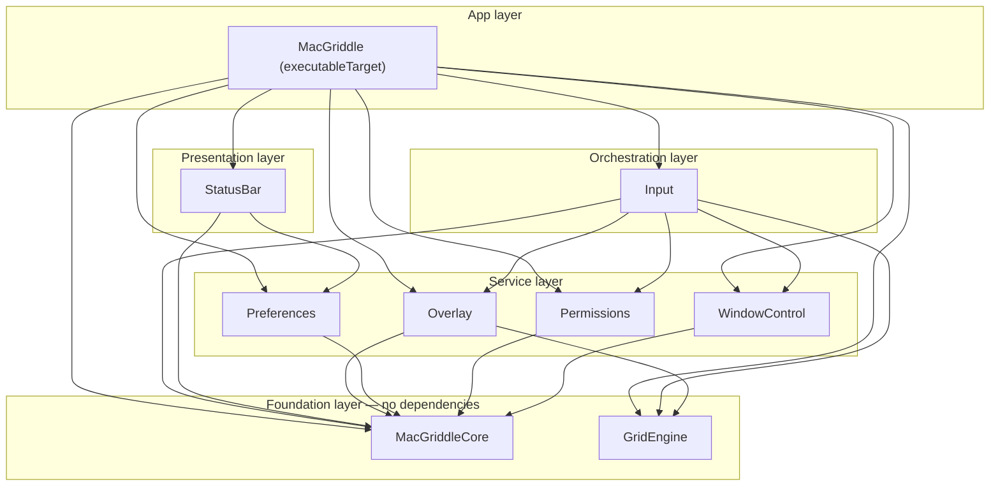

# Project Structure & Packaging

> Chunk 1 of 10. Source inputs: `docs/architecture/overview.md` (fixed target/dependency
> table, cross-cutting decisions) and `docs/RESEARCH.md` (Part B feasibility findings —
> Accessibility/Input Monitoring gating, sandbox constraints, `SMAppService`). This chunk
> is pure documentation: no code files were created, `swift build` was not run.

This chunk covers the concrete `Package.swift`, the `Sources/`/`Tests/` directory layout
that backs it, the hand-rolled `.app` bundle packaging strategy (no Xcode project on this
dev machine — Command Line Tools only), the launch-at-login call site, and why the project
is permanently unsandboxed.

---

## 1. `Package.swift`

Nine module targets plus one test target, matching the overview's table exactly: zero
external package dependencies — everything MacGriddle links against (`AppKit`,
`SwiftUI`, `ApplicationServices`, `CoreGraphics`, `ServiceManagement`, `Foundation`,
`XCTest`) is an Apple system framework that Swift picks up automatically via SDK module
maps. No `.linkedFramework(...)` linker settings are needed for any of them.

```swift
// swift-tools-version: 5.9
import PackageDescription

let package = Package(
    name: "MacGriddle",
    platforms: [
        .macOS(.v13)
    ],
    products: [
        // One library product per module target, purely so each module can be
        // built/tested in isolation from the CLI (`swift build --product GridEngine`)
        // or shown as its own scheme if this manifest is ever opened in Xcode.
        // Internal target-to-target dependencies below work regardless of these —
        // they're a convenience, not a requirement. See "Open Questions" at the
        // bottom of this document.
        .library(name: "MacGriddleCore", targets: ["MacGriddleCore"]),
        .library(name: "GridEngine", targets: ["GridEngine"]),
        .library(name: "WindowControl", targets: ["WindowControl"]),
        .library(name: "Overlay", targets: ["Overlay"]),
        .library(name: "Permissions", targets: ["Permissions"]),
        .library(name: "Preferences", targets: ["Preferences"]),
        .library(name: "StatusBar", targets: ["StatusBar"]),
        .library(name: "Input", targets: ["Input"]),
        .executable(name: "MacGriddle", targets: ["MacGriddle"])
    ],
    targets: [
        // MARK: - MacGriddleCore
        // Shared protocols/types (see core-contracts.md). No dependencies.
        // Every other target may depend on this; this must never depend on them.
        .target(
            name: "MacGriddleCore",
            dependencies: []
        ),

        // MARK: - GridEngine
        // Pure grid math. Deliberately dependency-free and must NOT import AppKit —
        // that's what keeps it runnable under plain `swift test` with no windowing/
        // display side effects. May import CoreGraphics (CGRect/CGPoint/CGSize) —
        // CoreGraphics is not AppKit and has no UI/windowing dependency of its own.
        .target(
            name: "GridEngine",
            dependencies: []
        ),
        .testTarget(
            name: "GridEngineTests",
            dependencies: ["GridEngine"]
        ),

        // MARK: - WindowControl
        // AX window lookup/read/write frame, Cocoa<->Quartz coordinate conversion.
        .target(
            name: "WindowControl",
            dependencies: ["MacGriddleCore"]
        ),

        // MARK: - Overlay
        // Per-screen grid overlay NSWindows + rendering. Consumes GridEngine's pure
        // math output; does not compute grid geometry itself.
        .target(
            name: "Overlay",
            dependencies: ["MacGriddleCore", "GridEngine"]
        ),

        // MARK: - Permissions
        // Accessibility + Input Monitoring check/request/observe (two independently
        // gated booleans — see permissions-model.md).
        .target(
            name: "Permissions",
            dependencies: ["MacGriddleCore"]
        ),

        // MARK: - Preferences
        // SwiftUI settings window + UserDefaults-backed store. Also owns the
        // launch-at-login wrapper (see §4 below).
        .target(
            name: "Preferences",
            dependencies: ["MacGriddleCore"]
        ),

        // MARK: - StatusBar
        // NSStatusItem + menu. Reads Preferences to open the settings window and
        // reflect its state from the menu.
        .target(
            name: "StatusBar",
            dependencies: ["MacGriddleCore", "Preferences"]
        ),

        // MARK: - Input
        // CGEventTap + gesture state machine. Orchestrates WindowControl, Overlay,
        // and Permissions during a live gesture.
        .target(
            name: "Input",
            dependencies: [
                "MacGriddleCore",
                "GridEngine",
                "WindowControl",
                "Overlay",
                "Permissions"
            ]
        ),

        // MARK: - MacGriddle (executable)
        // App entry point / composition root. Depends on every other module target
        // so it can wire them together at launch (see app-shell-and-lifecycle.md).
        .executableTarget(
            name: "MacGriddle",
            dependencies: [
                "MacGriddleCore",
                "GridEngine",
                "WindowControl",
                "Overlay",
                "Permissions",
                "Preferences",
                "StatusBar",
                "Input"
            ]
        )
    ]
)
```

**Why `swift-tools-version: 5.9`, not `6.x`:** tools-version 6 defaults new packages into
Swift 6's strict-concurrency checking. `RESEARCH.md` §B.1–B.2 is built entirely on C-interop
patterns that fight that checker for no real benefit here — `Unmanaged<...>` refcon
round-tripping through the `CGEventTap` C callback, `CFTypeRef?` out-parameters from every
`AXUIElementCopy...` call, and a `@convention(c)` callback closure. Staying on 5.9 (Swift 5
language mode) avoids that friction; revisit once the team deliberately wants to migrate.

**Why no `WindowControlTests`, `PermissionsTests`, etc. yet:** the overview's target list
names exactly one test target — `GridEngineTests` — because `GridEngine` is the one module
called out as needing to be "fully unit-testable" with no side effects. This chunk does not
invent additional test targets for the other modules; add them later with the identical
`.testTarget(name: "<X>Tests", dependencies: ["<X>"])` shape shown above if/when needed.

### Dependency graph



(`GridEngineTests` is omitted from this diagram since it's a test target, not a production
dependency edge — it depends on `GridEngine` alone, as shown in the manifest above.)

---

## 2. Directory Layout

SwiftPM's target-source-discovery convention is used throughout — no target needs an
explicit `path:` override because every folder name matches its target name exactly
(case-sensitive):

```text
mac-griddle/
├── Package.swift
├── Package.resolved                  (generated by SwiftPM; no external deps to pin yet)
├── Packaging/
│   └── Info.plist                    (see §3 — static template, copied by build-app.sh)
├── Scripts/
│   └── build-app.sh                  (see §3)
├── Sources/
│   ├── MacGriddleCore/                → chunk 2, core-contracts.md
│   ├── GridEngine/                    → chunk 6, grid-engine.md (no AppKit import)
│   ├── WindowControl/                 → chunk 5, window-control-and-coordinates.md
│   ├── Overlay/                       → chunk 7, overlay-rendering.md
│   ├── Permissions/                   → chunk 3, permissions-model.md
│   ├── Preferences/                   → chunk 9, preferences-ui.md (+ LaunchAtLogin.swift, §4)
│   ├── StatusBar/                     → chunk 10, statusbar-menu.md
│   ├── Input/                         → chunk 4, input-engine-and-state-machine.md
│   └── MacGriddle/                    → chunk 8, app-shell-and-lifecycle.md
│       └── main.swift                 (exact entry-point shape owned by chunk 8)
└── Tests/
    └── GridEngineTests/               → unit tests for chunk 6's pure grid math
```

Conventions:

- **Target name == folder name == module name.** Whatever a target is called in
  `Package.swift` is exactly what every other target writes in its `import` statements
  (e.g. `import GridEngine`), exactly the folder under `Sources/`, and exactly the product
  name. Keep these three in lockstep if anything is ever renamed.
- **No `Resources/` folder inside any `Sources/<Target>` in v1.** The cross-cutting
  decision to use an SF Symbol for the menu bar icon (no asset catalog, no full Xcode) means
  no target currently needs SwiftPM's `resources:` target parameter. If a future feature
  needs a bundled resource (localized strings, a sound file), add `resources: [.process(...)]`
  to that one target's declaration rather than introducing a project-wide asset pipeline.
- **`Packaging/` and `Scripts/` are siblings of `Sources/`/`Tests/`, not inside them.**
  Nothing under `Packaging/` is a Swift source file, so it must stay outside `Sources/*` or
  SwiftPM will try (and fail, or warn) to treat loose files as target sources/resources.
- **`.gitignore` should exclude `.build/`, `.swiftpm/`, and `*.app`** — all SwiftPM/packaging
  build output, none of it source-controlled. (Documented here for the combiner; this chunk
  does not create or edit a `.gitignore` file.)
- **CLI-first workflow**, matching "no full Xcode, Command Line Tools only": `swift build`,
  `swift test --filter GridEngineTests`, and `swift run MacGriddle` are the primary daily
  commands. `swift package resolve` only matters once/if an external dependency is ever added
  — there are none today.

---

## 3. `.app` Bundle Packaging

SwiftPM's `swift build` produces a bare Mach-O executable, not a `.app` bundle — there's no
Xcode project here to do that wrapping automatically, so `Scripts/build-app.sh` does it by
hand: build in release, assemble the standard `Contents/{MacOS,Resources}` bundle layout,
drop the compiled binary in, and copy in `Info.plist`.

### `Scripts/build-app.sh`

```bash
#!/usr/bin/env bash
set -euo pipefail

# Builds MacGriddle in release mode and wraps the resulting executable in a
# minimal, hand-rolled .app bundle. There is no Xcode project on this dev
# machine to do this packaging step automatically, so this script does what
# Xcode's build system would otherwise do for a native app target.
#
# NOT signed and NOT notarized — intentionally, for local dev builds only.
# See docs/architecture/chunks/project-structure.md §5 for why, and what
# changes before this app is ever handed to another machine.

PRODUCT_NAME="MacGriddle"

ROOT_DIR="$(cd "$(dirname "${BASH_SOURCE[0]}")/.." && pwd)"
BUILD_CONFIG="release"

echo "==> Building ${PRODUCT_NAME} (${BUILD_CONFIG})"
swift build --package-path "${ROOT_DIR}" -c "${BUILD_CONFIG}"

BIN_PATH="$(swift build --package-path "${ROOT_DIR}" -c "${BUILD_CONFIG}" --show-bin-path)"
BUILT_BINARY="${BIN_PATH}/${PRODUCT_NAME}"

if [[ ! -f "${BUILT_BINARY}" ]]; then
    echo "error: expected built executable at ${BUILT_BINARY}, not found" >&2
    exit 1
fi

APP_BUNDLE="${ROOT_DIR}/.build/${PRODUCT_NAME}.app"
CONTENTS_DIR="${APP_BUNDLE}/Contents"
MACOS_DIR="${CONTENTS_DIR}/MacOS"
RESOURCES_DIR="${CONTENTS_DIR}/Resources"

echo "==> Assembling ${PRODUCT_NAME}.app at ${APP_BUNDLE}"
rm -rf "${APP_BUNDLE}"
mkdir -p "${MACOS_DIR}" "${RESOURCES_DIR}"

cp "${BUILT_BINARY}" "${MACOS_DIR}/${PRODUCT_NAME}"
cp "${ROOT_DIR}/Packaging/Info.plist" "${CONTENTS_DIR}/Info.plist"

echo "==> Done: ${APP_BUNDLE}"
echo "    Run with: open \"${APP_BUNDLE}\""
echo "    Unsigned build — see project-structure.md §5 before distributing this to anyone else."
```

Needs `chmod +x Scripts/build-app.sh` once, after this file is created for real.

Deliberately out of scope for this script right now (see §5 for why, and the "Open
Questions" section for what's deferred rather than forgotten): code signing of any kind
(not even ad-hoc), notarization, and multi-architecture (`--arch arm64 --arch x86_64`)
universal-binary output. It builds for the host architecture only and copies the result in
unsigned, which is sufficient for running/debugging on this machine.

### `Packaging/Info.plist` (full contents)

```xml
<?xml version="1.0" encoding="UTF-8"?>
<!DOCTYPE plist PUBLIC "-//Apple//DTD PLIST 1.0//EN" "http://www.apple.com/DTDs/PropertyList-1.0.dtd">
<plist version="1.0">
<dict>
    <key>CFBundleName</key>
    <string>MacGriddle</string>
    <key>CFBundleDisplayName</key>
    <string>MacGriddle</string>
    <key>CFBundleIdentifier</key>
    <string>com.macgriddle.app</string>
    <key>CFBundleExecutable</key>
    <string>MacGriddle</string>
    <key>CFBundlePackageType</key>
    <string>APPL</string>
    <key>CFBundleInfoDictionaryVersion</key>
    <string>6.0</string>
    <key>CFBundleShortVersionString</key>
    <string>1.0.0</string>
    <key>CFBundleVersion</key>
    <string>1</string>
    <key>LSMinimumSystemVersion</key>
    <string>13.0</string>
    <key>LSUIElement</key>
    <true/>
    <key>NSPrincipalClass</key>
    <string>NSApplication</string>
    <key>NSHighResolutionCapable</key>
    <true/>
    <key>NSHumanReadableCopyright</key>
    <string>Copyright © 2026 MacGriddle.</string>
</dict>
</plist>
```

Notes on specific keys:

- **`LSUIElement` = `<true/>`** is the load-bearing key for the whole product's shape: it
  makes MacGriddle a menu-bar-only *accessory* app — no Dock icon, no app-switcher entry, no
  menu bar at the top of the screen of its own. (The overview's shorthand `LSUIElement=1` and
  this document's `<true/>` are the same boolean; `<true/>`/`<false/>` is the canonical plist
  form and is what's used here.) This is a bundle-level *declaration* of the policy; chunk 8
  (`app-shell-and-lifecycle.md`) separately sets `NSApplication.shared.setActivationPolicy(.accessory)`
  at runtime — the two should agree, and do.
- **No `CFBundleIconFile`** — no custom `.icns` in v1, consistent with the "no asset
  catalogs, SF Symbol only" cross-cutting decision. The *menu bar* icon is an
  `NSImage(systemSymbolName:...)` set at runtime (chunk 10's concern), which needs nothing
  in this plist. A real app icon can be added here later once `iconutil`/full Xcode is
  available.
- **`NSPrincipalClass` = `NSApplication`** is conventional boilerplate; MacGriddle's actual
  entry point is a plain `main.swift` (chunk 8), not the `NSApplicationMain()`/storyboard
  mechanism this key was originally designed for, so it isn't load-bearing here — it's kept
  because it's harmless, standard, and some tooling still expects it to be present.
- No `NS*UsageDescription` keys are included for Accessibility or Input Monitoring: neither
  permission has a customizable Info.plist usage-description string. Both prompts show fixed
  system copy driven by `AXIsProcessTrustedWithOptions`/`CGRequestListenEventAccess`
  respectively (see `RESEARCH.md` §B.1.1, §B.2.1) — there's nothing to add here for them.

---

## 4. Launch at Login (`SMAppService`)

Per `RESEARCH.md` §B.4, macOS 13's `SMAppService.mainApp` needs no separate helper bundle
for the "launch this same app at login" case — this is exactly why the project's minimum
target is 13.0.

**Where this lives:** the `Preferences` target, since it directly backs the "launch at
login" toggle that chunk 9 (`preferences-ui.md`) puts in the settings window, and
`Preferences` is already a clean leaf target (depends on `MacGriddleCore` only) with no
reason to push this into `MacGriddleCore` itself (`MacGriddleCore` is protocols/types, not
side-effecting OS-integration code).

```swift
// Sources/Preferences/LaunchAtLogin.swift
import ServiceManagement

/// Thin wrapper around SMAppService for the "Launch at Login" preference.
/// Deliberately stateless: every read goes straight to SMAppService rather
/// than caching a boolean, because the user can add/remove the login item
/// from System Settings > General > Login Items at any time outside the
/// app, and the toggle must not silently drift out of sync with that.
enum LaunchAtLogin {
    static var isEnabled: Bool {
        SMAppService.mainApp.status == .enabled
    }

    /// True when registered but the user still needs to flip it on in
    /// System Settings > General > Login Items — worth deep-linking there
    /// from the UI when this is true.
    static var requiresApproval: Bool {
        SMAppService.mainApp.status == .requiresApproval
    }

    static func setEnabled(_ enabled: Bool) throws {
        if enabled {
            try SMAppService.mainApp.register()
        } else {
            try SMAppService.mainApp.unregister()
        }
    }
}
```

**Exactly where it's invoked — and where it must NOT be:**

- **Only** from the settings window's "Launch MacGriddle at Login" toggle action, inside the
  `Preferences` target. This is a direct, synchronous, user-initiated call in response to the
  toggle changing — nothing about login-item registration is inferred or automatic.
- **Never** from the `MacGriddle` executable target's composition root
  (`applicationDidFinishLaunching` / `AppDelegate` init, chunk 8). The composition root may
  *read* `LaunchAtLogin.isEnabled` (e.g. if `StatusBar` ever wants to reflect it), but must
  never call `.register()`/`.unregister()` on its own — a fresh install stays at whatever
  `SMAppService` naturally reports (`.notRegistered`) until the user opts in themselves.

Illustrative call site (the full view — grid-size fields, colors, panic-hotkey display,
etc. — is chunk 9's scope; this is only to pin down the `SMAppService` invocation point):

```swift
// Sources/Preferences/GeneralSettingsView.swift (sketch — chunk 9 owns the real version)
import SwiftUI

struct GeneralSettingsView: View {
    @State private var launchAtLoginEnabled = LaunchAtLogin.isEnabled

    var body: some View {
        Toggle("Launch MacGriddle at Login", isOn: $launchAtLoginEnabled)
            .onChange(of: launchAtLoginEnabled) { _, newValue in
                do {
                    try LaunchAtLogin.setEnabled(newValue)
                } catch {
                    // Registration can fail (e.g. removed from Login Items
                    // mid-session) — resync to actual state, don't trust
                    // the optimistic toggle value.
                    launchAtLoginEnabled = LaunchAtLogin.isEnabled
                }
            }
    }
}
```

---

## 5. Why MacGriddle Cannot Be Sandboxed

The unambiguous, independently-sufficient blocker is **Accessibility control of other
processes' windows** (`RESEARCH.md` §B.1.1, §B.2.3): App Sandbox causes every
`AXUIElementCopyElementAtPosition`/`AXUIElementSetAttributeValue` call targeting another
app's UI to fail with an `AXError`, even when the user has already checked MacGriddle in
System Settings > Privacy & Security > Accessibility. `AXIsProcessTrustedWithOptions` also
requires the app not be sandboxed just to get the checkbox/list entry to appear at all. Since
window read/move/resize via `AXUIElement` (chunk 5's whole job) is the mechanism that makes
the snap-on-release gesture work at all, this alone rules out the sandbox — there's no
sandboxed code path that does what MacGriddle fundamentally does.

A more precise note on the event-tap half, since it's easy to over-state: `RESEARCH.md`
§B.2.1 is explicit that **Input Monitoring — the permission gating the listen-only
`CGEventTap` — is itself documented as available to sandboxed apps**, including on the Mac
App Store, in isolation. It is not, on its own, the reason MacGriddle leaves the sandbox.
What §B.2.3 separately flags is that a **global, session-wide (`.cgSessionEventTap`) tap
watching every other application's mouse/modifier events**, combined with the AX control
above, falls into the stricter combination of low-level input capabilities the sandbox is
designed to restrict. Net effect is the same either way — the app as a whole cannot be
sandboxed — but the AX piece is the hard, standalone blocker; the event tap is a contributing
factor only in combination with it, not independently.

**What this implies for distribution:**

- **No Mac App Store path, ever, for this feature set.** Not a "later" problem to revisit —
  it's a permanent consequence of the AX-control requirement in §B.1, confirmed by every
  comparable tool in `RESEARCH.md` §B.5 (Rectangle, AeroSpace, yabai, Amethyst all ship
  unsandboxed for the same reason).
- **Direct distribution only: Developer ID–signed and notarized**, once this project is ever
  handed to a machine that isn't this one. That means, later: a Developer ID Application
  certificate, `codesign --options runtime` (Hardened Runtime — required for notarization),
  `xcrun notarytool submit ... --wait`, and `xcrun stapler staple`. None of this is
  implemented by `Scripts/build-app.sh` today (see §3) — it's future packaging work, and it
  does **not** involve adding an App Sandbox entitlement (`com.apple.security.app-sandbox`)
  at any point; hardened runtime and sandboxing are independent, and only the former is
  needed here.
- **Fine to skip signing entirely for local dev builds**, which is what `Scripts/build-app.sh`
  does today — no `codesign` call at all, not even ad-hoc. `RESEARCH.md` §B.1.1 already notes
  that re-signing (including ordinary Xcode rebuilds) can look like a new code identity to
  TCC and force Accessibility/Input Monitoring to be re-granted — that churn is inherent to
  frequent local rebuilds regardless of signing strategy, not something skipping signing
  specifically causes or an ad-hoc `codesign` step would fully eliminate.
- No entitlements file exists yet, and none is needed for v1. If/when Developer ID signing is
  set up, a minimal `Packaging/MacGriddle.entitlements` can be added alongside `Info.plist` —
  it should stay empty/near-empty and must never add `com.apple.security.app-sandbox`.

---

## Assumptions & Open Questions for the Combiner

1. **Target count wording.** The task brief's summary line says "9 targets," but the
   overview's own target list enumerates 10 concrete `Package.swift` targets once `GridEngine`
   and `GridEngineTests` are counted separately (`MacGriddleCore`, `GridEngine`,
   `GridEngineTests`, `WindowControl`, `Overlay`, `Permissions`, `Preferences`, `StatusBar`,
   `Input`, `MacGriddle`). This document implements all 10 — the literal enumeration, not the
   summary count.
2. **`GridEngineTests → GridEngine`** isn't spelled out in the overview's table (it only says
   `GridEngine` depends on "—"), but a test target must depend on the target it tests. Treated
   as an obvious, non-controversial completion rather than a deviation.
3. **Added a `.library` product per module target** plus an explicit `.executable` product
   for `MacGriddle`. Not requested anywhere in the overview — purely for per-module
   buildability/Xcode-scheme convenience. Internal cross-target dependencies work identically
   with zero products declared, so drop these freely if the group wants the leanest possible
   manifest.
4. **`swift-tools-version: 5.9`**, chosen specifically to stay in Swift 5 language mode and
   avoid Swift 6's default strict-concurrency checking colliding with the `Unmanaged`/
   `CFTypeRef`/C-callback patterns `RESEARCH.md` requires for `CGEventTap`/`AXUIElement`.
   Worth revisiting as a deliberate, separate decision later — not something to silently
   upgrade.
5. **Bundle identifier**: used `com.macgriddle.app` exactly as proposed in the task brief.
   Flagging only that it's a placeholder with no domain/trademark check behind it — confirm
   before it's baked into a real Developer ID provisioning profile.
6. **`Info.plist` is a checked-in static file** (`Packaging/Info.plist`) that
   `build-app.sh` copies in, rather than a heredoc the script generates inline. Chose this so
   the plist is easy to hand-edit and diff on its own. Flag in case the group would rather
   have one fully self-contained script that generates it dynamically (e.g. to stamp
   `CFBundleVersion` from `git describe` at build time).
7. **`build-app.sh` is single-architecture and fully unsigned** (no `--arch` flags, no
   `codesign`, no notarization) — deliberately deferred per §5, not an oversight. A future
   `Scripts/sign-and-notarize.sh` operating on the same `.build/MacGriddle.app` output is the
   natural next step whenever real distribution is needed.
8. **Sandbox rationale nuance**: sharpened the task brief's framing ("App Sandbox blocks both
   global CGEventTap installation and AX control of other processes") against what
   `RESEARCH.md` §B.2.1 actually documents — Input Monitoring/the event tap is sandbox-
   compatible in isolation; AX control of other processes is the standalone hard blocker, and
   the tap only becomes an issue in combination with it. The conclusion (unsandboxed,
   Developer ID + notarization, no Mac App Store) is unchanged; only the internal "why" is
   more precise. Flagging in case another chunk (e.g. `permissions-model.md`) states the
   original, less precise framing and the combiner wants both to agree.
9. **`Packaging/` as a directory name** for `Info.plist` (and a future `.entitlements` file)
   is this chunk's own naming choice — not specified anywhere in the overview. Easy to rename
   if another chunk assumed something else (e.g. `Resources/` at the repo root).
