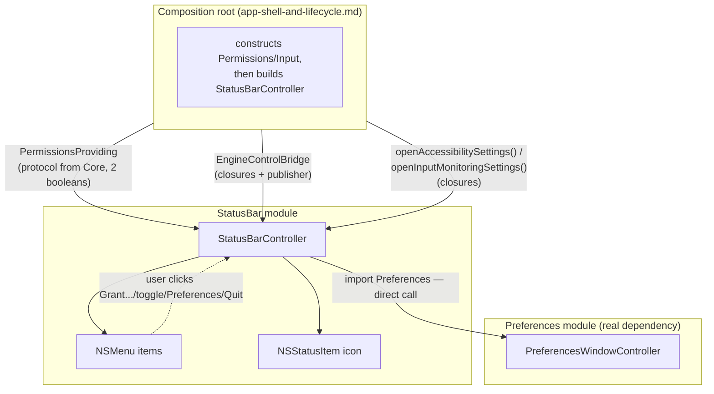

# StatusBar — Menu Bar Icon and Menu

Chunk 10 of 10. Covers the `StatusBar` target only.

**Declared dependencies (fixed by `overview.md`'s target table — not renegotiated here):** `MacGriddleCore`, `Preferences`.

**Explicitly NOT a dependency:** `Permissions`, `Input`. This one fact drives almost every design decision below — anything StatusBar needs from those two modules has to arrive either as a protocol type owned by `Core` (for state it only needs to *read*), or as a closure the composition root hands in at construction time (for actions that need to *reach into* a module StatusBar can't import). Anything StatusBar needs from `Preferences`, by contrast, can be a normal direct call, since that dependency edge really exists in the package graph.



---

## 1. `NSStatusItem` Setup

Created once, in `init`, and held as a strong instance property — an `NSStatusItem` that isn't retained anywhere disappears from the menu bar the moment it's deallocated, which for a local variable is essentially immediately. This is a well-known pitfall worth calling out explicitly since it fails silently (no crash, the icon just never shows or vanishes shortly after appearing).

```swift
import AppKit

@MainActor
public final class StatusBarController: NSObject {

    private let statusItem: NSStatusItem
    private let menu = NSMenu()

    // ... (menu item properties, see Section 2)

    public override init() {
        fatalError("use the designated initializer in Section 5")
    }
}
```

The button and its icon:

```swift
private func configureStatusItemButton() {
    guard let button = statusItem.button else { return }

    let image = NSImage(
        systemSymbolName: "square.grid.3x2",
        accessibilityDescription: "MacGriddle"
    )
    // Template mode is what makes AppKit auto-recolor the glyph to match
    // the current menu bar tint (light, dark, and any future
    // accent/tinted menu bar). This is the only correct rendering mode
    // for a monochrome status item glyph — never hand AppKit a
    // fixed-color icon here.
    image?.isTemplate = true
    button.image = image
    button.imagePosition = .imageOnly
}
```

Construction of the item itself, exactly per spec:

```swift
self.statusItem = NSStatusBar.system.statusItem(withLength: NSStatusItem.squareLength)
```

`NSStatusItem.squareLength` sizes the button to a fixed square matching the menu bar's height — the right choice here since MacGriddle shows an icon only, never a text title next to it (that's what `.variableLength` is for).

No separate click handler is wired up (no `button.action`/`button.target`). Once `statusItem.menu` is assigned (Section 2), AppKit automatically presents that menu on click — that's the entire click-handling story for this module. If a later revision wants to distinguish left-click (open menu) from some other click type, that would require *not* setting `.menu` directly and instead handling `button.action` manually — out of scope for what's asked here.

*Optional refinement, not required for correctness:* a `NSImage.SymbolConfiguration(pointSize:weight:)` can be applied via `image?.withSymbolConfiguration(...)` if the default auto-sized weight looks inconsistent next to other menu bar icons on the developer's own displays. Left out of the base snippet since it's a visual-polish call, not a functional one, and can't be verified visually on this dev machine (no Xcode/Interface Builder preview, per `overview.md`'s constraint).

---

## 2. Menu Contents

Order, top to bottom, and why each item is a *stable* property rather than something recreated on every state change (see Section 3 for why that matters):

| # | Item | Kind | Visible when |
|---|------|------|--------------|
| 1 | "MacGriddle" | disabled header | always |
| — | separator | | always |
| 2 | "Permissions Needed" | disabled sub-header | either permission missing |
| 3 | "Grant Accessibility Access…" | action | Accessibility not granted |
| 4 | "Grant Input Monitoring Access…" | action | Input Monitoring not granted |
| — | separator | | either permission missing |
| 5 | "Enabled" / "Disabled" | checkbox toggle | always (title + checkmark both track live state) |
| — | separator | | always |
| 6 | "Preferences…" (⌘,) | action | always |
| 7 | "About MacGriddle" | action | always |
| — | separator | | always |
| 8 | "Quit MacGriddle" (⌘Q) | action | always |

Only the separator right before Quit was explicitly called for in the brief; the other three separators are an editorial addition on my part, following ordinary macOS HIG practice of visually grouping a header, a dynamic status section, and the settings/quit block. They cost nothing functionally and every shipped menu-bar utility I'm aware of does the same — flagging as a judgment call rather than a literal requirement, in case a later pass wants a denser menu.

Item declarations (all stable `NSMenuItem` instances, held for the lifetime of the controller so Section 3 can mutate them in place):

```swift
extension StatusBarController {
    // Header
    private static func makeHeaderItem() -> NSMenuItem {
        let item = NSMenuItem(title: "MacGriddle", action: nil, keyEquivalent: "")
        item.isEnabled = false
        item.attributedTitle = NSAttributedString(
            string: "MacGriddle",
            attributes: [.font: NSFont.boldSystemFont(ofSize: NSFont.systemFontSize)]
        )
        return item
    }
}
```

```swift
// Stored properties on StatusBarController:

private let headerItem = StatusBarController.makeHeaderItem()

private let permissionsHeaderItem: NSMenuItem = {
    let item = NSMenuItem(title: "Permissions Needed", action: nil, keyEquivalent: "")
    item.isEnabled = false
    return item
}()

private let grantAccessibilityItem = NSMenuItem(
    title: "Grant Accessibility Access…",
    action: #selector(StatusBarController.grantAccessibilityAccess),
    keyEquivalent: ""
)

private let grantInputMonitoringItem = NSMenuItem(
    title: "Grant Input Monitoring Access…",
    action: #selector(StatusBarController.grantInputMonitoringAccess),
    keyEquivalent: ""
)

private let permissionsSectionSeparator = NSMenuItem.separator()

private let enabledToggleItem = NSMenuItem(
    title: "Enabled",
    action: #selector(StatusBarController.toggleEnabled),
    keyEquivalent: ""
)

private let preferencesItem = NSMenuItem(
    title: "Preferences…",
    action: #selector(StatusBarController.openPreferences),
    keyEquivalent: ","
)

private let aboutItem = NSMenuItem(
    title: "About MacGriddle",
    action: #selector(StatusBarController.showAbout),
    keyEquivalent: ""
)

private let quitItem = NSMenuItem(
    title: "Quit MacGriddle",
    action: #selector(NSApplication.terminate(_:)),
    keyEquivalent: "q"
)
```

`keyEquivalent: ","` and `"q"` alone are sufficient for ⌘, and ⌘Q — `NSMenuItem.keyEquivalentModifierMask` defaults to `.command`, so no extra modifier configuration is needed to match the brief's "cmd+comma"/"cmd+Q" requirement.

Assembly — building the menu once, in a fixed structure. Visibility of the dynamic middle section is set separately by `updateForCurrentState` (Section 3), not baked in here:

```swift
private func configureMenuItemTargets() {
    for item in [grantAccessibilityItem, grantInputMonitoringItem, enabledToggleItem, preferencesItem, aboutItem] {
        item.target = self
    }
    // quitItem deliberately keeps target == nil, so the action message
    // flows up the responder chain to NSApplication — the standard
    // pattern for Quit menu items, not a bridge Input/Permissions need.
}

private func buildMenuStructure() {
    menu.addItem(headerItem)
    menu.addItem(.separator())

    menu.addItem(permissionsHeaderItem)
    menu.addItem(grantAccessibilityItem)
    menu.addItem(grantInputMonitoringItem)
    menu.addItem(permissionsSectionSeparator)

    menu.addItem(enabledToggleItem)
    menu.addItem(.separator())

    menu.addItem(preferencesItem)
    menu.addItem(aboutItem)
    menu.addItem(.separator())

    menu.addItem(quitItem)

    menu.delegate = self
    statusItem.menu = menu
}
```

Menu items are mutated in place (`.isHidden`, `.title`, `.state`) rather than the menu being torn down and rebuilt from scratch on every state change. Two reasons: rebuilding while the menu happens to be open on screen risks visual glitches and loses whatever item is currently highlighted under the mouse; and it's simply less code to reason about than diffing "what should the menu contain now" against "what does it contain currently."

"Hide/replace this section once both are granted" is implemented as: once `accessibilityGranted && inputMonitoringGranted`, `permissionsHeaderItem`, both grant items, and `permissionsSectionSeparator` all get `isHidden = true`. `NSMenuItem.isHidden` fully removes an item from menu layout (unlike `isEnabled = false`, which would leave a grayed-out row in place) — so the menu simply flows from the "MacGriddle" header straight to the Enabled/Disabled toggle, with nothing left in its place. That satisfies "replace" as "replaced by nothing," which reads as the intended behavior once there's nothing actionable left to show.

Individual grant items are hidden independently of each other — if only Input Monitoring is still missing, only "Grant Accessibility Access…" hides while "Grant Input Monitoring Access…" (and the header/separator) stay visible. See `updateForCurrentState` in Section 3 for the exact logic.

---

## 3. Live State Observation

### Assumed shape of `PermissionsProviding`

`core-contracts.md` (chunk 2) owns the real definition; I can't see it. Per the brief, I'm assuming it's a reference type exposing the two independently-gated booleans from `docs/RESEARCH.md` §B.2.1 (Accessibility and Input Monitoring "granting one does not grant the other"), both as a synchronous current value (for the `menuWillOpen` defensive resync below) and as a Combine publisher (for reactive updates while the menu is closed or already open):

```swift
import Combine

// ASSUMED — defined in MacGriddleCore (core-contracts.md), not visible here.
public protocol PermissionsProviding: AnyObject {
    var isAccessibilityGranted: Bool { get }
    var isInputMonitoringGranted: Bool { get }

    var isAccessibilityGrantedPublisher: AnyPublisher<Bool, Never> { get }
    var isInputMonitoringGrantedPublisher: AnyPublisher<Bool, Never> { get }
}
```

**Flagging this explicitly:** the brief said to assume "an observable object/publisher exposing two booleans" — I turned that into a protocol with both a synchronous getter *and* a publisher per boolean, which is one plausible concrete shape but not the only one. If `core-contracts.md` instead models this as a single concrete `ObservableObject`-conforming class with `@Published var isAccessibilityGranted: Bool` (no protocol, no separate publisher properties), the code below adapts trivially — swap the `Publishers.CombineLatest3` inputs for `$isAccessibilityGranted`/`$isInputMonitoringGranted` — but the overall design (single `updateForCurrentState` function, `menuWillOpen` defensive resync, closures for actions) is unaffected either way. I deliberately did **not** add any request/action methods (e.g. `requestAccessibility()`) to this protocol, to stay inside what was explicitly assumed for me — see the closures below for how the "grant access" actions actually get triggered instead.

### The enable/disable bridge

Per the brief, `StatusBar` doesn't depend on `Input`, so the live "is the gesture engine enabled" boolean and the ability to change it both have to cross that gap via something the composition root builds. I bundled it into one small struct, scoped to `StatusBar`'s own public API (not Core — this type only exists to satisfy this module's `init`, it isn't a general-purpose contract other modules need):

```swift
public struct EngineControlBridge {
    public let isEnabled: () -> Bool
    public let isEnabledPublisher: AnyPublisher<Bool, Never>
    public let setEnabled: (Bool) -> Void

    public init(
        isEnabled: @escaping () -> Bool,
        isEnabledPublisher: AnyPublisher<Bool, Never>,
        setEnabled: @escaping (Bool) -> Void
    ) {
        self.isEnabled = isEnabled
        self.isEnabledPublisher = isEnabledPublisher
        self.setEnabled = setEnabled
    }
}
```

The composition root is expected to build this from whatever `Input` actually exposes (its exact shape is `input-engine-and-state-machine.md`'s concern, chunk 4 — also not visible here).

### Subscribing

```swift
private var cancellables = Set<AnyCancellable>()

private func subscribeToLiveState() {
    Publishers.CombineLatest3(
        permissionsProvider.isAccessibilityGrantedPublisher,
        permissionsProvider.isInputMonitoringGrantedPublisher,
        engineControl.isEnabledPublisher
    )
    .receive(on: DispatchQueue.main)
    .sink { [weak self] accessibilityGranted, inputMonitoringGranted, engineEnabled in
        self?.updateForCurrentState(
            accessibilityGranted: accessibilityGranted,
            inputMonitoringGranted: inputMonitoringGranted,
            engineEnabled: engineEnabled
        )
    }
    .store(in: &cancellables)
}
```

One combined subscription rather than three separate ones, so there's a single code path (`updateForCurrentState`) that always sees a consistent triple of the latest values — the permission-section visibility, the toggle item, and the icon (Section 4) all derive from the same snapshot instead of three independently-timed callbacks that could momentarily disagree.

### Defensive resync on open

The combined subscription already keeps everything live whether or not the menu is open — that's what makes this "live... without the user needing to reopen it" rather than a refresh-on-open-only design. `menuWillOpen(_:)` is added on top as a defensive resync, not as the primary mechanism, for the same reason `docs/RESEARCH.md` §B.2.2 already recommends re-checking `AXIsProcessTrusted()`/`CGPreflightListenEventAccess()` on `NSApplication.didBecomeActiveNotification`: permissions can be revoked from System Settings at any moment outside the app's control, and this guards against any edge case where a state change happened before `subscribeToLiveState()` finished wiring up (e.g. very early during app launch) or while the app was suspended.

```swift
extension StatusBarController: NSMenuDelegate {
    public func menuWillOpen(_ menu: NSMenu) {
        updateForCurrentState(
            accessibilityGranted: permissionsProvider.isAccessibilityGranted,
            inputMonitoringGranted: permissionsProvider.isInputMonitoringGranted,
            engineEnabled: engineControl.isEnabled()
        )
    }
}
```

### Applying state to the menu

```swift
private func updateForCurrentState(
    accessibilityGranted: Bool,
    inputMonitoringGranted: Bool,
    engineEnabled: Bool
) {
    let permissionsComplete = accessibilityGranted && inputMonitoringGranted

    permissionsHeaderItem.isHidden = permissionsComplete
    grantAccessibilityItem.isHidden = accessibilityGranted
    grantInputMonitoringItem.isHidden = inputMonitoringGranted
    permissionsSectionSeparator.isHidden = permissionsComplete

    enabledToggleItem.title = engineEnabled ? "Enabled" : "Disabled"
    enabledToggleItem.state = engineEnabled ? .on : .off

    refreshIcon(isFullyActive: permissionsComplete && engineEnabled)
}
```

Note that the "Enabled"/"Disabled" toggle is **not** disabled/grayed-out when a permission is missing, even though the engine can't actually do anything without both permissions granted. That's a deliberate scope boundary: StatusBar only displays and toggles the user's *intent* ("I want this on"); whether the engine can act on that intent given live permission state is `Input`'s state machine's problem (chunk 4), not something duplicated here.

The toggle's click handler does **not** optimistically flip its own title/state — it calls `setEnabled` and waits for the resulting value to come back through `isEnabledPublisher`:

```swift
@objc private func toggleEnabled() {
    engineControl.setEnabled(!engineControl.isEnabled())
}
```

This mirrors the same principle `docs/RESEARCH.md` §B.4 states for the launch-at-login toggle ("the UI toggle should read `SMAppService.mainApp.status` live rather than caching its own boolean") — the menu should never show a state it merely *hopes* is true; it only ever shows what `Input`'s real state actually reports back.

---

## 4. Icon State Signaling

**Proposal: dim the whole status item to reduced opacity when the engine isn't fully active; full opacity when it is.** "Fully active" = both permissions granted *and* the toggle is on — collapsed into one boolean, `isFullyActive`, computed in `updateForCurrentState` above.

Why a single dim/bright signal rather than distinct icon variants per cause (disabled vs. missing-Accessibility vs. missing-Input-Monitoring vs. combinations):

- A menu bar glyph is roughly 16–18pt. Encoding three-plus distinct states legibly at that size, in monochrome template rendering, is a lot of visual information to pack into a very small target — the icon's job is to say "something needs attention, go check the menu," not to diagnose the exact cause at a glance. One unambiguous bright/dim toggle reads instantly; several near-identical small glyph variants would not.
- It avoids depending on the exact SF Symbols catalog having a matching "off" variant for `square.grid.3x2` specifically (many SF Symbols have a curated `.slash` companion — `bell.slash`, `wifi.slash` — but that's a curated subset, not universal, and there's no way to verify a `square.grid.3x2`-specific slash variant exists on this dev machine, which per `overview.md` has no Xcode/asset-catalog tooling to browse the symbol library). Reusing the *same* glyph at two opacities sidesteps that uncertainty entirely.
- It's the same convention a number of existing menu-bar utilities already use for an "attention/off" state, so it doesn't need explaining.

Implementation — `NSView.alphaValue` is a pure rendering property; unlike `NSControl.isEnabled = false`, it does not affect hit-testing, so the button stays fully clickable (which matters: the user must always be able to open the menu to fix whatever's wrong, especially *while* something's wrong):

```swift
private func refreshIcon(isFullyActive: Bool) {
    guard let button = statusItem.button else { return }
    button.alphaValue = isFullyActive ? 1.0 : 0.4

    // alphaValue alone communicates nothing to VoiceOver — mirror the same
    // signal in the accessibility label so the non-visual affordance
    // exists too.
    button.setAccessibilityLabel(
        isFullyActive
            ? "MacGriddle"
            : "MacGriddle — attention needed, open menu for details"
    )
}
```

Caveat: `alphaValue` dims the entire button view, including the rounded highlight background AppKit draws while the menu is open — so the highlight will look faded too during that instant, not just the glyph. That reads as consistent with "this whole button is in an attention state" rather than as a bug, but if a future pass wants the highlight to stay full-strength while only the glyph fades, the escape hatch is compositing a second, pre-dimmed `NSImage` (draw the template image into a fresh canvas via `NSImage.draw(in:from:operation:fraction:)`, keep the result marked `isTemplate = true`) and swap `button.image` between the two, instead of touching `alphaValue`. Not proposed as the default here since it's more code for a difference that's unlikely to matter in practice.

0.4 is a starting value, not a carefully tuned constant — worth a quick visual check once the real icon is on a real menu bar; the exact number isn't load-bearing to the design.

---

## 5. Public API Surface

```swift
@MainActor
public final class StatusBarController: NSObject {

    public init(
        permissionsProvider: PermissionsProviding,
        engineControl: EngineControlBridge,
        openAccessibilitySettings: @escaping () -> Void,
        openInputMonitoringSettings: @escaping () -> Void
    ) {
        self.permissionsProvider = permissionsProvider
        self.engineControl = engineControl
        self.openAccessibilitySettings = openAccessibilitySettings
        self.openInputMonitoringSettings = openInputMonitoringSettings
        self.statusItem = NSStatusBar.system.statusItem(withLength: NSStatusItem.squareLength)
        super.init()

        configureStatusItemButton()
        configureMenuItemTargets()
        buildMenuStructure()
        subscribeToLiveState()

        updateForCurrentState(
            accessibilityGranted: permissionsProvider.isAccessibilityGranted,
            inputMonitoringGranted: permissionsProvider.isInputMonitoringGranted,
            engineEnabled: engineControl.isEnabled()
        )
    }

    private let permissionsProvider: PermissionsProviding
    private let engineControl: EngineControlBridge
    private let openAccessibilitySettings: () -> Void
    private let openInputMonitoringSettings: () -> Void
}
```

**There is no separate `show()`/`activate()` call.** Constructing an `NSStatusItem` and giving its button an image already makes it appear in the menu bar — unlike a window-based module, StatusBar's construction *is* its activation. The composition root's contract with this module is simply: construct one `StatusBarController`, once, at launch, and keep it alive for the life of the process (a `let` on the composition root/`AppDelegate` is sufficient — no `weak` reference, since nothing else will retain it and an `NSStatusItem` disappearing on deallocation is exactly the failure mode Section 1 warned about). I chose not to add a no-op `activate()` method just to superficially match "construct/show it" wording from the brief — there's genuinely no second step, and inventing one would just be a method that does nothing.

No explicit teardown API either: this controller is expected to live for the entire app process, deallocated only at process exit (at which point the OS reclaims the status item regardless). `NSStatusBar.system.removeStatusItem(_:)` exists if a future version ever needs to hide/recreate the item dynamically without quitting, but nothing in this spec calls for that, so it's not part of the surface now.

### What the composition root needs to wire up

Four inputs, matching the asymmetry described in the intro:

| Parameter | Comes from | Why it's shaped this way |
|---|---|---|
| `permissionsProvider` | `Permissions` module's concrete `PermissionsProviding` implementation | Protocol type lives in `Core`, so `StatusBar` can depend on the *type* without depending on the `Permissions` package target. |
| `engineControl` | Built by the composition root from `Input`'s real enabled/disabled state | `StatusBar` has no dependency on `Input` at all — this is the "simple closure/publisher bridge" called for in the brief. |
| `openAccessibilitySettings`, `openInputMonitoringSettings` | Built by the composition root, presumably calling into `Permissions`/`permissions-model.md`'s real deep-link logic | Same reasoning as `engineControl` — no `Permissions` dependency, so the *action* has to be hidden behind a closure even though the *state* (via `permissionsProvider`) comes through a shared protocol. |

`Preferences`, by contrast, needs no injected bridge at all — `StatusBar` really does depend on it, so `openPreferences` just calls into it directly:

```swift
import Preferences

@objc private func openPreferences() {
    PreferencesWindowController.shared.show()
}
```

`@objc private func showAbout()` needs nothing from any other module — it's a plain AppKit call, using the stock about panel rather than a custom one (nothing in the brief asked for custom About content):

```swift
@objc private func showAbout() {
    NSApp.orderFrontStandardAboutPanel(options: [:])
    // MacGriddle runs with an accessory activation policy (no Dock icon,
    // per app-shell-and-lifecycle.md) — without an explicit activate
    // call, the about panel can appear behind whatever app currently has
    // focus instead of coming to the front.
    NSApp.activate(ignoringOtherApps: true)
}
```

`@objc private func grantAccessibilityAccess()` / `@objc private func grantInputMonitoringAccess()` are thin — they exist purely so the two menu items have `@objc` selectors to target; all real behavior lives in the injected closures:

```swift
@objc private func grantAccessibilityAccess() {
    openAccessibilitySettings()
}

@objc private func grantInputMonitoringAccess() {
    openInputMonitoringSettings()
}
```

*Illustrative only — not implemented in this module, `permissions-model.md` owns the real values.* `docs/RESEARCH.md` §B.1.1 confirms the Accessibility URL verbatim:

```
x-apple.systempreferences:com.apple.preference.security?Privacy_Accessibility
```

The brief told me to assume "an analogous Input Monitoring URL exists" and flag if I guessed the exact string — I did guess it, following Apple's established `Privacy_<PaneKey>` convention:

```
x-apple.systempreferences:com.apple.preference.security?Privacy_ListenEvent
```

**This exact string is unverified in anything I read** (RESEARCH.md only confirms the Accessibility one). Treat it as a placeholder to check against `permissions-model.md` during combining, not a confirmed value.

### Testability, as a side effect of this shape

Every cross-module input is either a protocol or a plain closure/publisher, so `StatusBarController` can be exercised in isolation with a fake `PermissionsProviding` (backed by `CurrentValueSubject<Bool, Never>` for each flag) and a fake `EngineControlBridge` (closures writing to a local variable) — no real `AXIsProcessTrusted`, `CGEventTap`, or `Input` state machine required to test menu-state transitions. Not something the brief asked for explicitly, but it falls out of the DI choices made above at no extra cost, and it's consistent with the project keeping `GridEngine` unit-testable in isolation elsewhere in the target list.

---

## Assumptions & Flags for the Combiner

1. **`PermissionsProviding`'s exact shape is invented**, not read from `core-contracts.md`. I assumed a class-bound protocol with two booleans *and* two matching `AnyPublisher<Bool, Never>` properties (Section 3). If the real definition is instead a concrete `ObservableObject` class, a single publisher of a struct/tuple, or exposes request/action methods in addition to state, this chunk's subscription code needs a small adjustment — the overall architecture (one combined subscription driving one `updateForCurrentState` function, plus a `menuWillOpen` defensive resync) should not need to change.
2. **The Input Monitoring System Settings URL is a guess** (`Privacy_ListenEvent`), based on Apple's naming convention and *not* confirmed anywhere in the two documents I read. The Accessibility URL, by contrast, is directly confirmed in `docs/RESEARCH.md` §B.1.1. Verify the Input Monitoring string against `permissions-model.md` before implementation.
3. **`EngineControlBridge` and the two `open*Settings` closures are types/parameters I invented**, scoped to `StatusBar`'s own public API rather than added to `Core`. This was a deliberate choice to keep `core-contracts.md` free of StatusBar-specific plumbing, but `app-shell-and-lifecycle.md` (the composition root) may have already assumed a different bridging mechanism (e.g. a delegate protocol instead of closures) when it was written — reconcile the exact parameter names/shapes if so; the underlying idea (composition root bridges non-dependency modules via some callback mechanism) should hold either way.
4. **`Preferences`' public entry point (`PreferencesWindowController.shared.show()`) is also a guess**, since `preferences-ui.md` wasn't visible to this chunk either. Lower risk than the above three — it's a real compile-time dependency, so this is just a call-site name to fix up, not an architectural question.
