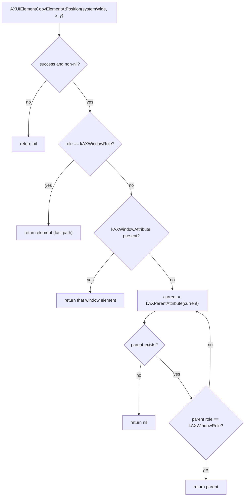

# Window Control & Coordinate Conversion (`WindowControl`)

**Target:** `WindowControl` · **SPM dependency:** `MacGriddleCore` only · **Grounded in:** `docs/RESEARCH.md` §B.1 (Accessibility API), §B.3 (coordinate systems)

This chunk designs the `WindowControl` target: the only place in MacGriddle that talks
directly to another application's `AXUIElement` tree, and the home of the Cocoa↔Quartz
coordinate-conversion utility every other AppKit-touching module needs at its seams.

## At a glance

| Function | Purpose | Underlying calls |
|---|---|---|
| `window(at:)` | hit-test a Quartz point → owning window | `AXUIElementCopyElementAtPosition`, `AXUIElementCopyAttributeValue` |
| `frame(of:)` | read a window's current frame | `AXUIElementCopyAttributeValue`, `AXValueGetValue` |
| `setFrame(_:of:)` | move + resize a window | `AXValueCreate`, `AXUIElementSetAttributeValue` |
| `isFrameSettable(_:)` | optional preflight before a write | `AXUIElementIsAttributeSettable` |
| `ScreenSpace.primaryScreenHeight()` | the one true flip reference | `NSScreen.screens` (never `.main`) |
| `ScreenSpace.cocoaToQuartz` / `.quartzToCocoa` | Cocoa ↔ Quartz, rect and point overloads | pure arithmetic |

## Responsibilities

1. Resolve the window-level `AXUIElement` under an arbitrary global point (Quartz space).
2. Read a window's current frame as a `CGRect`.
3. Write a window's frame (position + size) back through the Accessibility API.
4. Convert rects and points between Cocoa (AppKit) and Quartz (CoreGraphics/AX) screen space.
5. Provide the capture/restore primitives the gesture state machine uses to put a window
   back exactly where it started if a gesture is cancelled.
6. Report AX failures faithfully (never crash, never assume success) so callers — not this
   module — decide how to react to an app that won't move or resize.

## Non-goals (owned by other chunks)

- The gesture state machine that decides *when* to call `window(at:)` / `setFrame` —
  `input-engine-and-state-machine.md`.
- The `CGEventTap` that supplies the points this module hit-tests — also
  `input-engine-and-state-machine.md`.
- Grid math (which rectangle to snap to) — `grid-engine.md`.
- The authoritative `WindowHandle` / `WindowControlling` declarations — `core-contracts.md`
  (see next section for what this chunk assumes about them).
- Accessibility / Input Monitoring permission checks — `permissions-model.md`. This chunk
  assumes it is only ever invoked once `AXIsProcessTrusted()` is already true; every
  function below still degrades safely (returns `nil`/`false`) if that assumption is
  ever wrong, via the normal `AXError.apiDisabled` path.

---

## Module boundary & assumed contract

> **On "depends only on `MacGriddleCore`":** that constraint is about the Swift Package
> Manager *target* graph — no dependency on `GridEngine`, `Overlay`, `Permissions`, etc. It
> does not, and cannot, restrict system-framework imports. This chunk's code imports
> `ApplicationServices` (the AX APIs) and `AppKit` (`NSScreen`, for §4) directly, exactly as
> `docs/RESEARCH.md`'s own snippets do, and consistent with `overview.md`'s cross-cutting
> choice of AppKit for the engine side of the app.

`core-contracts.md` owns the real declarations of `WindowHandle` and `WindowControlling`,
and this chunk cannot see that file. Everything below is written against the following
**assumed** shape, reconstructed from `overview.md`'s description of this chunk ("AX window
lookup/read/write frame, coordinate conversion") and its statement that `WindowControl`
"itself works in Quartz space per its protocol contract":

```swift
// Presumed to live in MacGriddleCore. Shown here only because every
// function in this document is written against it — see "Open Questions
// for core-contracts.md" at the end of this file for exactly what is
// guessed here versus given.

import ApplicationServices

/// Opaque, cross-module reference to a single window, owned by whichever
/// application exposes it. `WindowControl` is the only target that should
/// ever read `.axElement`; every other target (`Input`, `Overlay`, ...)
/// should treat `WindowHandle` as an opaque value it passes around, not a
/// thing it introspects.
public struct WindowHandle {
    public let axElement: AXUIElement

    // Must be public: WindowControl is a *different* target from the one
    // declaring WindowHandle, and it is the only place new handles are
    // minted (inside `window(at:)`, from a freshly resolved AXUIElement).
    public init(axElement: AXUIElement) {
        self.axElement = axElement
    }
}

public protocol WindowControlling {
    /// The window at `point`, in Quartz (global-display, top-left-origin,
    /// Y-down) screen coordinates — see §4 below for why that's the space
    /// this whole protocol is defined in.
    func window(at point: CGPoint) -> WindowHandle?

    /// `window`'s current frame, in Quartz screen coordinates.
    func frame(of window: WindowHandle) -> CGRect?

    /// Moves and resizes `window` to `frame` (Quartz screen coordinates).
    /// Returns `false` — rather than throwing — on any AX failure or
    /// unsettable-attribute case. See §6 for why this chunk assumes `Bool`
    /// over `throws`.
    @discardableResult
    func setFrame(_ frame: CGRect, of window: WindowHandle) -> Bool
}
```

> **Guessed, pending `core-contracts.md`** — flagged again in full at the end of this
> document: the exact method names/labels (`window(at:)`, `frame(of:)`,
> `setFrame(_:of:)`), that `WindowHandle` wraps exactly one `AXUIElement` and nothing else
> (no cached `pid_t`, no cached frame), that failure is reported via `Bool` rather than
> `throws`, and that `WindowHandle` needs a public memberwise-style initializer. Everything
> *else* in this document — which AX calls to make, in what order, and the Quartz-space
> coordinate contract — follows directly from `docs/RESEARCH.md` and the fixed decisions in
> `overview.md`, not from a guess about `WindowControlling`.

The concrete conformance shown throughout this chunk is a class called `AXWindowController`:

```swift
import ApplicationServices

public final class AXWindowController: WindowControlling {
    public init() {}
}
```

(`AXWindowController` is stateless today — a `struct` would work identically — but it is
written as a `final class` to match the reference-type style `docs/RESEARCH.md` §B.2 uses
for the comparable `GlobalMouseAndModifierTap`, and to leave room for future instance state,
e.g. retry counters or instrumentation, without an API change.)

The rest of this document adds methods to `AXWindowController` via extensions, one section
at a time.

---

## 1. Window-under-cursor resolution

The building block is `AXUIElementCopyElementAtPosition`, called on the special
*system-wide* accessibility element — never on a specific app's element — per
`docs/RESEARCH.md` §B.1.2.

`AXUIElementCopyElementAtPosition` returns the **deepest** element at that point (a button,
a text field, a title-bar close box — whatever is visually topmost), not necessarily the
window itself, so the result has to be walked *up* to its owning window. Per
`docs/RESEARCH.md`'s finding, that walk is:

1. Fast path — is the hit element itself already role `kAXWindowRole`?
2. Otherwise, does it expose `kAXWindowAttribute` (a direct pointer to its containing
   window)?
3. Otherwise, fall back to walking `kAXParentAttribute` by hand until role `kAXWindowRole`
   is found or the chain runs out.

**Deliberately not used:** `kAXTopLevelUIElementAttribute`. It looks like the obvious
shortcut for step 2, but Apple's own header docs and this project's research confirm it
returns `nil` for some floating/panel-style windows. `kAXWindowAttribute` covers the same
case reliably, so the parent-walk stays the last resort, not the primary path.



```swift
import ApplicationServices

extension AXWindowController {
    public func window(at point: CGPoint) -> WindowHandle? {
        guard let axWindow = Self.resolvedWindowElement(at: point) else { return nil }
        return WindowHandle(axElement: axWindow)
    }
}

private extension AXWindowController {
    /// The system-wide accessibility element: the hit-testing root for
    /// *every* other application, never a specific app's own element.
    /// Cheap and stateless to hold on to — no need to recreate it per call.
    static let systemWideElement = AXUIElementCreateSystemWide()

    /// Resolves the window-level AXUIElement at `point`. `point` must
    /// already be in Quartz (global-display, top-left-origin) screen
    /// coordinates — see §4. Note the underlying C API takes `Float`
    /// (32-bit), not `CGFloat`/`Double`; the narrowing conversion below is
    /// required by `AXUIElementCopyElementAtPosition`'s actual signature,
    /// not a mistake.
    static func resolvedWindowElement(at point: CGPoint) -> AXUIElement? {
        var hitElement: AXUIElement?
        let error = AXUIElementCopyElementAtPosition(
            systemWideElement,
            Float(point.x),
            Float(point.y),
            &hitElement
        )
        guard error == .success, let element = hitElement else { return nil }
        return resolveToWindow(element)
    }

    /// Walks from an arbitrary hit-tested element up to its owning window,
    /// in the order described above. See the mermaid diagram for the full
    /// decision tree.
    static func resolveToWindow(_ element: AXUIElement) -> AXUIElement? {
        // 1. Fast path — is this element itself a window?
        var roleRef: CFTypeRef?
        if AXUIElementCopyAttributeValue(element, kAXRoleAttribute as CFString, &roleRef) == .success,
           let role = roleRef as? String,
           role == kAXWindowRole as String {
            return element
        }

        // 2. Most elements expose kAXWindowAttribute: a direct pointer to
        //    their containing window, without needing a manual parent walk.
        //    Per Apple's header docs: "Required for any element that has
        //    an element of role kAXWindowRole somewhere in its parent
        //    chain."
        var windowRef: CFTypeRef?
        if AXUIElementCopyAttributeValue(element, kAXWindowAttribute as CFString, &windowRef) == .success,
           let window = windowRef {
            return (window as! AXUIElement)
        }

        // 3. Fallback for the rare element with neither: walk
        //    kAXParentAttribute manually until role == kAXWindowRole or
        //    the chain ends.
        var current = element
        while true {
            var parentRef: CFTypeRef?
            guard AXUIElementCopyAttributeValue(current, kAXParentAttribute as CFString, &parentRef) == .success,
                  let parent = parentRef else {
                return nil
            }
            current = parent as! AXUIElement

            var parentRoleRef: CFTypeRef?
            if AXUIElementCopyAttributeValue(current, kAXRoleAttribute as CFString, &parentRoleRef) == .success,
               let parentRole = parentRoleRef as? String,
               parentRole == kAXWindowRole as String {
                return current
            }
        }
    }
}
```

---

## 2. Reading a window's frame

Position and size come back from the Accessibility API as `AXValue`-boxed `CFTypeRef`s,
which must be unboxed with `AXValueGetValue` into a `CGPoint`/`CGSize`. Two independent
things can fail here and both are checked: the `AXError` from the `AXUIElementCopy...` calls
that fetch the boxed values, and the separate `Bool` from `AXValueGetValue` that reports
whether the unboxing itself succeeded (e.g. the `CFTypeRef` wasn't actually an `AXValue` of
the expected type).

```swift
import ApplicationServices

extension AXWindowController {
    public func frame(of window: WindowHandle) -> CGRect? {
        let axWindow = window.axElement

        var positionRef: CFTypeRef?
        var sizeRef: CFTypeRef?

        guard AXUIElementCopyAttributeValue(axWindow, kAXPositionAttribute as CFString, &positionRef) == .success,
              AXUIElementCopyAttributeValue(axWindow, kAXSizeAttribute as CFString, &sizeRef) == .success
        else { return nil }

        var origin = CGPoint.zero
        var size = CGSize.zero
        guard AXValueGetValue(positionRef as! AXValue, .cgPoint, &origin),
              AXValueGetValue(sizeRef as! AXValue, .cgSize, &size)
        else { return nil }

        return CGRect(origin: origin, size: size)
    }
}
```

Nothing here is force-unwrapped without a preceding `AXError`/`Bool` check — see §6 for why
that discipline is non-negotiable in this module specifically.

---

## 3. Writing a window's frame

Setting works in reverse: box a `CGPoint`/`CGSize` into an `AXValue` with `AXValueCreate`,
then call `AXUIElementSetAttributeValue` once per attribute.

**Ordering matters.** `docs/RESEARCH.md` §B.1.4 documents position-before-size as the safer
order, matching Apple's own sample code and multiple prior-art window managers: applying a
*smaller* size first, while the window is still sitting at its *old* position, is what can
get the resize clipped/clamped against stale geometry — e.g. a window pinned to the
bottom-right of a screen that's both shrinking and moving. Setting the new position first,
then the new size, avoids that. Research didn't surface a case calling for the reverse
order, so `setFrame` applies position-then-size unconditionally rather than branching on
grow-vs-shrink.

```swift
import ApplicationServices

extension AXWindowController {
    @discardableResult
    public func setFrame(_ frame: CGRect, of window: WindowHandle) -> Bool {
        let axWindow = window.axElement
        var origin = frame.origin
        var size = frame.size

        guard let positionValue = AXValueCreate(.cgPoint, &origin),
              let sizeValue = AXValueCreate(.cgSize, &size)
        else { return false }

        // Position before size (see rationale above). Both calls execute
        // unconditionally — the `&&` below only combines the two AXError
        // results for the return value, it does not short-circuit the
        // second AXUIElementSetAttributeValue call. That's intentional:
        // even if the position write fails, MacGriddle still attempts the
        // size write rather than leaving the window in a partially-applied,
        // ambiguous state, and the caller still gets an accurate combined
        // failure signal either way.
        let positionResult = AXUIElementSetAttributeValue(axWindow, kAXPositionAttribute as CFString, positionValue)
        let sizeResult = AXUIElementSetAttributeValue(axWindow, kAXSizeAttribute as CFString, sizeValue)

        return positionResult == .success && sizeResult == .success
    }
}
```

### Optional preflight: `isFrameSettable`

Some windows report `kAXPositionAttribute`/`kAXSizeAttribute` as not settable at all — e.g.
certain non-resizable utility panels — in which case `setFrame` above simply returns
`false` rather than crashing. A caller that wants to know *in advance* (e.g. to grey out or
skip a window in some future UI, rather than discovering the failure on the hot resize path)
can preflight with `AXUIElementIsAttributeSettable`:

```swift
import ApplicationServices

extension AXWindowController {
    /// Not required before calling `setFrame` — it already fails safely
    /// either way. Useful only when a caller wants to distinguish
    /// "this window doesn't support being moved/resized" from "the call
    /// failed for some other reason" ahead of time.
    public func isFrameSettable(_ window: WindowHandle) -> Bool {
        let axWindow = window.axElement
        var positionSettable: DarwinBoolean = false
        var sizeSettable: DarwinBoolean = false

        let positionCheck = AXUIElementIsAttributeSettable(axWindow, kAXPositionAttribute as CFString, &positionSettable)
        let sizeCheck = AXUIElementIsAttributeSettable(axWindow, kAXSizeAttribute as CFString, &sizeSettable)

        return positionCheck == .success && sizeCheck == .success
            && positionSettable.boolValue && sizeSettable.boolValue
    }
}
```

---

## 4. Coordinate conversion (Cocoa ↔ Quartz)

Recap of `docs/RESEARCH.md` §B.3, restated here because this chunk is where the conversion
utility actually lives:

| | Origin | Y direction | Used by |
|---|---|---|---|
| **Cocoa** (AppKit) | Bottom-left of the *primary* screen | Increases **upward** | `NSScreen.frame`/`.visibleFrame`, `NSEvent.mouseLocation`, `NSWindow.frame` |
| **Quartz** (CoreGraphics / Accessibility) | Top-left of the *primary* screen | Increases **downward** | `AXUIElementCopyElementAtPosition`, `kAXPositionAttribute`/`kAXSizeAttribute`, `CGEvent.location` |

`WindowControlling` is defined to work entirely in Quartz space (§1–§3 above never convert
anything), because that's the space both `AXUIElement` and the `CGEventTap` that feeds this
module already agree on. The conversion is only needed at the seams where AppKit enters the
picture — most relevantly, **deciding which physical `NSScreen` a Quartz point falls on**,
since `NSScreen.frame` is Cocoa space and can't be compared against a Quartz point directly.

The flip is always relative to the **primary** screen's height — `NSScreen.screens[0]`,
the display that owns the menu bar / is first in System Settings' arrangement — **never**
`NSScreen.main`, which tracks whichever screen contains the current *key* window and changes
as focus moves. Flipping against the wrong screen's height is the direct cause of "resizes
onto the wrong monitor" bugs on multi-monitor setups.

```swift
import AppKit

public enum ScreenSpace {
    /// The height of the PRIMARY screen (`NSScreen.screens[0]`) — Quartz's
    /// global coordinate origin is defined relative to this display, and
    /// it is NOT necessarily the screen currently under the cursor or the
    /// one with the key window.
    ///
    /// Deliberately not cached: screen arrangement can change at runtime
    /// (a monitor is connected/disconnected, or the user changes which
    /// display is "primary" in System Settings), and a stale cached value
    /// is exactly the kind of bug this type exists to prevent. Every
    /// conversion call below takes `primaryScreenHeight` as a required
    /// argument rather than defaulting it, so call sites can't forget
    /// where the value came from.
    public static func primaryScreenHeight() -> CGFloat {
        NSScreen.screens.first?.frame.height ?? NSScreen.main?.frame.height ?? 0
    }

    /// Cocoa (AppKit: bottom-left origin, Y increases upward) → Quartz
    /// (CoreGraphics/Accessibility: top-left origin, Y increases downward).
    public static func cocoaToQuartz(_ rect: CGRect, primaryScreenHeight: CGFloat) -> CGRect {
        CGRect(
            x: rect.origin.x,
            y: primaryScreenHeight - rect.origin.y - rect.height,
            width: rect.width,
            height: rect.height
        )
    }

    /// Quartz → Cocoa. The transform is its own inverse, so the arithmetic
    /// is identical to `cocoaToQuartz` — kept as a distinct, separately
    /// named function so each call site reads correctly for the direction
    /// it actually means, rather than every Quartz→Cocoa caller having to
    /// remember that "cocoaToQuartz" also happens to work in reverse.
    public static func quartzToCocoa(_ rect: CGRect, primaryScreenHeight: CGFloat) -> CGRect {
        CGRect(
            x: rect.origin.x,
            y: primaryScreenHeight - rect.origin.y - rect.height,
            width: rect.width,
            height: rect.height
        )
    }

    /// Cocoa point → Quartz point. NOT the rect arithmetic above with
    /// height=0 — a bare point has no far edge to account for, so it flips
    /// around just the Y coordinate itself.
    public static func cocoaToQuartz(_ point: CGPoint, primaryScreenHeight: CGFloat) -> CGPoint {
        CGPoint(x: point.x, y: primaryScreenHeight - point.y)
    }

    /// Quartz point → Cocoa point.
    public static func quartzToCocoa(_ point: CGPoint, primaryScreenHeight: CGFloat) -> CGPoint {
        CGPoint(x: point.x, y: primaryScreenHeight - point.y)
    }
}
```

### Why `WindowControl` needs `NSScreen` at all

`overview.md` assigns "coordinate conversion" to this target specifically, and the primary
consumer of the *point* overloads is answering "which screen is the cursor over right now,"
which some other target (most plausibly `Input`, since it's the only other target that
depends on `WindowControl` per the project's target table) needs when deciding which
screen's grid overlay is active:

```swift
import AppKit

/// Illustrative only — this call site more plausibly lives in `Input`
/// (which depends on WindowControl) or wherever screen-under-cursor
/// lookups happen, not inside WindowControl's own public surface. Shown
/// here to demonstrate exactly why ScreenSpace must expose both
/// directions: WindowControl's hot path hands out Quartz points, but
/// NSScreen.frame is Cocoa space, so answering "which screen is this on"
/// requires converting one side before comparing.
func screen(containing quartzPoint: CGPoint) -> NSScreen? {
    let height = ScreenSpace.primaryScreenHeight()
    let cocoaPoint = ScreenSpace.quartzToCocoa(quartzPoint, primaryScreenHeight: height)
    return NSScreen.screens.first { $0.frame.contains(cocoaPoint) }
}
```

---

## 5. Restore-on-cancel

The gesture spec (per `overview.md` step 6 / `docs/RESEARCH.md` Part A.3 step 6) requires
that cancelling a gesture — releasing the mouse button while ⌥ Option is still held, before
anchoring — leaves the window exactly as it was. The pattern this module provides:

1. **Capture once**, immediately, before any AX mutation is made for this gesture — call
   `frame(of:)` exactly once at drag start and hold onto the result.
2. **Restore verbatim** on cancel — call `setFrame` with that same, untouched `CGRect`. No
   re-derivation from grid math, no rounding, no re-reading anything in between.

```swift
/// Captured once, at gesture start, before any AX mutation. This is the
/// exact value written back if the gesture is cancelled — never
/// re-derived from grid math, and captured only once even if a future
/// live-resize toggle (see overview.md) applies several intermediate
/// frames during the same gesture.
public struct CapturedWindowFrame {
    public let handle: WindowHandle
    public let originalFrame: CGRect
}

public func captureForRestore(_ handle: WindowHandle, using control: WindowControlling) -> CapturedWindowFrame? {
    guard let original = control.frame(of: handle) else { return nil }
    return CapturedWindowFrame(handle: handle, originalFrame: original)
}

/// Called on gesture cancellation. Writes the captured frame back exactly
/// as read. If the window has since closed, the underlying AX call fails
/// with `.invalidUIElement` and `setFrame` returns `false` — there is
/// nothing to restore in that case, so callers should treat a `false`
/// return here as "nothing to do," not as an error to retry.
@discardableResult
public func restore(_ captured: CapturedWindowFrame, using control: WindowControlling) -> Bool {
    control.setFrame(captured.originalFrame, of: captured.handle)
}
```

(`CapturedWindowFrame` is a convenience built on top of `WindowControlling`'s three
primitives — it does not need to be part of the protocol itself, and doesn't appear in
`core-contracts.md`'s assumed shape above. It can live as a plain helper type inside
`WindowControl` that `Input` calls.)

### Is this actually safe against rounding/precision issues?

Yes, for the part this module controls. `AXValueCreate`/`AXValueGetValue` copy the raw bytes
of a `CGPoint`/`CGSize` (each field a `CGFloat`, i.e. `Double` on every architecture macOS
13+ ships on) into and out of the `AXValue` box — there is no integer rounding, no
points/pixels unit conversion, and no arithmetic performed by this module anywhere in the
capture→restore path. If the `CGRect` read by `frame(of:)` is passed to `setFrame` completely
unmodified, the bits sent back are bit-for-bit identical to the bits read.

Two things worth flagging that are **not** guaranteed by this module, both noted here as
reasoned inference rather than something `docs/RESEARCH.md` verified directly:

- **This is a guarantee about our side of the call, not the target app's.** If the target
  app's own layout logic changes its frame for an unrelated reason between capture and
  restore (e.g. an async relayout, or the app itself reacting to a display change mid-drag),
  restoring the captured frame could "fight" that unrelated change. This is an edge case, not
  a bug in the round-trip itself — the captured frame was a legitimate frame the app had
  already reported once, so under normal circumstances writing it back is a true no-op on
  the app's side too.
- **Check the restore call's return value like any other write.** A `false` from `restore`
  most commonly means the window closed mid-gesture (`.invalidUIElement`) — treat that as
  "nothing left to restore," not as a failure requiring a retry.

---

## 6. Known AX quirks to flag

`docs/RESEARCH.md` §B.1.5 states the governing rule for this entire module: **never
force-unwrap an `AXUIElementCopy...`/`AXUIElementSetAttributeValue` call's result without
checking the returned `AXError` first** — a failed call leaves any out-parameter in an
undefined state, and the window on the other end is owned by a process MacGriddle does not
control and can disappear or misbehave at any time. Every function in §1–§3 above follows
the same `guard ... == .success else { return / continue }` shape for exactly this reason.

This is why `setFrame` (§3) returns `Bool` rather than assuming success, and why the
protocol assumption in this document does the same (see the open question about `Bool` vs.
`throws` at the end) — callers must be able to detect failure, because failure here is not
rare or exceptional, it's an expected outcome for some fraction of real windows:

- **Verified in `docs/RESEARCH.md`:** `.cannotComplete` is called out explicitly as "common
  with some Electron apps mid-animation" — the target app is temporarily unresponsive to AX
  calls. The documented handling is retry once, then give up gracefully; there's no value in
  retrying indefinitely against a process that isn't cooperating.
- **Verified in `docs/RESEARCH.md`:** some windows report `kAXPositionAttribute`/
  `kAXSizeAttribute` as genuinely not settable (§3's `isFrameSettable` preflight) — a
  non-resizable utility panel, for instance. This is not an error condition, just a window
  `WindowControl` can't act on.
- **General ecosystem knowledge, not specific to this project's research:** Electron/
  Chromium-based apps (the same app family `docs/RESEARCH.md` Part A.2 names as the reason
  WinGrid11 moved away from live-resize, there because of redraw corruption rather than AX
  failures specifically) build their accessibility tree through Chromium's own internal AX
  bridge rather than native AppKit, and that bridge has a documented history of gaps —
  attributes that report settable but respond inconsistently or only after the renderer
  process catches up. Catalyst (UIKit-on-Mac) and some SwiftUI-bridged apps have similarly
  been reported to have thinner or delayed AX support than a pure AppKit app. A `.success`
  `AXError` from `setFrame` is therefore necessary but not airtight proof the window visibly
  moved for every app on the system.
- **Framing, not a MacGriddle bug:** this is a limitation of the apps' own AX
  implementations, not something `WindowControl` can engineer around from the outside — the
  same category of issue shows up in the public issue trackers of every AX-based window
  manager surveyed in `docs/RESEARCH.md` §B.5 (Rectangle, AeroSpace, yabai, Amethyst all
  build on the same public API and inherit the same ecosystem gaps).

`WindowControl`'s responsibility stops at faithfully reporting success or failure through
`setFrame`'s return value; deciding how the gesture state machine or UI reacts to a `false`
(silently accept it, log it, surface something to the user) is out of scope for this chunk —
see `input-engine-and-state-machine.md`.

---

## Consolidated open questions for `core-contracts.md`

This chunk could not see `core-contracts.md` and had to assume the shape of `WindowHandle`
and `WindowControlling` documented in "Module boundary & assumed contract" above. Specific
guesses, for the combiner/implementer to confirm or correct:

1. **Method names/labels** — assumed `window(at:)`, `frame(of:)`, `setFrame(_:of:)`. Any of
   the names, argument labels, or argument order could differ in the real declaration.
2. **Failure signaling** — assumed `setFrame` returns `Bool` (matching
   `docs/RESEARCH.md`'s own sample code exactly) rather than `throws`. §6 explains why
   *some* failure-detection mechanism is required; it does not settle Bool vs. throws.
3. **`WindowHandle`'s shape** — assumed a bare wrapper around a single `AXUIElement`, with a
   public initializer (required because `WindowControl` — a different target — is what
   constructs instances from a freshly resolved element, while other targets only ever
   receive and pass around existing handles).
4. **Not assumed, flagged as worth deciding explicitly:** whether `WindowHandle` should also
   cache the owning `pid_t` (cheap via `AXUIElementGetPid`, sometimes useful for "is this the
   same app" checks) — this chunk did not need it for any function above, so it's omitted
   from the assumed shape rather than guessed in.
5. **Not assumed, flagged as worth deciding explicitly:** whether `WindowHandle` needs
   `Equatable`/`Hashable` (e.g. for the state machine to confirm "the window I started
   dragging is still the one I'm about to commit a resize on"). Worth knowing either way:
   `AXUIElement` does not automatically conform to `Equatable`/`Hashable` in Swift — that
   would need an explicit `CFEqual`/`CFHash`-backed conformance added wherever `WindowHandle`
   ends up declared, e.g. `extension AXUIElement: Hashable { ... }` using `CFEqual`/`CFHash`.
6. **Considered and not adopted here:** a fully opaque `WindowHandle` that hides
   `AXUIElement` from every target except `WindowControl` (e.g. via an internal token/cache
   inside `WindowControl` instead of a public `axElement` property). This would be stronger
   encapsulation, but adds real complexity — a live-handle cache with its own invalidation
   and cleanup story — that nothing in the current spec calls for. Flagged here so it reads
   as a deliberate trade-off, not an oversight.

Everything *not* in this list (which AX calls to make and in what order, the AXError
handling shape, the Quartz-space coordinate contract, the coordinate-conversion arithmetic
and its `NSScreen.screens[0]`-not-`.main` rule) is grounded directly in `docs/RESEARCH.md`
and `overview.md`'s fixed decisions, not guessed.

## Sources

- `docs/RESEARCH.md` §B.1.1–§B.1.5 — Accessibility API: trust, hit-testing, frame read,
  frame write, `AXError` handling.
- `docs/RESEARCH.md` §B.3.1–§B.3.2 — coordinate system mismatch and the conversion utility.
- `docs/RESEARCH.md` Part A.2–A.3 — Electron/Chromium redraw-corruption context for the
  quirks section, and the cancel-gesture requirement motivating §5.
- `docs/architecture/overview.md` — target/dependency table, chunk scope for
  `window-control-and-coordinates.md`, fixed coordinate-space decision.
